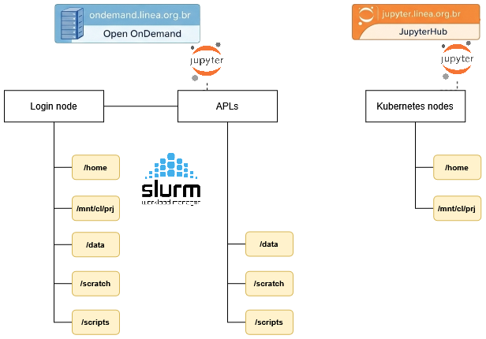

# Storage

Different storage areas are available, each with a specific purpose. The areas have different access, retention, and backup characteristics.

## Overview of storage areas

<div style="text-align: center;">

  

</div>

| Area       | Main use                                                | Automatic cleanup                  | Backup | Access                                       |
| ---------- | ------------------------------------------------------- | ---------------------------------- | ------ | -------------------------------------------- |
| `/home`    | Personal files, configurations, and Python environments | No                                 | Yes    | Cluster login node and Jupyter environment   |
| `/scratch` | Temporary processing data                               | After 30 days without modification | No     | All cluster nodes                            |
| `/scripts` | Submission scripts, Python environments, and kernels    | No                                 | No     | All cluster nodes                            |
| `/data`    | Long-term storage                                       | No                                 | No     | All cluster nodes (restricted use on demand) |


!!! info
    Access to `/data` is provided on demand.

## `/scratch`

`/scratch` is intended for temporary storage of data used during HPC processing. It can be used for input files, intermediate results, and other data required during job execution.

Users can access their scratch directory through the environment variable or by using the full path.

```Bash

cd $SCRATCH

```

Or 

```Bash

cd /scratch/users/<username> 

```

!!! danger "ATENÇÃO"
    This area is NOT backed up!

Files that have not been modified in the last 30 days will be automatically removed, making this a temporary storage area.

Users are advised to transfer important files from `$SCRATCH` to their `homedir`.


!!! warning
    The cleanup script runs once a week, always on weekends.  

**The default quota for `/scratch` available to users authorized to use the Cluster is:**

| area     | bsoft  | bhard  | isoft  | ihard  | grace period |
| -------- | ------ | ------ | ------ | ------ | ------------ |
| /scratch | 35 GB  | 40 GB  | 100000 | 120000 | 7 days       |

## `/data`

`/data` is intended for long-term storage. Access to this area is provided on demand.


## `/home`

`/home` is intended for the user's personal files and configurations. It can also be used to store Python environments that will be used on the [Jupyter Notebook](https://jupyter.linea.org.br).

**The default home directory quota for each user, according to their profile, is shown below:**

| perfil                 | bsoft  | bhard  | isoft   | ihard    | grace period |
| ---------------------- | ------ | ------ | ------- | -------- | ------------ |
| general public          | 5 GB   | 7 GB    | 7000    | 10000    | 7 dias       |
| institutional public  | 25 GB  | 30 GB   | 40000   | 50000    | 7 dias       |
| LSST collaboration       | 35 GB  | 40 GB   | 1000000 | 1200000  | 7 dias       |

!!! tip
    To check the configured quota values, use the command: `show_quota`.


Note: The user's `/home` directory is **not** affected by the automatic cleanup process.

## `/scripts`

`/scripts` is intended for scripts and environments used to run jobs on the HPC. It is the recommended location for job submission scripts, Python environments, and kernels used during processing.

Users can access their scripts directory through the environment variable or by using the full path.


```Bash

cd $SCRIPTS

```

Or 

```Bash

cd /scripts/<username> 

```

This area is intended for storing job submission scripts and others. It is also recommended to use this path to create Python environments (envs) and kernels.

**The default quota for `/scripts` available to users is:**

| area     | bsoft | bhard | isoft | ihard | grace period |
| -------- | ----- | ----- | ----- | ----- | ------------ |
| /scripts | 10 GB | 12 GB | 100k  | 120k  | 7 days       |

Note: The `/scripts` directory is **not** affected by the automatic cleanup process.


!!! info
    Although both `/home` and `/scripts` can store Python environments, they serve different purposes. Environments stored in `/home` can be used in Jupyter, while `/scripts` is the recommended location for environments that will be used on HPC processing nodes.


## NAS (NFS)

NAS storage systems are used for long-term storage and are not accessible through the processing (HPC) nodes.

Current characteristics: 

| Fabricante | Modelo | Capacidade | Instalado em | Disponibilidade |
| ---------- | -------------------- | ---------- | ------------ | --------------- |
| SGI | IS5600 | 240TB | Jul-2014 | In use |
| HPE | APOLO 4510 | 1.2 PB | Apr-2025 | In use |

## Backup

| areas | daily incremental backup | monthly full backup | retention |
| -------- | :-------------------------: | :-----------------------: | :------: |
| /home | :heavy_check_mark: | :heavy_check_mark: | 90 dias |
| /data | :x: | :x: | - |
| /scratch | :x: | :x: | - |
| /scripts | :x: | :x: | - |

!!! info
    Although it does not have scheduled backups, the `/data` volume uses a robust disk redundancy system that preserves the integrity of its data.

## Lustre Usage

The Apollo cluster environment has a high-performance [Lustre](https://www.lustre.org/) file system with two storage tiers, one on SSD with ~70 TB (*T0*) and the other on HDD with ~500 TB (*T1*), both connected to a 100 Gb/s EDR InfiniBand network. The two storage tiers are available at `/scratch` and `/data`.

### Best practices

Distributed file systems such as Lustre are ideal for HPC and HTC environments. In these environments, the typical workload consists of large files that need to be accessed from many compute nodes with very high bandwidth and/or low latency. Therefore, these file systems are very different from those used on desktop computers or standalone servers. Although they are excellent at handling large files, they also have strong limitations when handling small files and access patterns more commonly found in corporate and desktop environments. Operations that can be extremely fast on a workstation's local disk can be painfully slow and expensive on a Lustre file system, affecting both the users performing these operations and, eventually, all other users. These best practices and recommendations are intended to enable smooth use of Lustre by minimizing or avoiding unnecessary or very expensive file-system operations.

**Avoid accessing file and directory attributes**

Accessing metadata information, such as file attributes (for example, type, ownership, protection, size, dates, etc.) on Lustre consumes many resources and can degrade file-system performance, especially when performed frequently or in directories containing a large number of files.

Minimize the use of system calls that access or modify these attributes, such as `stat()`, `statx()`, `open()`, `openat()`, etc.

The same applies to commands such as `ls -l` (for the entire directory) or `ls --color`, which use the calls mentioned above. Instead, use a simple `ls` or `ls -l filename`.

**Avoid using commands that massively access metadata**

Avoid using commands such as `ls -R`, `find`, `locate`, `du`, `df`, and similar commands.

These commands recursively traverse the file system and/or perform heavy metadata operations. They are very intensive in their access to file-system metadata and can severely degrade overall file-system performance. If it is absolutely necessary to recursively traverse the file system, use the Lustre-provided `lfs find` command instead of `find`, for example.

**Use the Lustre `lfs` command**

To minimize the number of Lustre RPC calls, use `lfs` commands instead of system-provided commands whenever possible:

* `lfs df` => instead of `df`

* `lfs find` => instead of `find`

**Avoid using wildcards**

Expanding wildcards requires many resources. Running commands with wildcards over a large number of files can take a long time and severely affect file-system performance. Instead of using wildcards, create a list of target files and apply the command to each file.

**Read-only access**

Whenever possible, open files as read-only using `O_RDONLY`. In addition, if you do not need to update the file access time, open files as `O_RDONLY | O_NOATIME`. If access-time information is required during parallel I/O, let the parent process open files as `O_RDONLY` and have all other ranks open the same files as `O_RDONLY|O_NOATIME`.

**Avoid having a large number of files in a single directory**

When a file is accessed, Lustre locks the parent directory. When many files in the same directory must be opened, this creates contention. Writing thousands of files to a single directory creates a massive load on Lustre metadata servers, generally resulting in file-system shutdowns. Accessing a single directory containing thousands of files can cause significant resource contention, degrading file-system performance.

The alternative is to organize data into several subdirectories and divide the files among them. A common approach is to use the square root of the number of files; for example, for 90,000 files the square root would be 300, so 300 directories containing 300 files each should be created.

**Avoid small files**

Accessing small files on the Lustre file system is very inefficient. The recommended file size is greater than 1 GB. Reorganize data into large files or use file formats such as **HDF5**. Alternatively, if the total size of the files is small, such as a few gigabytes, copy the small files to `/tmp` or to a local temporary directory on each compute node at the beginning of the job (do not forget to transfer and/or delete the files at the end). This approach can be combined with archiving tools such as `tar`; storing small files in one or more large tarballs can be kept on Lustre more efficiently.

When reading or writing files, Lustre performs much better with large buffer sizes (>= 1 MB). It is highly recommended to aggregate small read and write operations into larger operations. The MPI-IO collective buffer enables aggregated I/O.

**Avoid small repetitive file operations**

Avoid performing small repetitive I/O operations, such as frequently opening files in append mode, writing small amounts of data, and closing the file. Instead, open the file once, perform all I/O operations, and close it.

**Avoid multiple processes opening the same files at the same time**

Multiple processes opening the same files at the same time can create contention and file-opening errors. Instead, perform the opening from a single process (parent), or open the file read-only to avoid locking, or implement opening with a retry-and-wait approach in case of error.

**Avoid accessing the same file region from many processes**

If multiple processes access the same file region at the same time, the Lustre distributed lock manager will enforce consistency so that all clients see consistent results. Having many processes trying to access the same region simultaneously can cause performance degradation.

In this case, it may be preferable to replicate the file, split the file, perform I/O operations from a single process rank, or ensure that simultaneous access will not occur. In any case, it is recommended to keep the number of file-open and locking operations in parallel as small as possible to reduce contention.

If multiple processes attempt to append to the same file, this will trigger locking and may cause significant contention. Ideally, only one process should append to each file.

**File operations through the parent process**

When accessing small shared files in a parallel task, it is often more efficient to perform all necessary operations through the parent process and, if necessary, transmit the data to other ranks rather than having all ranks access the same files. Similarly, if multiple ranks of a parallel job require information about a particular file, the most efficient approach is for the parent process to make the necessary calls (for example `stat()`, `fstat()`, etc.) and then transmit the information to the other ranks.

**File striping**

In Lustre, large files can be divided into segments that can, in turn, be automatically distributed across several storage devices. File striping is useful for parallel I/O on large files. For this to work, the mount point in question must point to multiple storage devices (OSTs). The `lfs df` command can be used to check whether a given mount point points to multiple OSTs. To obtain file striping information for a given file, use:

`lfs getstripe filename`

File striping can be configured using the `lfs setstripe` command. If the command is applied to a directory, it sets the default striping configuration for files created in that directory. A subdirectory inherits all striping settings from its parent directory. If the command is applied to a file, it stripes that file across the OSTs according to the specified settings.

`lfs setstripe -s 128m -c 8 filename` => divides the file into 128 MB segments and distributes them across 8 OSTs

If a large file is shared in parallel by multiple processes, with each process working on its own portion of the file, it may be useful to stripe the file across a number of segments equal to the number of processes, or a multiple of the number of processes.

For maximum performance, I/O requests should be aligned with stripes, meaning that processes accessing the file should do so at offsets corresponding to stripe boundaries. This minimizes the chances of a process having to access more than one segment (and more than one OST) to obtain the required data.

For small files, striping should be disabled; this can be achieved by setting the stripe count to 1. The same applies if a large file is accessed by a single process.

`lfs setstripe -s 1m -c 1 meudiretorio/arquivospequenos/`

**Avoid installing software on Lustre**

Software generally consists of many small files and, as mentioned above, accessing many small files on Lustre can overload metadata servers. Software builds in particular can be performed more efficiently locally by copying or unpacking the software to `/tmp/$USER/` or to your `homedir`.

In addition, under high load, I/O access to Lustre file systems can be blocked. If executables are stored on Lustre and access to the file system fails, the executables may hang. Therefore, whenever possible, it is better to copy executables to `/tmp` on the cluster nodes.

### Useful commands

a) How can I check my available quota?

`    show_quota`

b) How can I check a project's quota?

`    show_proj_quota <projeto>`

c) How can I list my files created more than 30 days ago?

`    lfs find $SCRATCH --uid $UID -mtime +30 --print`

d) How can I list my files created less than 30 days ago?

`    lfs find $SCRATCH --uid $UID -mtime -30 --print`

e) How can I list the Lustre OSTs?

`    lfs osts $SCRATCH`

f) How can I list files stored for more than 30 days on a specific Lustre OST?

`    lfs find $SCRATCH -mtime +30 --print --obd t0-OST0002_UUID`

g) How can I configure directory striping to "break" files and distribute those "pieces" across 10 OSTs?

`    lfs setstripe -c 10 $SCRATCH/meus_arquivos_grandes`

h) How can I check file/directory striping?

`    lfs setstripe -c $SCRATCH/meus_arquivos_grandes`

!!! tip
    LIneA's Lustre was designed to operate at 100 Gbps. To achieve maximum performance, use striping and always use large files (+1GB).

## References

These best practices were compiled from the experience of the LIneA team and the following sources:

1. https://www.nas.nasa.gov/hecc/support/kb/lustre-best-practices_226.html

1. https://hpcf.umbc.edu/general-productivity/lustre-best-practices/

1. https://wiki.gsi.de/foswiki/bin/view/Linux/LustreFs

1. https://doc.lustre.org/lustre_manual.pdf
