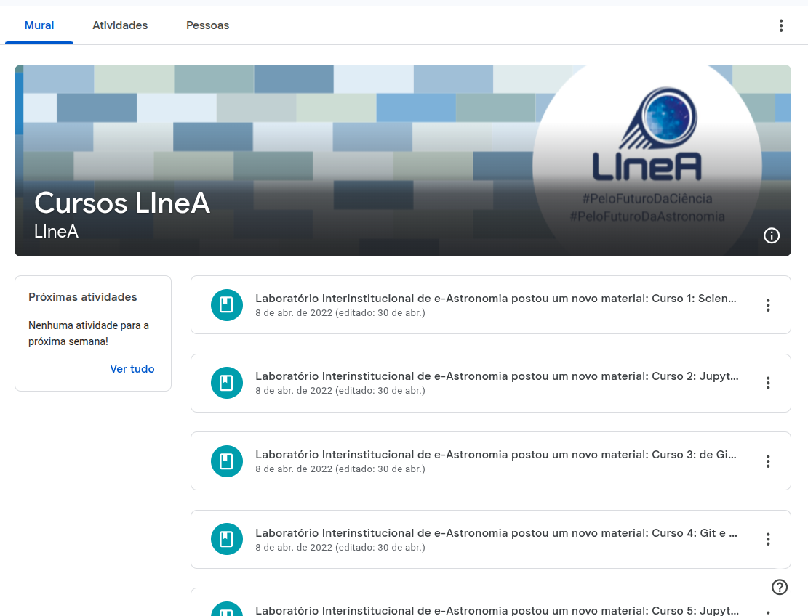

LIneA offers training courses on the main tools used by the projects. Recordings and teaching materials from all previously offered courses are available on .

### Tutorial Videos

#### User Registration Tutorials
* [User Registration for LSST Collaboration Members](https://youtu.be/9YGwrCiO7I0)

* [User Registration for the General Public](https://youtu.be/NFnG-OnFZjM)

#### Tutorials for Using the HPC Environment
* [How to create a new kernel for Jupyter Notebook - LIneA Open OnDemand](https://youtu.be/EOiCO8S7vGc)
