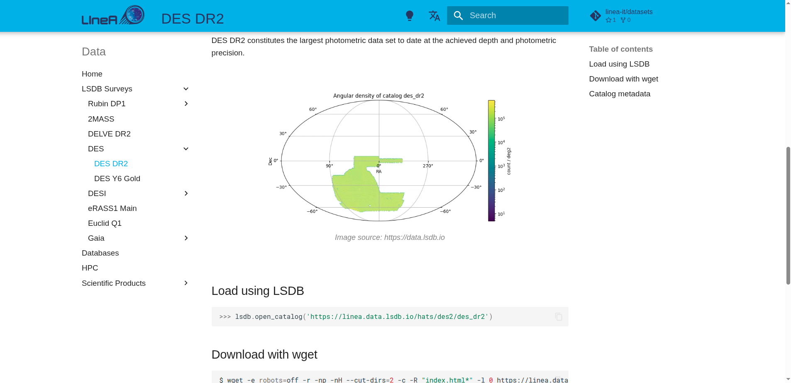

# Data Repository

The entire data repository hosted at LIneA is documented on the [data.linea.org.br](https://data.linea.org.br/en/index.html) website. There you will find relevant information about the datasets, links to their respective publications and source survey websites, as well as access instructions through the scientific platforms and APIs.

    
<a href="https://data.linea.org.br/en/index.html" target="_blank" rel="noopener noreferrer"><strong><u>data.linea.org.br</strong></u></a> 

  

