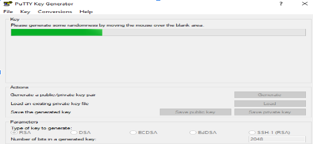

## How to create SSH key pair
To access our environment via ssh you need to generate a key pair following the steps below:

### Linux
a) To generate the key pair use the following command in your terminal:
    
    ssh-keygen -t rsa -b 4096
    
    Generating public/private rsa key pair.
    Enter file in which to save the key (/root/.ssh/id_rsa):  [press ENTER]
    Created directory '/root/.ssh'.
    Enter passphrase (empty for no passphrase): [enter a password and press ENTER]
    Enter same passphrase again: [repeat password and press ENTER]

b) After receiving the message that the key was generated. You can view the two created files by listing the directory contents: `ls $HOME/.ssh id_rsa id_rsa.pub`
c) After generating the keys, send the **.pub** key to the IT team via email [helpdesk@linea.org.br](mailto:helpdesk@linea.org.br). The LIneA IT team will configure the key on the server and return with login instructions for the Apollo cluster. ***Wait for confirmation***.

### Windows
To generate key pairs on Windows OS:
a) Download and install the Putty application.
b) Access the installation folder (this example uses Windows 10) `C:\Program File\PuTTY` (path may vary by OS), open Puttygen.

c) Click Generate (keep key type as **RSA**).

**NOTE: Moving the mouse pointer helps generate the key faster by creating random bits**.

d) Key pair successfully generated.

- Copy the public key to be saved on the server (highlighted in yellow in image);
- Set a password for the public key (highlighted in blue);
- After copying, save both public and private keys on your computer (highlighted in red) and send the `.pub` key to the IT team via email [helpdesk@linea.org.br](mailto:helpdesk@linea.org.br). The LIneA IT team will configure the key on the server. ***Wait for confirmation***.

e) After receiving confirmation email that the `.pub` key was registered on the access server, configure the `Putty` program.

- Create a desktop shortcut, open `PuTTY`;
- Enter Hostname: login.linea.org.br.

f) On the left side go to `SSH > Auth (blue highlight) > click Browse (yellow highlight) and select the key file with .ppk extension`.

h) If you need to use a tunnel, make the following configuration.
**NOTE: tunnels are configured according to what the user needs to access**
- Go to Tunnels option (left side);
- In Source port enter the port number;
- Destination > enter destination address > Add.

Return to the left side and go to the first menu option `Session (red highlight) enter session name (yellow highlight) and click Save (blue highlight)`, to connect click `Open`.

