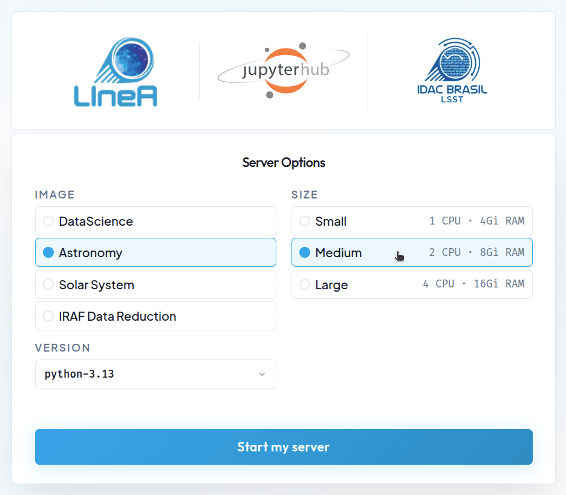

[JupyterHub](https://jupyter.org/hub) is a multi-user development environment based on *IPython Notebooks* that provides access to shared computational resources on a remote server, without requiring installation or maintenance by users. The only prerequisites for accessing JupyterHub are: having a user account at LIneA (see [here](../primeiros_passos.md) for instructions on how to create your account) and a web browser with Internet access. The so-called [Jupyter Notebooks](https://docs.jupyter.org/en/latest/) allow users to combine interactive code, execution results, explanatory text, and multimedia resources within a single document.

As part of the [LIneA Science Platform](./index.md), the LIneA JupyterHub is integrated with other data visualization and access tools. In this way, all data analysis can be performed *online* within the platform—from data ingestion, visualization, and processing to the analysis of results—without the need to *download* the data to the user's personal computer.


## Home Screen

By clicking on the "JupyterHub" card within the LIneA Science Platform (or by accessing it directly at [jupyter.linea.org.br](https://jupyter.linea.org.br)), you will be redirected to the login page and then to the home screen, which displays the different configuration options for the Jupyter server.

<div style="text-align: center;">
  
</div>

### Available Configurations

#### Pre-configured Docker Images

The default installation of LIneA JupyterHub is based on *Docker containers* with pre-configured environments designed to meet most user needs. Four *Docker images* are available:

* **DataScience** – the [Jupyter Data Science Notebook](https://jupyter-docker-stacks.readthedocs.io/) stack, including popular *data science* libraries such as Pandas, NumPy, Matplotlib, SciPy, and Scikit-learn.  
* **Astronomy** – the generic astronomy stack, which includes the main *data science* libraries as well as widely used domain-specific packages such as Astropy, Astroquery, Healpy, Photutils, PyVO, Dustmaps, LSDB, and AstroML, among others.  
* **SolarSystem** – a stack tailored for Solar System studies, including the main libraries from the **DataScience** and **Astronomy** images, as well as specialized packages such as sbpy, spiceypy, rebound, sora-astro, reboundx, among others.  
* **IRAF Data Reduction** – a customized image designed to support tasks that depend on the reduction and manipulation of astronomical images using traditional tools such as IRAF and DS9 (more modern tools such as Astropy CCDProc, Photutils, and Reproject are available in the **Astronomy** image).


??? info "Check here the list of the main libraries included in the environments and links to their respective documentation."
    <table>
    <thead>
    <tr>
      <th>Category</th>
      <th>Library</th>
      <th>Purpose</th>
      <th>Doc</th>
    </tr>
    </thead>
    <tbody>
    <!-- Data Science -->
    <tr>
      <td rowspan="9"><b>Data<br>Science<br>and ML</b></td>
      <td><a href="https://corner.readthedocs.io">corner</a></td>
      <td>Visualization of posterior distributions.</td>
      <td><a href="https://corner.readthedocs.io/en/latest/">doc</a></td>
    </tr>
    <tr>
      <td><a href="https://dynesty.readthedocs.io">dynesty</a></td>
      <td>Bayesian nested sampling.</td>
      <td><a href="https://dynesty.readthedocs.io/en/latest/">doc</a></td>
    </tr>
    <tr>
      <td><a href="https://emcee.readthedocs.io">emcee</a></td>
      <td>MCMC sampling.</td>
      <td><a href="https://emcee.readthedocs.io/en/stable/">doc</a></td>
    </tr>
    <tr>
      <td><a href="https://lmfit.github.io/lmfit-py/">lmfit</a></td>
      <td>Nonlinear model fitting.</td>
      <td><a href="https://lmfit.github.io/lmfit-py/">doc</a></td>
    </tr>
    <tr>
      <td><a href="https://numpy.org">NumPy</a></td>
      <td>Numerical operations and multidimensional arrays.</td>
      <td><a href="https://numpy.org/doc">doc</a></td>
    </tr>
    <tr>
      <td><a href="https://pandas.pydata.org">Pandas</a></td>
      <td>Table analysis and data manipulation.</td>
      <td><a href="https://pandas.pydata.org/docs/">doc</a></td>
    </tr>
    <tr>
      <td><a href="https://scikit-image.org">scikit-image</a></td>
      <td>Image processing.</td>
      <td><a href="https://scikit-image.org/docs/stable/">doc</a></td>
    </tr>
    <tr>
      <td><a href="https://scikit-learn.org">scikit-learn</a></td>
      <td>Machine learning and predictive models.</td>
      <td><a href="https://scikit-learn.org/stable/documentation.html">doc</a></td>
    </tr>
    <tr>
      <td><a href="https://scipy.org">SciPy</a></td>
      <td>Advanced scientific functions and numerical methods.</td>
      <td><a href="https://docs.scipy.org/doc/scipy/">doc</a></td>
    </tr>

    <!-- Visualization -->
    <tr>
      <td rowspan="7"><b>Visualization</b></td>
      <td><a href="https://bokeh.org">Bokeh</a></td>
      <td>Interactive visualizations for the web.</td>
      <td><a href="https://docs.bokeh.org/">doc</a></td>
    </tr>
    <tr>
      <td><a href="https://datashader.org">Datashader</a></td>
      <td>Rendering of large-scale datasets.</td>
      <td><a href="https://datashader.org">doc</a></td>
    </tr>
    <tr>
      <td><a href="https://holoviews.org">HoloViews</a></td>
      <td>Declarative data visualization.</td>
      <td><a href="https://holoviews.org/reference/index.html">doc</a></td>
    </tr>
    <tr>
      <td><a href="https://hvplot.holoviz.org">hvPlot</a></td>
      <td>High-level visualization API.</td>
      <td><a href="https://hvplot.holoviz.org">doc</a></td>
    </tr>
    <tr>
      <td><a href="https://matplotlib.org">Matplotlib</a></td>
      <td>2D/3D scientific visualization.</td>
      <td><a href="https://matplotlib.org/stable/contents.html">doc</a></td>
    </tr>
    <tr>
      <td><a href="https://plotly.com/python/">Plotly</a></td>
      <td>Interactive plots and dashboards.</td>
      <td><a href="https://plotly.com/python/">doc</a></td>
    </tr>
    <tr>
      <td><a href="https://seaborn.pydata.org">Seaborn</a></td>
      <td>High-level statistical visualizations.</td>
      <td><a href="https://seaborn.pydata.org/tutorial.html">doc</a></td>
    </tr>
    <!-- Others -->
    <tr>
      <td rowspan="5"><b>Databases,<br>Jupyter and<br>Utilities</b></td>
      <td><a href="https://www.psycopg.org/">psycopg2</a></td>
      <td>PostgreSQL connector for Python.</td>
      <td><a href="https://www.psycopg.org/docs/">doc</a></td>
    </tr>
    <tr>
      <td><a href="https://www.sqlalchemy.org/">SQLAlchemy</a></td>
      <td>ORM and SQL toolkit for database manipulation.</td>
      <td><a href="https://docs.sqlalchemy.org/">doc</a></td>
    </tr>
    <tr>
      <td><a href="https://www.fatiando.org/pooch/latest/">pooch</a></td>
      <td>Dataset download management.</td>
      <td><a href="https://www.fatiando.org/pooch/latest/">doc</a></td>
    </tr>
    <tr>
      <td><a href="https://dask.org">Dask</a></td>
      <td>Parallel and distributed computing.</td>
      <td><a href="https://docs.dask.org">doc</a></td>
    </tr>
    <tr>
      <td><a href="https://ipykernel.readthedocs.io">IPykernel</a></td>
      <td>Python kernel for notebooks.</td>
      <td><a href="https://ipykernel.readthedocs.io/en/latest/">doc</a></td>
    </tr>
    <!-- Astronomy -->
    <tr>
      <td rowspan="21"><b>Astronomy</b></td>
      <td><a href="https://astrocut.readthedocs.io">astrocut</a></td>
      <td>Astronomical image cutouts.</td>
      <td><a href="https://astrocut.readthedocs.io/en/latest/">doc</a></td>
    </tr>
    <tr>
      <td><a href="https://www.astroml.org">astroML</a></td>
      <td>Machine learning applied to astronomy.</td>
      <td><a href="https://www.astroml.org/user_guide.html">doc</a></td>
    </tr>
    <tr>
      <td><a href="https://www.astropy.org">Astropy</a></td>
      <td>Core astronomy tools.</td>
      <td><a href="https://docs.astropy.org">doc</a></td>
    </tr>
    <tr>
      <td><a href="https://astroquery.readthedocs.io">Astroquery</a></td>
      <td>Queries to online astronomical archives and catalogs.</td>
      <td><a href="https://astroquery.readthedocs.io/en/latest/">doc</a></td>
    </tr>
    <tr>
      <td><a href="https://scitools.org.uk/cartopy/docs/latest/">Cartopy</a></td>
      <td>Geospatial maps and projections.</td>
      <td><a href="https://scitools.org.uk/cartopy/docs/latest/">doc</a></td>
    </tr>
    <tr>
      <td><a href="https://dustmaps.readthedocs.io">Dustmaps</a></td>
      <td>Milky Way extinction maps.</td>
      <td><a href="https://dustmaps.readthedocs.io/en/latest/">doc</a></td>
    </tr>
    <tr>
      <td><a href="https://hats-import.readthedocs.io">HATS Import</a></td>
      <td>Catalog conversion to HATS format.</td>
      <td><a href="https://hats-import.readthedocs.io/en/stable/">doc</a></td>
    </tr>
    <tr>
      <td><a href="https://healpy.readthedocs.io">Healpy</a></td>
      <td>HEALPix map manipulation.</td>
      <td><a href="https://healpy.readthedocs.io/en/latest/">doc</a></td>
    </tr>
    <tr>
      <td><a href="https://ipyaladin.readthedocs.io">ipyaladin</a></td>
      <td>Interactive sky visualization (Aladin Lite in Jupyter).</td>
      <td><a href="https://ipyaladin.readthedocs.io/en/latest/">doc</a></td>
    </tr>
    <tr>
      <td><a href="https://pypi.org/project/lineaSSP/">lineassp</a></td>
      <td>LIneA Solar System Portal API.</td>
      <td><a href="https://pypi.org/project/lineaSSP/">doc</a></td>
    </tr>
    <tr>
      <td><a href="https://docs.lightkurve.org">lightkurve</a></td>
      <td>Light curve analysis (Kepler/TESS).</td>
      <td><a href="https://docs.lightkurve.org">doc</a></td>
    </tr>
    <tr>
      <td><a href="https://lsdb.readthedocs.io">LSDB</a></td>
      <td>Scalable catalog analysis.</td>
      <td><a href="https://lsdb.readthedocs.io/en/stable/">doc</a></td>
    </tr>
    <tr>
      <td><a href="https://photutils.readthedocs.io">Photutils</a></td>
      <td>Photometry and source detection.</td>
      <td><a href="https://photutils.readthedocs.io/en/latest/">doc</a></td>
    </tr>
    <tr>
      <td><a href="https://pyspeckit.readthedocs.io">pyspeckit</a></td>
      <td>Spectral fitting and analysis.</td>
      <td><a href="https://pyspeckit.readthedocs.io/en/latest/">doc</a></td>
    </tr>
    <tr>
      <td><a href="https://github.com/rcboufleur/pySPAC">pyspac</a></td>
      <td>Solar phase curve analysis and characterization.</td>
      <td><a href="https://rcboufleur.github.io/pySPAC/">doc</a></td>
    </tr>
    <tr>
      <td><a href="https://pyvo.readthedocs.io">PyVO</a></td>
      <td>Access to Virtual Observatory services.</td>
      <td><a href="https://pyvo.readthedocs.io/en/latest/">doc</a></td>
    </tr>
    <tr>
      <td><a href="https://github.com/linea-it/pzserver">pzserver</a></td>
      <td>Remote access to data and execution of PZ Server pipelines.</td>
      <td><a href="https://linea-it.github.io/pzserver/">doc</a></td>
    </tr>
    <tr>
      <td><a href="https://pypi.org/project/pz-rail/">rail</a></td>
      <td>Photometric redshift pipeline.</td>
      <td><a href="https://rail-hub.readthedocs.io/en/latest/">doc</a></td>
    </tr>
    <tr>
      <td><a href="https://astropy-regions.readthedocs.io">Regions</a></td>
      <td>Sky region manipulation.</td>
      <td><a href="https://astropy-regions.readthedocs.io/en/latest/">doc</a></td>
    </tr>
    <tr>
      <td><a href="https://reproject.readthedocs.io">Reproject</a></td>
      <td>Reprojection of astronomical images.</td>
      <td><a href="https://reproject.readthedocs.io/en/stable/">doc</a></td>
    </tr>
    <tr>
      <td><a href="https://specutils.readthedocs.io">specutils</a></td>
      <td>Astronomical spectral analysis.</td>
      <td><a href="https://specutils.readthedocs.io/en/stable/">doc</a></td>
    </tr>

    <tr>
      <td rowspan="5"><b>Solar<br>System</b></td>
      <td><a href="https://rebound.readthedocs.io">rebound</a></td>
      <td>N-body simulations.</td>
      <td><a href="https://rebound.readthedocs.io/en/latest/">doc</a></td>
    </tr>
    <tr>
      <td><a href="https://reboundx.readthedocs.io">reboundx</a></td>
      <td>Extensions for REBOUND.</td>
      <td><a href="https://reboundx.readthedocs.io/en/latest/">doc</a></td>
    </tr>
    <tr>
      <td><a href="https://sbpy.readthedocs.io">sbpy</a></td>
      <td>Tools for small-body science.</td>
      <td><a href="https://sbpy.readthedocs.io/en/latest/">doc</a></td>
    </tr>
    <tr>
      <td><a href="https://spiceypy.readthedocs.io">spiceypy</a></td>
      <td>Python interface for SPICE (NASA).</td>
      <td><a href="https://spiceypy.readthedocs.io/en/main/">doc</a></td>
    </tr>
    <tr>
      <td><a href="https://pypi.org/project/sora-astro/">sora-astro</a></td>
      <td>Stellar occultation analysis.</td>
      <td><a href="https://sora.readthedocs.io/latest/">doc</a></td>
    </tr>
    </tbody>
    </table>

    
### Computational Resources

**Server Configuration of the K8S Environment**

The JupyterHub platform runs on a Kubernetes (K8S) cluster and includes 12 dedicated physical servers. Each machine is equipped with the following computational resources:

| Kubernetes Node Configuration | |
| ------------------------------ | ------- |
| **RAM** | 64 GB |
| **Threads per core** | 2 |
| **Cores per socket** | 6 |
| **Sockets** | 2 |

**Available Configurations for Users**

On the home page, a menu on the right displays up to three computational resource options that will be reserved simultaneously for each user's Jupyter server. The available options are:

| **Size** | **CPUs** | **RAM** |
|----------|----------|---------|
| **Small** | 1.0 | 4 GiB |
| **Medium** | 2.0 | 8 GiB |
| **Large** | 4.0 | 16 GiB |

Options offering more than one CPU allow parallel code execution, which is useful for tasks that benefit from multiple cores, such as numerical simulations or machine learning model training. However, the K8S-based JupyterHub is designed as a lightweight and interactive development environment and is not optimized for CPU- or memory-intensive workloads. For more demanding tasks—such as large-scale data processing or complex model training—it is recommended to use the alternative Jupyter service available on the Ondemand platform, which provides direct access to LIneA's HPC infrastructure.

!!! info "Jupyter over K8S vs Jupyter over HPC"
    LIneA provides two separate Jupyter Notebook environments. The first runs in containers on the Kubernetes (K8S) platform and is integrated with the PostgreSQL database and file system. The second is available on the [Ondemand platform](../processamento/uso/openondemand.md) and provides direct access to the HPC infrastructure.


## Environment Management

If your work requires additional libraries or specific version pinning, we recommend using the [Conda](https://docs.conda.io/projects/conda/en/stable/index.html) package manager. To learn more, visit the official Conda [tutorial](https://bit.ly/tryconda) and the project's [*Cheat Sheet*](https://docs.conda.io/projects/conda/en/4.6.0/_downloads/52a95608c49671267e40c689e0bc00ca/conda-cheatsheet.pdf), which provides a list of the most useful commands.

### How to Create a Custom Environment

For example, let us create an environment with Python 3.12 named `myenv`. To open a Terminal, click on the JupyterLab top menu:

`File > New > Terminal`

Let us begin by checking the available environments.

```bash
conda env list
```

If this is your first time accessing the platform, you should see only the _base_ environment available.

Creating the new environment:

```bash
conda create -n myenv python=3.12
```

#### Activate the Environment

To activate the environment:

```bash
conda activate myenv
```

After that, you can install packages normally using Conda or Pip. For example:

```bash
conda install numpy=1.26
pip install astropy=7.1
```

To make the new environment available for use in a notebook, it must be registered as a _kernel_.

### How to Register the Environment as a Jupyter Kernel

#### Create a New Kernel

Creating a new _kernel_ from a Conda environment is done using the `ipykernel` library. It is already available in the _base_ environment.

```bash
python -m ipykernel install --user --name myenv --display-name "MyEnv"
```

Once created, kernels are available for launching new notebooks in the "_Launcher_" tab or can be selected from the menu in the upper-right corner of a notebook. To list existing kernels:

```bash
jupyter kernelspec list
```

#### Remove the Kernel

To remove a _kernel_:

```bash
jupyter kernelspec remove myenv
```

#### Remove the Environment

If you wish to remove the environment:

```bash
conda env remove --name myenv
```


## Data Access

### Database

LIneA provides a database dedicated to the storage of tabular astronomical data, managed by the Postgres system. This database stores catalogs, maps, and auxiliary tables released by astronomical surveys, as well as tables created by users as results of queries or uploads. Access to data hosted in the database from a notebook in JupyterHub is performed using the `pyvo` library through the [TAP](https://www.ivoa.net/documents/TAP/) service, with programmatic queries written in **SQL** or **ADQL**.

**Setup**

To connect to the LIneA TAP service API, we will use the [requests](https://docs.python-requests.org/en/latest/) and [PyVO](https://pyvo.readthedocs.io/en/latest/) libraries. PyVO is an Astropy-affiliated package that enables remote queries of astronomical data from repositories compliant with IVOA service protocol standards.

```python
import pyvo
import requests
```

The first step is to establish a connection with the LIneA TAP service:

```python
tap_session = requests.Session()
tap_url = "https://userquery.linea.org.br/tap"
tap_service = pyvo.dal.TAPService(tap_url, session=tap_session)
```
Next, we can perform queries using the SQL or ADQL language. For example, to query the `gaia_dr3.gaia_source` table and retrieve the first 10 rows:

```python
query = "SELECT TOP 10 * FROM gaia_dr3.gaia_source"
result = tap_service.search(query)    
```

The result of the query is returned as an object of type `pyvo.dal.TAPResults`, which can be converted into an `astropy.table.Table`. This, in turn, can be optionally converted into a Pandas DataFrame to facilitate data manipulation and analysis:

```python
from astropy.table import Table
import pandas as pd
table = Table(result.to_table())
df = table.to_pandas()
```   

Access the complete documentation on how to query the LIneA Postgres database using the `pyvo` library here: [TAP Service](../sci-platforms/user_query.html#tap-service)


### LSDB

The [Large Scale Database (LSDB)](https://docs.lsdb.io/en/stable/) is a Python library developed by the LSST Interdisciplinary Network for Collaboration and Computing (LINCC) as part of the Legacy Survey of Space and Time (LSST). It is designed to facilitate access to and analysis of large astronomical datasets. A vast collection of public data is made available by the project on the LSDB.io website.

LIneA hosts a local copy of these datasets, integrating with the international LSDB.io ecosystem. This infrastructure provides greater efficiency in data transfer for users geographically close to Brazil and enables the Brazilian astronomical community to access and analyze these datasets in an optimized manner using high-performance computing (HPC) resources.

Access to LSDB data from JupyterHub is performed using the `lsdb` library, which provides a Python interface for querying and manipulating data stored in LSDB. Although LSDB is optimized for handling large data volumes, it can also be useful for small queries. Visit the [tutorial list on the official LSDB website](https://docs.lsdb.io/en/latest/tutorials.html) to learn how to take full advantage of this powerful tool.

To perform a simple query, simply import the library and open a specific catalog. For example, to access the DES DR2 object catalog hosted in LIneA's LSDB:

```python
import lsdb
import pandas as pd 
```
LSDB uses the "lazy" computation methodology, in which commands are planned in advance and operations are executed only at the end of the process.

The command below does not yet load the data into local memory; it only plans to retrieve these columns from the catalog located at the specified URL.

```python
cat = lsdb.open_catalog("https://linea.data.lsdb.io/hats/des/des_dr2", 
                        columns=["COADD_OBJECT_ID", "RA", "DEC", "MAG_AUTO_G_DERED", "MAG_AUTO_R_DERED", 
                                 "EXTENDED_CLASS_COADD", "FLAGS_G", "FLAGS_R"])
``` 

The variable `cat` stores an object of type `Catalog`, which contains methods and attributes to be used—also lazily—without performing computations. For example, let us perform a spatial query in the region of the Sculptor star cluster with a radius of 0.5 degrees:

```python
sculptor_stars = cat.cone_search(ra=15.03875, dec=-33.70916667, radius_arcsec=0.5 * 3600) 
```

After defining the columns and the region of interest, we can execute the query using the `compute()` method and finally load the data into a Pandas DataFrame:


```python
df = sculptor_stars.compute()
```

## Tutorials in Jupyter Notebooks

In the `Tutorials` menu on the top bar of JupyterLab, you will find notebook templates containing usage examples to learn how to:

* Use a Jupyter Notebook (if you are a beginner)
* Customize your environment with specific libraries and versions
* Access data hosted at LIneA directly from a notebook

<font color="red"> [PLACEHOLDER FOR A FIGURE WITH A SCREENSHOT OF THE TUTORIALS MENU] </font>

The tutorials are available in LIneA’s public GitHub repository, [jupyterhub-tutorial](https://github.com/linea-it/jupyterhub-tutorial), and are regularly updated to include new use cases and address the most frequently asked questions from users. When clicking on a specific tutorial, the system creates a copy of the notebook in the current directory within the user's workspace, ensuring that each user can run and modify their own copy.

Upon logging into JupyterHub, the system creates a copy of all tutorial notebooks in the `$HOME/notebooks/tutorials/` directory in the user's workspace. Modifying the original files is not recommended, as future updates may be lost. If you wish to maintain a customized version, we recommend always using the `Tutorials` menu to create a new, updated copy in the current working directory.

## AI Assistant (Experimental)

The pre-configured images include an AI assistant integrated into JupyterLab, trained with domain-specific language models to support scientific code development. This implementation is still in an experimental phase, and all user feedback is welcome. To access the service, click the chat icon in the side menu.

<font color="red"> [PLACEHOLDER FOR A FIGURE WITH A SCREENSHOT OF THE SIDE MENU AND THE AI ASSISTANT ICON] </font>

<font color="red"> [PLACEHOLDER FOR AN EXPLANATION ABOUT THE TRAINED LLMs AND HOW TO USE THEM] </font>