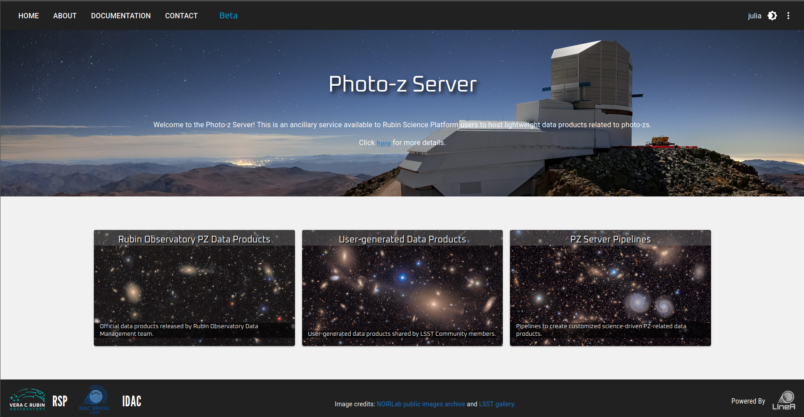

### Introduction 

Inspired by the DES Science Portal ([Gschwend et al., 2018](https://www.sciencedirect.com/science/article/abs/pii/S2213133718300891?via%3Dihub){:target="_blank"}; [Fausti Neto et al., 2018](https://www.sciencedirect.com/science/article/abs/pii/S2213133717300975){:target="_blank"}), the [Photo-z Server](https://pzserver.linea.org.br/) is an online service complementary to the Rubin Science Platform (RSP) to host and produce photo-z-related lightweight data products and to offer data management tools that allow sharing data products among RSP users, attach and share relevant metadata, and help on provenance tracking. 
 
The service is hosted at the Brazilian Independent Data Access Center (IDAC) and is open to the whole LSST Community without geographic constraints. It is designed to be as broad and generic as possible to be helpful for all LSST Science Collaborations working with photo-z data products. As required by the LSST in-kind program, the source code will be publicly available on [GitHub](https://github.com/linea-it/pzserver_app){:target="_blank"}.

The Photo-z Server was designed to help RSP users participate in the Photo-z (PZ) Validation Cooperative. This DM team initiative will occur during the LSST commissioning phase (see technical note [dmtn-049](https://dmtn-049.lsst.io/) for details). The PZ Coordination Group will receive "admin" user credentials with special permissions to add data products tagged as "official data products". 

During the PZ Validation Cooperative, the PZ Coordination Group can use the Photo-z Server to host and distribute standardized training and validation sets for algorithm performance comparison experiments and to collect the results from different users. Nonetheless, the Photo-z Server will continue serving the LSST Community in subsequent years. Beyond the PZ Validation Cooperative, RSP users can use the Photo-z Server to easily keep track of and share lightweight files containing various test results.


!!! info "Datasets"
     The Photo-z Server administrators maintain and periodically update a curated list of data resources to support the LSST Community with photo-z-related data products. Detailed descriptions and links to each data product are available on a [separate page](../data/pz_server_data.md).


### Photo-z Server website

The main user interface of the Photo-z Server website is its website at [pzserver.linea.org.br](https://pzserver.linea.org.br/). 


<p align="center">
  
</p>


The three cards on the landing page lead to the list of data products (left and center) or to the Photo-z Server pipelines (right). 

On the data products list page, users can browse, search and filter the products uploaded by users or created with the Photo-z Server pipeline. The data products uploaded on the PZ Server becomes automatically visible, downloadable and shareable to all registered users.    

<p align="center">
  
</p>


### Product types

#### Reference Redshift Catalog


Catalog of reference redshifts and positions of galaxies (usually spectroscopic redshifts and equatorial coordinates).


<font size=4>Basic requirements</font>

In the context of the PZ Server, Reference Redshift Catalogs are defined as any catalog containing spherical equatorial coordinates and redshift measurements (usually spectroscopic or true redshifts for simulations). A Reference Redshift Catalog can include data from a single spectroscopic survey or a combination of data from several sources. To be considered a single Reference Redshift Catalog, the data should be provided as a single file to Photo-z Server's upload tool (if your file is larger than the limit of 200MB, please contact the [Photo-z Server team](mailto:julia@linea.org.br)). 

Mandatory columns: 
* Right ascension [degrees] - `float`
* Declination [degrees] - `float`
* Redshift - `float`

Recommended columns: 
* Redshift error - `float`
* Quality flag - `integer`, `float`, or `string`
* Survey name


#### Training Set

Training set for photo-z algorithms (tabular data). It usually contains magnitudes, errors, and reference redshifts.

 
In the context of the PZ Server, Training Sets are defined as the product of the spatial cross-matching between a given Spec-z Catalog (single survey or compilation) and the photometric data, in this case, the LSST Objects Catalog. The PZ Server's *Training Set Maker* pipeline allows users to build customized Training Sets based on the available Spec-z Catalogs (details below).    

_Note 1: Training sets are commonly split into two or more subsets for photo-z validation purposes. If the Training Set owner has previously defined which objects should belong to each subset (training and validation/test sets), this information must be available as an extra column in the table or as clear instructions for reproducing the subset separation in the data product description._

  
_Note 2: The PZ Server only supports catalog-level Training Sets. Image-based Training Sets, e.g., for deep-learning algorithms, are not supported._


Mandatory column: 
* Spectroscopic (or true) redshift - `float`

Other expected columns
* Object ID from LSST Objects Catalog - `integer`
* Observables: magnitudes (and/or colors, or fluxes) from LSST Objects Catalog - `float`
* Observable errors: magnitude errors (and/or color errors, or flux errors) from LSST Objects Catalog - `float`
* Right ascension [degrees] - `float`
* Declination [degrees] - `float`
* Quality Flag - `integer`, `float`, or `string`
* Subset Flag - `integer`, `float`, or `string`


#### Training Results

Results of a photo-z training procedure (free format). Usually a pickle file created by RAIL Inform submodule.

The training results of machine learning-based PZ algorithms can also be hosted in the PZ Server to be shared and reused. This product type allows files in free format. When the training results are generated with RAIL, they are stored as *pickle* files and can be downloaded to the local work directory. 

OBS: The method `download_product` always brings the data as a compressed (.zip) file, regardless of the number of auxiliary files attached to the data. 


#### Validation Results

Results of a photo-z validation procedure (free format). Usually contains photo-z estimates (single estimates and/or pdf) of a validation set, photo-z validation metrics, validation plots, etc.


The PZ Server is also a good place to safely store the results of a photo-z validation procedure. Users can upload a list of files in free format, such as tabular files with photo-z estimates (single estimates and/or PDFs) of a validation set, auxiliary files with photo-z validation metrics, validation plots, etc. 


#### Photo-z Estimates

Results of a photo-z estimation procedure (usually the output of RAIL Estimate module). If the data is larger than the file upload limit (200MB), the product entry stores only the metadata (instructions on accessing the data should be provided in the description field.


Photo-z tables are the results of a photo-z estimation procedure. If the data is larger than the file upload limit of 200MB (for instance, the PZ tables for the LSST Object catalogs delivered as part of annual data releases), the product entry stores only the metadata (and instructions on accessing the data should be provided in the description field).

#### Other


### Upload a new data product 

To upload a new data product, click the button **NEW PRODUCT** on the top right of the [User-generated Data Products page](https://pzserver.linea.org.br/user_products) and fill in the Upload Form with relevant metadata. Description and auxiliary files are optional and can be modified later. 


<p align="center">
  
</p>

Depending on the data product type, if the data is tabular, the upload tool might require specific file formats. The formats currently supported are: CSV, FITS, HDF5, and Parquet[^dagger]. 

[^dagger]: Get in touch with the [development team](mailto:julia@linea.org.br) if your science case requires a different file format.  

### Download a data product

On the details page, some relevant metadata is displayed together with a table preview (when tabular data) and the rendered HTML auxiliary file, when available. 

<p align="center">
  
</p>

The download button triggers the download of a compressed .zip file with all the contents of the data product, including auxiliary description files. 

### Share data products

Each data product has a unique name, hereafter called "**internal_name**" automatically composed by the system as a unique **id** number plus the name chosen by the user with spaces replaced by underlines. This name is the URL address of the data product's details page on the PZ Server website (https://pzserver.linea.org.br/product/**internal_name**) and is the key to access the data using the Photo-z Server Python API (see details below). The easiest way to share a data product is by providing the product's **internal_name** or URL, which leads to the product's download page.


## Photo-z Server API 

The Photo-z Server also offers an API as a Python package to facilitate the command-line access of data and metadata. The API contains functions to explore the data products available, retrieve the contents of a given data product to work on memory or download the files of interest. 

The Python package `pzserver` is open source available on [GitHub](https://github.com/linea-it/pzserver){:target="_blank"} and is installable via pip with: 


```bash
pip install pzserver
```

### Tutorial notebook 

A [tutorial notebook](https://github.com/linea-it/pzserver/blob/main/docs/notebooks/pzserver_tutorial.ipynb) with examples for all `pzserver` methods is available on the [`pzserver` library's repository on GitHub](https://github.com/linea-it/pzserver). There is also the [Photo-z Server API documentation page](https://linea-it.github.io/pzserver){:target="_blank"} with further details targeted for developers. 

### Access token 

Once installed and imported in a Python environment, the `PzServer` class opens the remote connection to the PZ Server database. 

```python
from pzserver import PzServer
pz_server = PzServer(token="<paste your access token here>")  
``` 

An access token is required for authentication. The token can be generated by users on the PZ Server website (top right corner menu on the home page).    


 


### Basic commands  


Basic commands to display data and metadata in a Jupyter notebook cell (if not in a Jupyter notebook, replace `display` for `get` to return the results as Python dictionaries):  

```python
pz_server.display_product_types()
```

```python
pz_server.display_releases()
```

```python
pz_server.display_products_list() 
```

```python
pz_server.display_products_list(filters={"release": "DP1", 
                                         "product_type": "Training Set"})
```

```python
search_results = pz_server.get_products_list(filters={"product_type": "results"}) 
```

```python 
pz_server.display_product_metadata(<product_id>)
```

Basic commands to download or retrieve data to memory: 

```python 
pz_server.download_product(<product_id>, save_in=".")
```

```
data = pz_server.get_product(<product_id>)
```

Please see the [tutorial notebook](https://github.com/linea-it/pzserver/blob/main/docs/notebooks/pzserver_tutorial.ipynb) for the complete list of examples, including instructions to upload and modify data products via the `pzserver` library. 


## Photo-z Server pipelines 


&ensp; &ensp; [<font size=4>Combine Redshift Catalogs</font>](./crc.md)

&ensp; &ensp; [<font size=4>Training Set Maker</font>](./tsm.md)

  


## Acknowledgement 

The Photo-z Server uses computational resources of IDAC-Brazil at the Laboratório Interinstitucional de e-Astronomia (LIneA) with financial support from INCT do e-Universo (Process no. 465376/2014-2).


