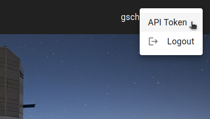

### Introduction 

Inspired by the DES Science Portal ([Gschwend et al., 2018](https://www.sciencedirect.com/science/article/abs/pii/S2213133718300891?via%3Dihub){:target="_blank"}; [Fausti Neto et al., 2018](https://www.sciencedirect.com/science/article/abs/pii/S2213133717300975){:target="_blank"}), the [Photo-z Server](https://pzserver.linea.org.br/) is an online service complementary to the Rubin Science Platform (RSP) to host and produce photo-z-related lightweight data products and to offer data management tools that allow sharing data products among RSP users, attach and share relevant metadata, and help on provenance tracking. 
 
The service is hosted at the Brazilian Independent Data Access Center (IDAC) and is open to the whole LSST Community without geographic constraints. It is designed to be as broad and generic as possible to be helpful for all LSST Science Collaborations working with photo-z data products. As required by the LSST in-kind program, the source code will be publicly available on [GitHub](https://github.com/linea-it/pzserver_app){:target="_blank"}.

The Photo-z Server was designed to help RSP users participate in the Photo-z (PZ) Validation Cooperative. This DM team initiative will occur during the LSST commissioning phase (see technical note [dmtn-049](https://dmtn-049.lsst.io/) for details). The PZ Coordination Group will receive "admin" user credentials with special permissions to add data products tagged as "official data products". 

During the PZ Validation Cooperative, the PZ Coordination Group can use the Photo-z Server to host and distribute standardized training and validation sets for algorithm performance comparison experiments and to collect the results from different users. Nonetheless, the Photo-z Server will continue serving the LSST Community in subsequent years. Beyond the PZ Validation Cooperative, RSP users can use the Photo-z Server to easily keep track of and share lightweight files containing various test results.

### Getting started

#### Photo-z Server website

The main user interface of the Photo-z Server website is its website at [pzserver.linea.org.br](https://pzserver.linea.org.br/). 


<p align="center">
  
</p>


The three cards on the landing page lead to the list of data products (left and center) or to the Photo-z Server pipelines (right). 

On the data products list page, users can browse, search and filter the products uploaded by users or created with the Photo-z Server pipeline. The data products uploaded on the PZ Server becomes automatically visible, downloadable and shareable to all registered users.    

<p align="center">
  
</p>


#### Data product types

The photo-z-related products are organized into four categories (product types):

* **Reference Redshift Catalog:** Catalog of reference redshifts and positions of galaxies (usually spectroscopic redshifts and equatorial coordinates).
* **Training Set:** Training set for photo-z algorithms (tabular data). It usually contains magnitudes, errors, and reference redshifts.
* **Training Results:** Results of a photo-z training procedure (free format). Usually a pickle file created by RAIL Inform submodule.
* **Validation Results:** Results of a photo-z validation procedure (free format). Usually contains photo-z estimates (single estimates and/or pdf) of a validation set, photo-z validation metrics, validation plots, etc.
* **Photo-z Estimates:** Results of a photo-z estimation procedure (usually the output of RAIL Estimate module). If the data is larger than the file upload limit (200MB), the product entry stores only the metadata (instructions on accessing the data should be provided in the description field.


#### Upload a new data product 

To upload a new data product, click the button **NEW PRODUCT** on the top right of the [User-generated Data Products page](https://pzserver.linea.org.br/user_products) and fill in the Upload Form with relevant metadata. Description and auxiliary files are optional and can be modified later. 


<p align="center">
  
</p>

Depending on the data product type, if the data is tabular, the upload tool might require specific file formats. The formats currently supported are: CSV, FITS, HDF5, and Parquet[^dagger]. 

[^dagger]: Get in touch with the development team if your science case requires a different file format.  

#### Share data products

Each data product has a unique name, hereafter called "**internal_name**" automatically composed by the system as a unique **id** number plus the name chosen by the user with spaces replaced by underlines. This name is the URL address of the data product's details page on the PZ Server website (pzserver.linea.org.br/product/**internal_name**) and is the key to access the data using the Photo-z Server Python API (see details below). The easiest way to share a data product is by providing the product's **internal_name** or URL, which leads to the product's download page.

#### Download a data product

On the details page, some relevant metadata is displayed together with a table preview (when tabular data) and the rendered HTML auxiliary file, when available. 

<p align="center">
  
</p>

The download button triggers the download of a compressed .zip file with all the contents of the data product, including auxiliary description files. 

### Photo-z Server API 

The Photo-z Server also offers an API as a Python package to facilitate the command-line access of data and metadata. The API contains functions to explore the data products available, retrieve the contents of a given data product to work on memory or download the files of interest. 

The Python package `pzserver` is open source available on [GitHub](https://github.com/linea-it/pzserver){:target="_blank"} and is installable via pip with: 


```bash
pip install pzserver
```

#### Tutorial notebook 

A [tutorial notebook](https://github.com/linea-it/pzserver/blob/main/docs/notebooks/pzserver_tutorial.ipynb) with examples for all `pzserver` methods is available on the [`pzserver` library's repository on GitHub](https://github.com/linea-it/pzserver). There is also the [Photo-z Server API documentation page](https://linea-it.github.io/pzserver){:target="_blank"} with further details targeted for developers. 

#### Access token 

Once installed and imported in a Python environment, the `PzServer` class opens the remote connection to the PZ Server database. 

```python
from pzserver import PzServer
pz_server = PzServer(token="<paste your access token here>")  
``` 

An access token is required for authentication. The token can be generated by users on the PZ Server website (top right corner menu on the home page).    


 


#### Basic commands  


Basic commands to display data and metadata in a Jupyter notebook cell (if not in a Jupyter notebook, replace `display` for `get` to return the results as Python dictionaries):  

```python
pz_server.display_product_types()
```

```python
pz_server.display_releases()
```

```python
pz_server.display_products_list() 
```

```python
pz_server.display_products_list(filters={"release": "DP1", "product_type": "Training Set"})
```

```python
search_results = pz_server.get_products_list(filters={"product_type": "training results"}) 
```

```python 
pz_server.display_product_metadata(<product_id>)
```

Basic commands to download or retrieve data to memory: 

```python 
pz_server.download_product(<product_id>, save_in=".")
```

```
training_set = pz_server.get_product(<training_set_id>)
training_set.display_metadata()
```

Please see the [tutorial notebook](https://github.com/linea-it/pzserver/blob/main/docs/notebooks/pzserver_tutorial.ipynb) for the complete list of examples, including methods for specific product types, instructions to upload and modify data products via the `pzserver` library. 

## Photo-z Server Pipelines

### Combine Redshift Catalogs

The **Combine Redshift Catalogs** pipeline allows users to generate a single, unified redshift sample by combining multiple individual redshift catalogs. It performs spatial crossmatching to identify multiple measurements of the same galaxy and offers flexible options to resolve or retain duplicates.

This pipeline is especially useful for preparing clean redshift samples that can be used as training sets, validation sets, or calibration inputs for photometric redshift (photo-z) estimation.

---

#### How the Pipeline Works

##### 1. Input Catalog Preparation
Each selected redshift catalog goes through a preparation step:

- The catalog is read using Dask for efficient processing.
- A unique identifier called `CRD_ID` is assigned to each object. This ID is sequential across all catalogs (e.g., the second catalog starts counting where the first ended).
- The pipeline attempts to translate redshift quality flags and object types to the internal homogenized system. For this to work, the catalog must contain a `survey` column with uppercase string values (e.g., `2DFGRS`, `2DFLENS`, etc.) that match a survey supported in the internal translation YAML. 
- If the user selects to resolve duplicates, each catalog is checked for internal duplicates based on exact matches in RA and DEC (rounded to 6 decimal places).

For administrators uploading official spectroscopic catalogs to the PZServer, please contact the LIneA team so we can update the internal YAML file used to translate quality flags and object types. This ensures that the original flags are properly mapped and interpreted by the pipeline. This process maps original survey-specific values into a standardized system inspired by VVDS:

###### Standard quality flag system:
- 0: No redshift
- 1: Low confidence (<70%)
- 2: Medium confidence (70–90%)
- 3: High confidence (90–99%)
- 4: Very high confidence (>99%)
- 6: Star (non-extragalactic)

###### Object types:
- `s`: Spectroscopic
- `g`: Grism
- `p`: Photometric

If the catalog is **user-uploaded**, users are responsible for ensuring that the columns `z_flag_homogenized` and `type_homogenized` are present in the dataset. These column names must match exactly and follow the standard system described above. Even if the catalog includes a `survey` column and the original quality flags, automatic translation may not work if the survey is not yet supported in the internal YAML. Providing homogenized columns directly is the only way to guarantee correct behavior for user-uploaded catalogs.

Additionally, the pipeline flags objects that fall within key Deep Drilling Fields (DP1 regions), such as ECDFS, EDFS, 47 Tuc, Fornax, and others.

---

##### 2. Duplicate Resolution Within a Single Catalog
When the user selects to resolve duplicates, each catalog is checked for objects with identical sky positions (RA and DEC rounded to 6 decimal places). The following logic is used:

- Objects with the same rounded RA/DEC are grouped.
- Tie-breaking is applied in fixed priority order:
    - `z_flag_homogenized` (higher is better, 6 = star is eliminated)
    - `type_homogenized` (priority: `s > g > p`)
- In each round:
    - Objects with the best score are retained for the next round.
    - Others are eliminated.
- If a tie persists after all columns:
    - The pipeline applies the fixed threshold `delta_z_threshold = 0.0005`. If the redshift difference is smaller than 0.0005, one entry is selected and the other eliminated. If the redshift difference is greater than 0.0005, the pair is kept as a hard tie (`tie_result = 2`).
- Final labels:
    - `tie_result = 1`: selected object
    - `tie_result = 0`: eliminated
    - `tie_result = 2`: unresolved tie

This process aims to ensure that each sky position in a catalog contributes at most one object to the final sample, according to scientifically-motivated priorities. However, in some cases unresolved ties (hard ties) may remain if no clear winner can be determined, and those will be labeled with `tie_result = 2`.

---

##### 3. Cross-Catalog Duplicate Resolution
When combining multiple catalogs with duplicate resolution enabled, the pipeline uses LSDB to perform crossmatches between catalogs. For each matched pair:

- Tie-breaking is applied in fixed priority order:
    1. `z_flag_homogenized` (higher is better; entries with value 6, indicating stars, are eliminated).
    2. `type_homogenized` (priority order: `s > g > p`).

- Missing values (NaNs) are handled with fallback logic:
    - If both sides have valid values, the higher one wins.
    - If only one side has a value, it's remembered as a fallback.
    - If no column resolves the tie, the fallback is used.
    - If all values are NaN or equal, the pair is marked as a hard tie (`tie_result = 2`).

- If a hard tie remains, the pipeline applies the fixed `delta_z_threshold = 0.0005`:
    - If the redshift difference is smaller than 0.0005, one of the entries is kept.
    - If the redshift difference is greater than 0.0005, the pair is kept as a hard tie (`tie_result = 2`).

- Final decisions are stored in `tie_result`, and the `compared_to` field lists all other IDs that were considered during tie-breaking.

---

##### 4. Output Options
After combining and resolving duplicates (if selected), the final dataset is cleaned and saved.

- Columns with only missing or empty values are dropped.
- If the option **"Yes, and remove duplicates"** is selected, **only rows with `tie_result == 1` are retained**.
- The final file can be saved in one of the following formats:
    - Parquet
    - HDF5
    - CSV
    - FITS

---

#### User Interface Options
When running the pipeline from the Photo-z Server UI, users must provide the following:

1. **Combined catalog name**  
   Name that will be used to register the result in the system.

2. **Description** *(optional)*  
   Any description or notes about the sample.

3. **Select Redshift Catalogs**  
   Choose one or more catalogs already available in the system.

4. **Resolve duplicates**
     - **No**: Simply concatenate the catalogs (stacking objects with the same columns).
     - **Yes, but keep all**: Identify duplicates and add `tie_result` information, but retain all entries.
     - **Yes, and remove duplicates**: Identify and **keep only the best measurement** per galaxy (only rows with `tie_result == 1`).

5. **Output format**  
   Choose one: Parquet, HDF5, CSV, or FITS.

Once these fields are filled in, users can click **Run** to execute the pipeline.

---

#### Summary of Modes
| UI Option                      | Description                                                                 |
|-------------------------------|-----------------------------------------------------------------------------|
| **No**                        | Stack all catalogs without resolving duplicates                            |
| **Yes, but keep all**         | Identify duplicates and annotate with `tie_result`, but keep all entries   |
| **Yes, and remove duplicates**| Identify duplicates and keep only one per object (`tie_result == 1`)       |

---

For more advanced configurations or questions, please contact the LIneA team.