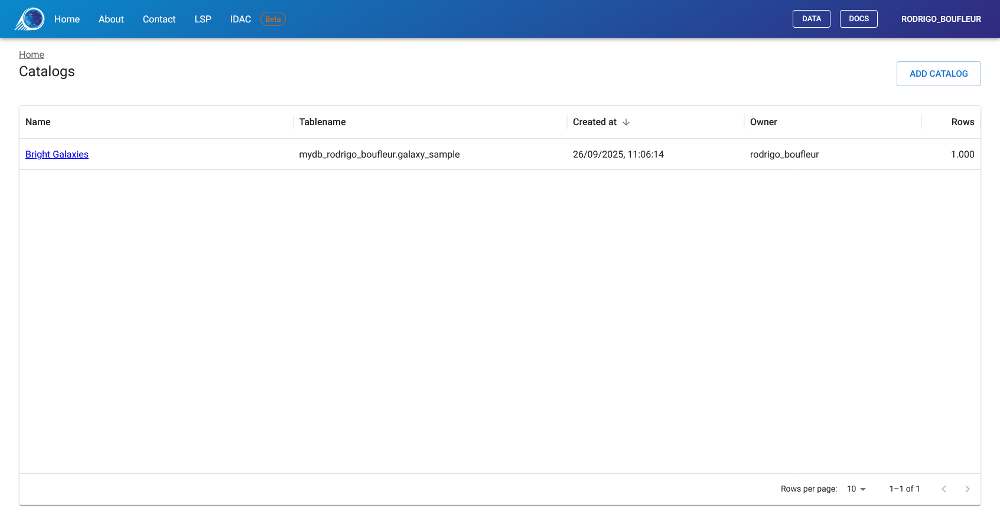
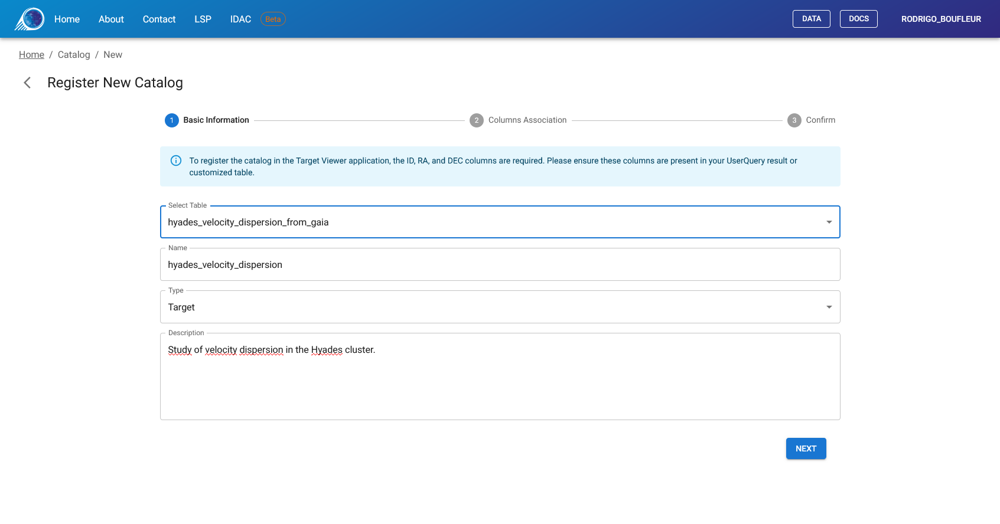
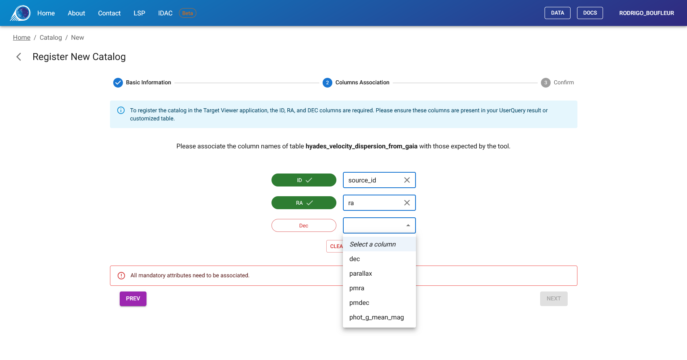
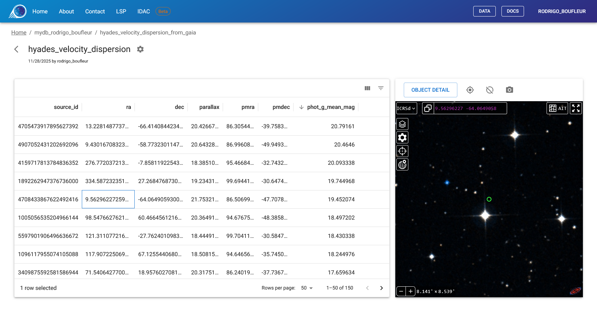

[*Target Viewer*](https://target.linea.org.br) is a customized tool for visualizing astronomical images based on lists of target objects previously defined by the user. The system uses *Aladin Lite v3* to provide an integrated experience for exploring catalogs stored in the user's personal database space.

Similarly to *Sky Viewer*, *Target Viewer* was originally developed within the scope of the *DES* (*Dark Energy Survey*) project. The current iteration, architected to integrate with the IDAC-Brazil service portfolio, is a flexible solution offering differentiated access levels: public data intended for the general community and embargoed data (such as LSST) restricted to authenticated members.

## Overview

*Target Viewer* enables astronomers to:

- Register custom tables as target catalogs
- Visualize astronomical images centered on each target object
- Navigate through large catalogs with advanced filtering and sorting
- Customize visualization settings per catalog

---

## Getting Started

### Step 1: Create Your Target List in User Query

Before using *Target Viewer*, you need to create a table containing your target objects using [*User Query*](https://userquery.linea.org.br/query).

Your table must contain at least three columns:
- An **object identifier** (e.g., `objectId`, `id`)
- **Right Ascension** in decimal degrees (e.g., `ra`)
- **Declination** in decimal degrees (e.g., `dec`)

You can create this table by:
- Running a SQL query and saving the results
- Joining existing catalog data with your selection criteria

!!! note
    For detailed instructions on creating and saving tables, see the [User Query Documentation](https://docs.linea.org.br/userquery).

### Step 2: Register Your Table in Target Viewer

1. Access [*Target Viewer*](https://targetviewer.linea.org.br) and sign in
2. Click **"Add Catalog"** on the home page
3. Follow the 3-step registration wizard (detailed below)

### Step 3: Visualize Your Targets

After registration, your catalog appears on the home page. Click on it to start exploring your targets with astronomical imagery.

## Home Page

The home page displays all your registered catalogs. Each entry shows the catalog name, original table name, creation date, and row count.

Click on a catalog name to open the visualization interface, or use the **"Add Catalog"** button to register a new table.

---

## Registering a New Catalog

The registration process has three steps. If interrupted, the system will prompt you to continue or discard the pending registration upon your next visit.

### Step 1: Basic Information

Select your table from the dropdown list and provide a descriptive title. Only tables not yet registered will appear in the list.

### Step 2: Column Association

This step maps your table columns to the required fields. The system needs to know which columns contain the object ID, RA, and Dec.

The interface shows each required field with a colored indicator:

- 🔴 **Red** = Not yet mapped (required)
- 🟢 **Green** = Successfully mapped

Select the appropriate column from your table for each required field. The "Complete Registration" button becomes available only when all required fields are mapped.

**Required mappings:**

- **ID**: Your object identifier column
- **RA**: Right Ascension column (must be in decimal degrees)
- **Dec**: Declination column (must be in decimal degrees)

### Step 3: Confirmation

Review your settings and click **"Complete Registration"** to finish. Your catalog will immediately appear on the home page.

---

## Catalog Visualization

The main visualization interface is divided into two panels:

- **Left panel**: Data grid with your catalog records
- **Right panel**: *Aladin Lite* astronomical image viewer

### Using the Data Grid

The data grid displays all records from your catalog with full sorting and filtering capabilities.

**Navigation:**

- Click column headers to sort
- Use the filter icons to apply conditions (equals, contains, greater than, etc.)
- Navigate pages using the controls at the bottom

**Selection:**

- Click any row to select it
- The *Aladin Lite* viewer automatically centers on the selected object
- A marker circle indicates the target position

!!! note
    Selection is preserved while the browser tab remains open. Refreshing the page keeps your selection, but closing the tab clears it.

### Toolbar Actions

Above the *Aladin Lite* viewer, a toolbar provides quick actions for the selected target:

- **Object Detail**: Opens a detailed view in a new tab showing all object properties
- **Center on Target**: Re-centers the viewer on the selected object
- **Show/Hide Marker**: Toggles visibility of the target marker circle
- **Take Snapshot**: Downloads the current view as an image

## Object Detail View

Click **"Object Detail"** to open a dedicated page for the selected target. This view shows:

- **Left panel**: All properties from your catalog in a table format
- **Right panel**: Full *Aladin Lite* viewer centered on the object

This is useful for detailed inspection or sharing a link to a specific object.

## Catalog Settings

Catalog owners can access settings by clicking the gear icon (⚙️) in the catalog header.

### Available Settings

**Metadata:**

- Update the catalog title and description

**Visualization:**

- **Default Survey**: Choose which background image to display
- **Default FOV**: Set the initial field of view (in arcminutes)
- **Marker Radius**: Set the target marker size (in arcseconds)

**Column Association:**

- Modify the ID/RA/Dec column mappings if needed

**Remove Catalog:**

- Delete the catalog registration (does not affect the original table)

## Available Image Surveys Hosted at LIneA

The following surveys are available as background images:

| Survey Name | Access | Description |
|-------------|--------|-------------|
| *DES DR2 IRG* | Public | *Dark Energy Survey* Data Release 2 (Color composite) |
| *Rubin First Look* | Public | Initial public images from Rubin Observatory |
| *LSST DP0.2* | Restricted | *Data Preview 0.2* (Simulation). Exclusive to members. |
| *LSST DP1* | Restricted | *Data Preview 1*. Exclusive to members. |

Restricted surveys only appear in the dropdown if you belong to the required collaboration group. Authentication is handled automatically through the *LIneA Science Platform*.

!!! note
    In addition to the surveys hosted at LIneA, you can access any public survey or catalog overlay from CDS using the native *Aladin Lite* menus described below.

## Aladin Lite Viewer Reference

*Target Viewer* uses *Aladin Lite v3* for astronomical image visualization. This section describes the viewer's native features, which are independent of the *Target Viewer* application.

### Search Bar

Located at the top of the viewer. Navigate to any position by:

- **Coordinates**: Enter decimal or sexagesimal format (e.g., `13 25 27.6 -43 01 09`)
- **Object name**: Enter an identifier (e.g., `NGC 4755`) to resolve via the *Sesame* service

### Layer Manager (Stack Icon)

Access remote catalogs and surveys from CDS:

- **Overlays**: Add catalog layers from SIMBAD, Gaia, 2MASS, and others
- **Surveys**: Switch between different image surveys from remote servers

### Image Controls

When a survey is selected in the Layer Manager:

- **Contrast**: Adjust brightness, saturation, and gamma
- **Opacity**: Control layer transparency
- **Colormap**: Change color rendering (Rainbow, Heatmap, Grayscale, etc.)

### Settings (Gear Icon)

Toggle visualization aids:

- **Coordinate Grid**: Display RA/Dec grid lines
- **Reticle**: Show central crosshair
- **HEALPix Grid**: Display tessellation grid

### Coordinate Systems

Switch between reference frames:

- **ICRS**: Equatorial coordinates (sexagesimal)
- **ICRSd**: Equatorial coordinates (decimal degrees)
- **GAL**: Galactic coordinates

### Projections

Available map projections:

- **Tangential**: Best for small fields, straight great circles
- **Stereographic**: Preserves shapes, good for moderate fields
- **Spheric**: Virtual globe view
- **Zenital equal-area**: Preserves area, good for density studies
- **Mercator**: Cylindrical, good for equatorial regions
- **Hammer-Aitoff**: All-sky equal-area ellipse
- **Mollweide**: All-sky pseudocylindrical

### Context Menu (Right-Click)

- **What is this?**: Query SIMBAD for objects at click position
- **Copy Coordinates**: Copy RA/Dec to clipboard
- **Take a snapshot**: Download current view as image
- **Select sources**: Draw regions to filter catalog points

### Acknowledgements

This application uses the *Aladin sky atlas* developed at CDS, Strasbourg Observatory, France:

- [2000A&AS..143...33B](https://ui.adsabs.harvard.edu/abs/2000A%26AS..143...33B/abstract) (Aladin Desktop)
- [2014ASPC..485..277B](https://ui.adsabs.harvard.edu/abs/2014ASPC..485..277B/abstract) (Aladin Lite v2)
- [2022ASPC..532....7B](https://ui.adsabs.harvard.edu/abs/2022ASPC..532....7B/abstract) (Aladin Lite v3)

## Support

For questions or issues, contact us through the [*LIneA Science Platform*](https://scienceplatform.linea.org.br/contact) or visit our [Documentation Portal](https://docs.linea.org.br).
