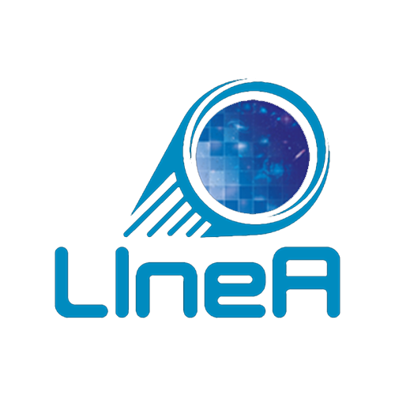
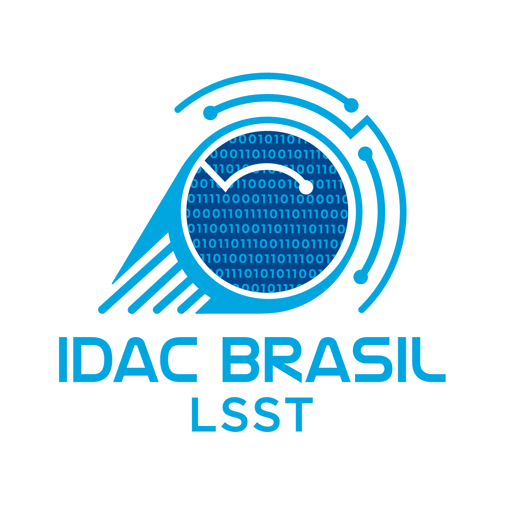

## Reconocimiento del uso de los recursos computacionales de LIneA

Modelos texto sugeridas para reconocer el uso de las colecciones de datos o los recursos computacionales de LIneA en publicaciones científicas, presentaciones y otros trabajos académicos.

### Uso de los recursos de IDAC-BR

Para usuarios de IDAC-BR (miembros del proyecto LSST):

En inglés:

> _"This work makes use of the computing resources provided by IDAC-Brazil, made available as a contribution of the Laboratório Interinstitucional de e-Astronomia (LIneA) to the Rubin community through the Rubin In-Kind program (contribution ID BRA-LIN-S1), and was supported by FINEP under grants 0311/16 and 0883/24, by the INCT do e-Universo program with funding from CNPq (grant 465376/2014-2), and by FAPERJ (grants E-26/200.965/2018, E-26/201.681/2019, E-26/210.010/2018, and E-26/211.013/2019)."_ 

En español:

> _"Este trabajo hace uso de los recursos computacionales proporcionados por IDAC-Brazil, disponibles como una contribución del Laboratório Interinstitucional de e-Astronomia (LIneA) a la comunidad Rubin a través del programa Rubin In-Kind (contribución ID BRA-LIN-S1), y fue apoyado por FINEP bajo las subvenciones 0311/16 y 0883/24, por el programa INCT do e-Universo con financiamiento del CNPq (subvención 465376/2014-2), y por FAPERJ (subvenciones E-26/200.965/2018, E-26/201.681/2019, E-26/210.010/2018 y E-26/211.013/2019)."_ 

### Uso de los recursos del LIneA 

Para miembros de la comunidad brasileña con proyectos seleccionados en convocatorias públicas (por ejemplo, SINCADA) y usuarios de los servicios gratuitos de LIneA en general:

En inglés:

> _“This work was developed with the support of the Laboratório Interinstitucional de e-Astronomia (LIneA), supported by FINEP under grants 0311/16 and 0883/24, and by the INCT do e-Universo program, with funding from CNPq (grant 465376 2014-2) and FAPERJ (grants E-26/200.965/2018, E-26/201.681/2019, E-26/210.010/2018, and E-26/211.013/2019).”_
 
 
En español:

> _“Este trabajo fue desarrollado con el apoyo del Laboratório Interinstitucional de e-Astronomia (LIneA), responsable de la contribución in-kind BRA-LIN al Observatorio Vera C. Rubin. Las actividades de LIneA fueron financiadas por FINEP mediante las subvenciones n.º 0311/16 y n.º 0883/24, y por el programa INCT do e-Universo, con financiamiento del CNPq (subvención n.º 465376/2014-2) y de la FAPERJ (subvenciones n.º E-26/200.965/2018, E-26/201.681/2019, E-26/210.010/2018 y E-26/211.013/2019).”_ 

## Logos para presentaciones 

  
   
  <a href="../images/logo-linea.fw_2.png" 
   download="logo-linea-azul-completo.png" 
   style="display: inline-block; margin-top: 10px; padding: 8px 16px; background-color: #007bff; color: white; text-decoration: none; border-radius: 4px;">
   Download PNG
  </a>

  
   
  <a href="../images/04_LSST_sstidecbrasil_RGB_POSITIVA_ec.png" 
   download="logo-linea-azul.png" 
   style="display: inline-block; margin-top: 10px; padding: 8px 16px; background-color: #007bff; color: white; text-decoration: none; border-radius: 4px;">
   Download PNG
  </a>

