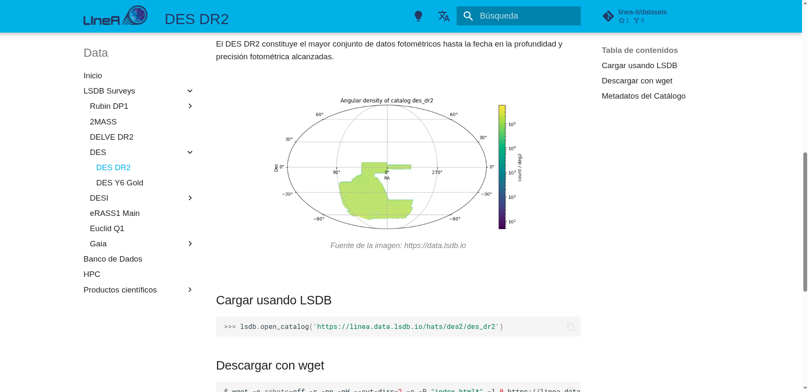

# Repositorio de Datos

Todo el repositorio de datos alojado en LIneA está documentado en el sitio web [data.linea.org.br](https://data.linea.org.br/es/index.html). Allí encontrarás información relevante sobre los conjuntos de datos, enlaces a sus respectivas publicaciones y sitios web de los surveys de origen, así como instrucciones de acceso a través de las plataformas científicas y APIs.

    
<a href="https://data.linea.org.br/es/index.html" target="_blank" rel="noopener noreferrer"><strong><u>data.linea.org.br</strong></u></a> 

