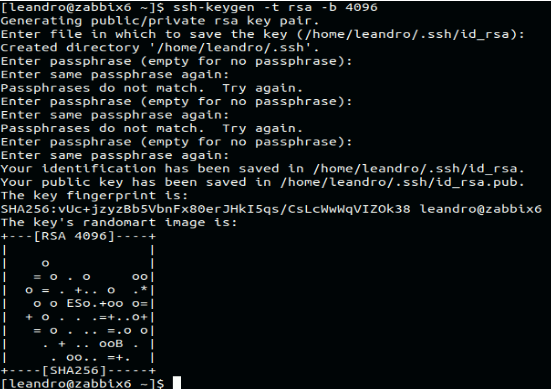
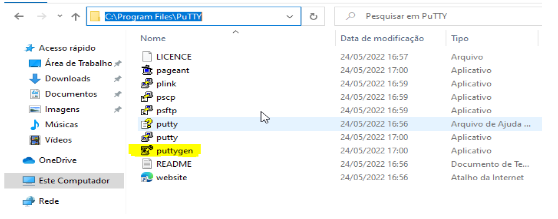
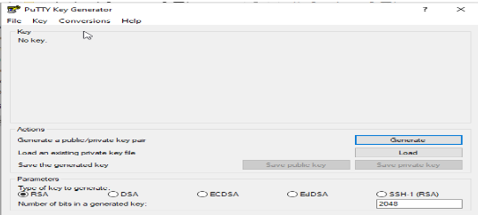
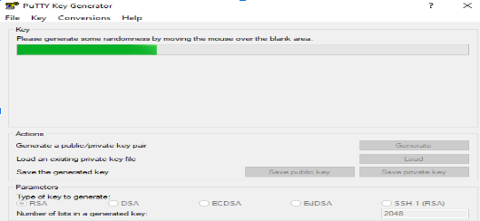
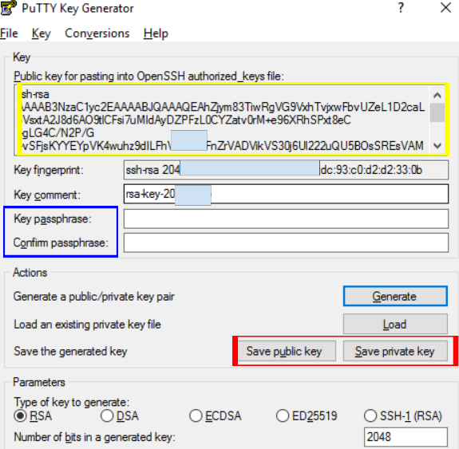
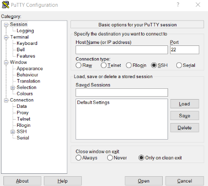
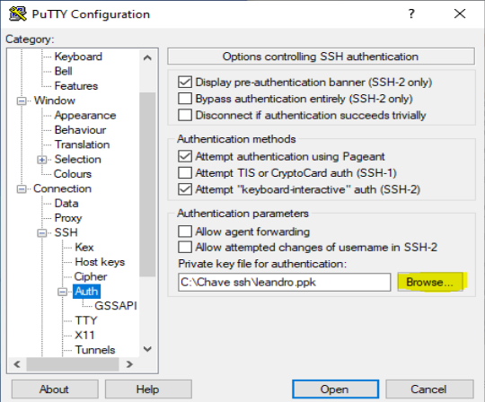
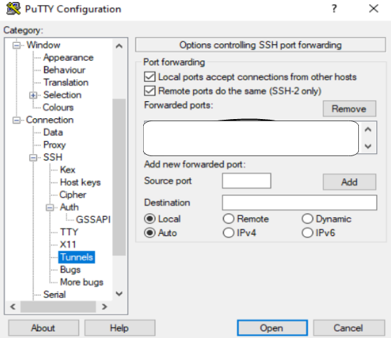
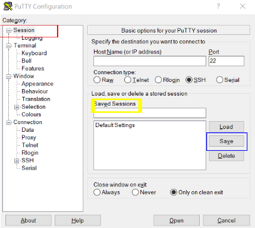

## Cómo crear un par de claves SSH

Para acceder a nuestro entorno vía SSH es necesario generar un par de claves siguiendo los pasos indicados a continuación:

### Linux

a) Para generar el par de claves utilice el siguiente comando en su terminal.

    ssh-keygen -t rsa -b 4096
    
    Generating public/private rsa key pair.
    Enter file in which to save the key (/root/.ssh/id_rsa):  [presione ENTER]
    Created directory '/root/.ssh'.
    Enter passphrase (empty for no passphrase): [introduzca una contraseña y presione ENTER para confirmar]
    Enter same passphrase again: [repita la contraseña y presione ENTER]

b) Tras recibir el mensaje de que la clave fue generada, puede ver los dos archivos creados listando el contenido del directorio `ls $HOME/.ssh id_rsa  id_rsa.pub`

c) Una vez generadas las claves, envíe la clave **.pub** al equipo de TI por correo electrónico a [helpdesk@linea.org.br](mailto:helpdesk@linea.org.br). El equipo de TI de LIneA configurará la clave en el servidor y le enviará instrucciones para acceder al clúster *Apollo*. ***Aguarde la confirmación***.

### Windows

Para generar un par de claves en el sistema operativo Windows:

a) Descargue e instale la aplicación *PuTTY*.

b) Acceda a la carpeta donde se instaló el programa (esta instalación se realizó en Windows 10) `C:\Program File\PuTTY` (la ruta puede variar según el sistema operativo). Abra el programa *PuTTYgen*.

c) Haga clic en *Generate* (mantenga el tipo de clave como **RSA**).

**NOTA: Mover el puntero del ratón ayuda a generar la clave más rápidamente, ya que genera bits aleatorios**.

d) Par de claves generado con éxito.

 - Copie la clave pública para guardarla en el servidor (detalle en la imagen en amarillo);
 - Establezca una contraseña para la clave pública (detalle en la imagen en azul);
 - Tras copiar, guarde las claves pública y privada en su computadora (detalle en la imagen en rojo) y envíe la clave `.pub` al equipo de TI por correo electrónico a [helpdesk@linea.org.br](mailto:helpdesk@linea.org.br). El equipo de TI de LIneA configurará la clave en el servidor. ***Aguarde la confirmación***.

    
e) Tras recibir el correo electrónico de confirmación de que la clave `.pub` fue registrada en el servidor de acceso, realice las configuraciones en el programa *PuTTY*.
    
 - Cree un acceso directo en el escritorio y abra *PuTTY*;
 - Introduzca en Hostname: login.linea.org.br.

f) En el lado izquierdo, vaya a la opción `SSH > Auth (detalle en azul) > haga clic en Browse (detalle en amarillo) y seleccione la clave a utilizar con extensión .ppk`.

h) En caso de necesitar utilizar algún túnel, realice la siguiente configuración.    
**NOTA: los túneles se configuran según lo que el usuario vaya a acceder**

- Vaya a la opción *Tunnels* (lado izquierdo);
- En *Source port* introduzca el puerto;
- *Destination* > introduzca la dirección de destino > *Add*.

Regrese al lado izquierdo y vaya a la primera opción del menú `Session (en rojo), introduzca el nombre de la sesión (en amarillo) y haga clic en Save (en azul)`. Para acceder, haga clic en `Open`.

