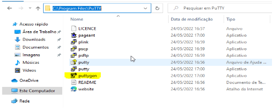
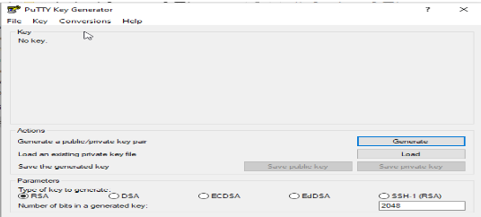
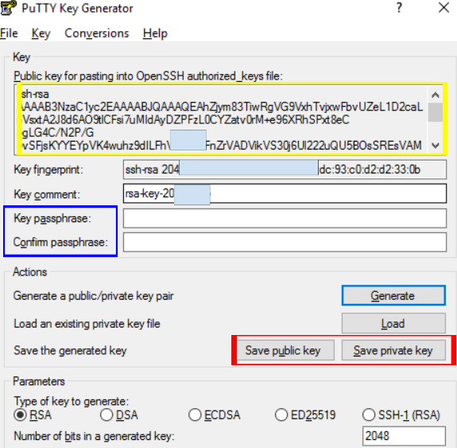
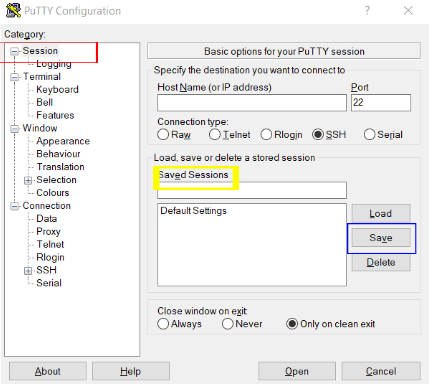

## Cómo crear un par de claves SSH
Para acceder a nuestro entorno via ssh necesitas generar un par de claves siguiendo estos pasos:

### Linux
a) Para generar el par de claves usa el siguiente comando en tu terminal:
    
    ssh-keygen -t rsa -b 4096
    
    Generating public/private rsa key pair.
    Enter file in which to save the key (/root/.ssh/id_rsa):  [presiona ENTER]
    Created directory '/root/.ssh'.
    Enter passphrase (empty for no passphrase): [ingresa una contraseña y presiona ENTER]
    Enter same passphrase again: [repite la contraseña y presiona ENTER]

b) Después de recibir el mensaje de que la clave fue generada. Puedes ver los dos archivos creados listando el contenido del directorio: `ls $HOME/.ssh id_rsa id_rsa.pub`
c) Después de generar las claves, envía la clave **.pub** al equipo de TI por correo [helpdesk@linea.org.br](mailto:helpdesk@linea.org.br). El equipo de TI de LIneA configurará la clave en el servidor y te enviará instrucciones para acceder al cluster Apollo. ***Espera la confirmación***.

### Windows
Para generar pares de claves en Windows:
a) Descarga e instala la aplicación Putty.
b) Accede a la carpeta de instalación (este ejemplo usa Windows 10) `C:\Program File\PuTTY` (la ruta puede variar según el SO), abre Puttygen.

c) Haz clic en Generate (mantén el tipo de clave como **RSA**).

**NOTA: Mover el puntero del mouse ayuda a generar la clave más rápido al crear bits aleatorios**.

d) Par de claves generado exitosamente.

- Copia la clave pública para guardarla en el servidor (resaltado en amarillo en la imagen);
- Establece una contraseña para la clave pública (resaltado en azul);
- Después de copiar, guarda ambas claves (pública y privada) en tu computadora (resaltado en rojo) y envía la clave `.pub` al equipo de TI por correo [helpdesk@linea.org.br](mailto:helpdesk@linea.org.br). El equipo de TI de LIneA configurará la clave en el servidor. ***Espera la confirmación***.

e) Después de recibir el correo de confirmación de que la clave `.pub` fue registrada en el servidor, configura el programa `Putty`.

- Crea un acceso directo en el escritorio, abre `PuTTY`;
- Ingresa Hostname: login.linea.org.br.

f) En el lado izquierdo ve a `SSH > Auth (resaltado en azul) > haz clic en Browse (resaltado en amarillo) y selecciona el archivo de clave con extensión .ppk`.

h) Si necesitas usar un túnel, haz la siguiente configuración.
**NOTA: los túneles se configuran según lo que el usuario necesite acceder**
- Ve a la opción Tunnels (lado izquierdo);
- En Source port ingresa el número de puerto;
- Destination > ingresa la dirección de destino > Add.

Regresa al lado izquierdo y ve a la primera opción del menú `Session (resaltado en rojo) ingresa un nombre para la sesión (resaltado en amarillo) y haz clic en Save (resaltado en azul)`, para conectarte haz clic en `Open`.

