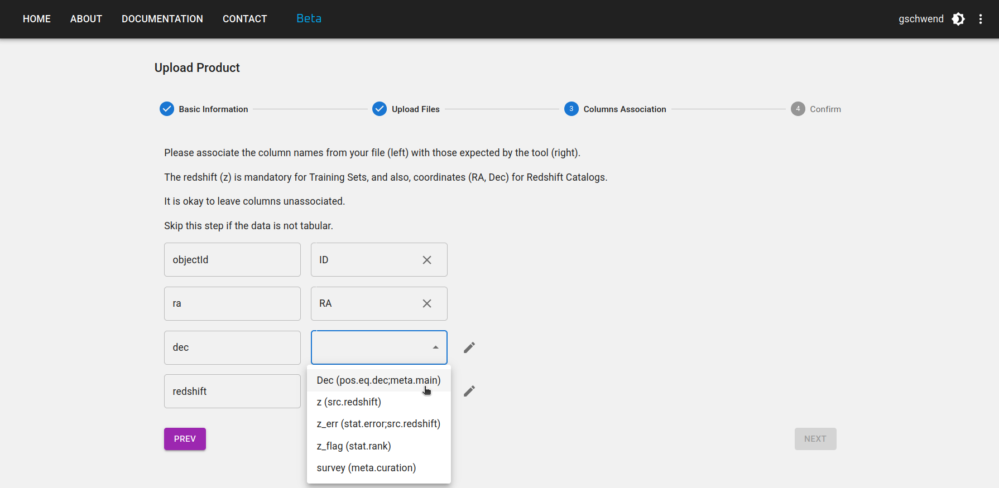

### Advertencia

!!! danger "Advertencia sobre la versión ES"
    Esta es una traducción del documento original disponible en inglés. Elegimos no traducir los nombres de los pipelines y los tipos de productos para mantener los nombres consistentes con los que aparecen en el Photo-z Server. Además, no traducimos extractos de código para mantenerlos consistentes con el tutorial disponible como Jupyter notebook en el repositorio de la biblioteca Python `pzserver`.

### Introducción

Inspirado en el DES Science Portal ([Gschwend et al., 2018](https://www.sciencedirect.com/science/article/abs/pii/S2213133718300891?via%3Dihub){:target="_blank"}; [Fausti Neto et al., 2018](https://www.sciencedirect.com/science/article/abs/pii/S2213133717300975){:target="_blank"}), el [Photo-z Server](https://pzserver.linea.org.br/) es un servicio online complementario a la Rubin Science Platform (RSP) para alojar y producir productos de datos ligeros relacionados con photo-z y ofrecer herramientas de gestión de datos que permiten compartir productos de datos entre usuarios de la RSP, adjuntar y compartir metadatos relevantes y facilitar el rastreo de procedencia.

El servicio se aloja en el Brazilian Independent Data Access Center ([IDAC](https://scienceplatform.linea.org.br/idac)) y está abierto a toda la comunidad LSST, sin restricciones geográficas. Su diseño es lo más amplio y genérico posible para facilitar la colaboración científica de LSST con productos de datos de photo-z. Según lo exige el programa de contribuciones _in-kind_ de LSST, el código fuente está disponible públicamente en [GitHub](https://github.com/linea-it/pzserver_app){:target="_blank"}.

El Photo-z Server se diseñó para ayudar a los usuarios de RSP a participar en el Photo-z (PZ) Validation Cooperative. Esta iniciativa del equipo Data Management (DM) se llevará a cabo durante la fase de commissioning de LSST (consulte la nota técnica [dmtn-049](https://dmtn-049.lsst.io/) para obtener más información). El grupo de coordinación de PZ recibirá credenciales de usuario admin con permisos especiales para agregar productos de datos etiquetados como _official data products_. Estos incluirán conjuntos estandarizados de entrenamiento y validación utilizados para comparar el rendimiento de los algoritmos, así como un medio para recopilar resultados de múltiples usuarios.

Más allá de el PZ Validation Cooperative, el Photo-z Server seguirá siendo un recurso para la Comunidad LSST en los próximos años. Los usuarios de RSP podrán seguir utilizándolo para organizar, rastrear y compartir archivos ligeros con diversos resultados de pruebas.


!!! tip "Datasets"
    Los administradores del Photo-z Server mantienen y actualizan periódicamente una lista seleccionada de recursos de datos para apoyar a la comunidad LSST con productos de datos relacionados con photo-z. Las descripciones detalladas y los enlaces a cada producto de datos están disponibles en una [página aparte](../../en/data/pz_server_data.md).


### Sitio web del Photo-z Server

La interfaz de usuario principal del Photo-z Server es su sitio web en [pzserver.linea.org.br](https://pzserver.linea.org.br/).

<p align="center">

</p>

Los tres cards de la página de inicio conducen a la lista de productos de datos (izquierda y centro) o a los pipelines del Photo-z Server (derecha).

En la página de la lista de productos de datos, los usuarios pueden explorar, buscar y filtrar los productos subidos por otros usuarios o creados con un pipeline del Photo-z Server. Los productos de datos subidos al Photo-z Server se vuelven automáticamente visibles, descargables y compartibles para todos los usuarios registrados.

<p align="center">

</p>

### Cargar un nuevo producto de datos

Para cargar un nuevo producto de datos, haga clic en el botón **NUEVO PRODUCTO** en la esquina superior derecha de la [User-generated Data Products page](https://pzserver.linea.org.br/user_products) y complete el formulario con los metadatos relevantes en cuatro pasos:

**Paso 1:** Ingrese un nombre corto y mnemotécnico para su nuevo producto de datos. Seleccione el tipo de producto de datos que va a cargar (p. ej., Reference Redshift Catalog, Training Set, etc.) y el release a que pertenece (si corresponde).

<p align="center">

</p>

**Paso 2:** Seleccione su archivo principal y todos los archivos auxiliares que desee cargar. El archivo principal contiene el producto de datos, mientras que los archivos auxiliares pueden incluir documentación, descripción o cualquier otra información relevante sobre el producto.

Si el producto de datos es tabular, la herramienta de carga podría requerir formatos de archivo específicos según su tipo. Los formatos actualmente compatibles son: CSV, FITS, HDF5 y Parquet. Póngase en contacto con el equipo de desarrollo (mailto:pzserver-admin@linea.org.br) si su caso científico requiere un formato de archivo diferente o si su archivo supera el límite de 200 MB.

<p align="center">

</p>

**Paso 3:** Si el producto de datos es un Reference Redshift Catalog o un Training Set, algunas columnas son obligatorias. Los nombres de las columnas son libres, pero debe proporcionar la asociación con su significado y [UCD en el estándar IVOA](https://www.ivoa.net/documents/REC/UCD/UCD-20050812.html), como se muestra en la figura siguiente.

<p align="center">

</p>

**Paso 4:** Revise su información y vuelva a los pasos anteriores si es necesario. No olvide pulsar el botón FINISH al final de la página para enviar su producto de datos.

<p align="center">

</p>

### Descargar un producto de datos

Para descargar un producto de datos, haga clic en el icono  en la fila del producto en la página [Productos de datos generados por el usuario](https://pzserver.linea.org.br/user_products). Al hacer clic, se generará un archivo comprimido .zip con todo el contenido del producto, incluyendo los archivos de descripción auxiliares.

También hay un botón en la página de detalles del producto, al que se puede acceder haciendo clic en el nombre del producto en la lista.

<p align="center">

</p>

### Compartir productos de datos

Para compartir un producto de datos, haga clic en el icono  en la fila del producto en la [página de Productos de Datos Generados por el Usuario](https://pzserver.linea.org.br/user_products) o en la página de detalles del producto. Al hacer clic, se abrirá una ventana emergente con el **internal_name** y la URL del producto. Puede copiar la información para compartirla con otros usuarios.

!!! info "internal_name"
        Cada producto de datos tiene un nombre único ("**internal_name**"), compuesto automáticamente por el sistema como un número **id** único seguido del nombre elegido por el usuario, con los espacios en blanco sustituidos por guiones bajos. Este nombre es la URL de la página de detalles del producto de datos en el sitio web de Photo-z Server:

    <p align="center"> https://pzserver.linea.org.br/product/nombre_interno </p>

    y es la clave para acceder a los datos mediante la API de Python de Photo-z Server (ver detalles a continuación). La forma más sencilla de compartir un producto de datos es proporcionar el **internal_name** o la URL del producto, que lleva a la página de descarga del producto.

## Tipos de productos

### Reference Redshift Catalog

En el contexto de Photo-z Server, Reference Redshift Catalogs se definen como cualquier catálogo que contenga coordenadas ecuatoriales esféricas y mediciones de redshift (generalmente espectroscópicas o redshift verdaderos para simulaciones).

Columnas obligatorias:

* Ascensión recta [grados] - `float`
* Declinación [grados] - `float`
* Redshift - `float`

Columna recomendada:

* Error de redshift - `float`

Un Reference Redshift Catalog puede incluir datos de un único proyecto espectroscópico o una combinación de datos de varias fuentes.

!!! warning "Requisitos de pipeline"
    Si se pretende utilizar el Reference Redshift Catalog como datos de entrada para los _Combine Redshift Catalogs_, aplicando la función de resolución de duplicados (consulte [detalles de la canalización aquí](./pz_server_crc.md)), se recomienda incluir las siguientes columnas:

    * Indicador de calidad (asociar con **z_flag** en el paso 3 de la carga) - `integer`, `float` o `string` (el indicador de calidad original del catálogo fuente, si está disponible).
    * Tipo de medición - `string` (p. ej., "s" para "spectroscopic", "g" para "grism/prism", "p" para "photometric", según lo adoptado en [SITCOMTN-154](https://sitcomtn-154.lsst.io/){:target="_blank"})
    * Nombre del proyecto (asociar con **survey** en el paso 3 de la carga) - `string` (p. ej., "DESI", "COSMOS2025", "JADES", etc.)
    * Otras columnas con información adicional que desee utilizar para la resolución de duplicados (p. ej., resolución del instrumento).

### Training Set

En el contexto del Photo-z Server, los Training Sets se definen como el producto del cruce espacial entre un Reference Redshift Catalog (levantamiento individual o compilación) y los datos fotométricos, en este caso, el LSST Object Catalog. El pipeline *Training Set Maker* del Photo-z Server permite a los usuarios crear Training Sets personalizados basados en los Reference Redshift Catalogs disponibles (consulte [detalles del pipeline aquí](./pz_server_tsm.md)).

!!! info "subconjuntos de train/test"
    Los training sets se suelen dividir en dos o más subconjuntos para la validación de photo-z. Si el propietario del training set ha definido previamente qué objetos deben pertenecer a cada subconjunto (entrenamiento y validación/prueba), esta información debe estar disponible como una columna adicional en la tabla o como instrucciones claras para reproducir la separación de los subconjuntos en la descripción del producto de datos. Para dos archivos separados, cada uno debe cargarse por separado y se convertirá en un producto de datos independiente, ambos con el tipo de producto "Training Set". Su destino puede indicarse explícitamente en el nombre y/o descripción del producto.  

!!! info "training sets basados en imágenes"
    El tipo Training Set solo admite datos a nivel de catálogo. Los training sets basados en imágenes, por ejemplo, para algoritmos de deep-learning, no son compatibles. En este caso, utilice el tipo de producto "Other" y proporcione una descripción clara del formato de los datos en la descripción del producto.

Para garantizar la flexibilidad en los observables, la única columna obligatoria es el redshift (`float`). Otras columnas esperadas son:

* `objectId` del LSST Objects Catalog - `integer`
* Observables (magnitudes y/o colores, o flujos) del LSST Objects Catalog - `float`
* Errores de los observables - `float`
* Ascensión recta [grados] - `float`
* Declinación [grados] - `float`
* Indicador de calidad - `integer`, `float` o `string`
* Indicador de subconjunto - `integer`, `float` o `string`

### Training Results

Los resultados de entrenamiento de los algoritmos basados en machine learning también se pueden alojar en el Photo-z Server para su uso compartido y reutilización. Este tipo de producto permite archivos en formato libre. Cuando los resultados de entrenamiento se generan con el [método `inform` de RAIL](https://rail-hub.readthedocs.io/en/latest/source/overview.html#estimation), se almacenan como archivos *pickle*.

### Validation Results

El tipo de producto Validation Results está diseñado para identificar los resultados de cualquier procedimiento de validación de foto-z. Puede utilizarse para almacenar los resultados del PZ Validation Cooperative o cualquier otra tarea de validación.

Este tipo de producto es bastante genérico. Puede contener estimaciones de photo-z (estimaciones individuales o PDF) de un conjunto de prueba, métricas de validación, gráficos QQ-PIT, etc. Los usuarios pueden cargar un archivo principal y una lista de archivos auxiliares en cualquier formato.

### Photo-z Estimates

Las estimaciones de Photo-z son el resultado de un procedimiento de estimación de Photo-z, generalmente la salida del módulo [método `estimate` de RAIL](https://rail-hub.readthedocs.io/en/latest/source/overview.html#estimation). Si los datos superan el límite de carga de archivos (200 MB), la entrada del producto solo almacena los metadatos y se deben proporcionar instrucciones para acceder a ellos en el campo de descripción.

### Other

Cualquier otro producto de datos que no se ajuste a las categorías anteriores se puede cargar como producto de tipo Other. Este es un tipo de producto genérico que permite a los usuarios cargar cualquier formato de archivo y proporcionar una descripción del producto de datos en el campo de descripción.

## API & Python library 

El Photo-z Server también ofrece una API y una biblioteca de Python para facilitar el acceso a datos y metadatos mediante la línea de comandos. La API contiene funciones para explorar los productos de datos disponibles, recuperar el contenido de un producto de datos determinado para trabajar en la memoria o descargar los archivos de interés.

La biblioteca de Python `pzserver` es de código abierto y está disponible en [GitHub](https://github.com/linea-it/pzserver){:target="_blank"}. Se puede instalar mediante pip con:

```bash
pip install pzserver
```

### Tutorial notebook 

Un [tutorial notebook](https://github.com/linea-it/pzserver/blob/main/docs/notebooks/pzserver_tutorial.ipynb) con ejemplos de todos los métodos de `pzserver` está disponible en el repositorio de la biblioteca [`pzserver` en GitHub](https://github.com/linea-it/pzserver). También está disponible la [página de documentación de la API](https://linea-it.github.io/pzserver){:target="_blank"} con más detalles para desarrolladores.

### Token de acceso

Una vez instalada e importada en un ambiente Python, la clase `PzServer` abre la conexión remota a la base de datos de Photo-z Server.

```python
from pzserver import PzServer
pz_server = PzServer(token="<pegue aquí su token de acceso>")
```

Se requiere un token de acceso para la autenticación. Los usuarios pueden generarlo en el sitio web de Photo-z Server (menú de la esquina superior derecha de la página de inicio).

 

### Comandos básicos

Comandos básicos para mostrar datos y metadatos en una celda de Jupyter Notebook (si no está en una Jupyter Notebook, reemplace `display` por `get` para devolver los resultados como diccionarios de Python):

```python
pz_server.display_product_types()
```

```python
pz_server.display_releases()
```

```python
pz_server.display_products_list()
```

```python
pz_server.display_products_list(filters={"release": "DP1",
                                         "product_type": "Training Set"})
```

```python
search_results = pz_server.get_products_list(filters={"product_type": "results"})
```

```python
pz_server.display_product_metadata(id or "internal_name")
```

Comandos básicos para descargar o devolver datos en memoria:

```python
pz_server.download_product(id or "internal_name", save_in=".")
```

```python
data = pz_server.get_product(id or "internal_name")
```

Consulta el [tutorial notebook](https://github.com/linea-it/pzserver/blob/main/docs/notebooks/pzserver_tutorial.ipynb) para obtener la lista completa de ejemplos, incluyendo instrucciones para cargar y modificar metadatos con la biblioteca `pzserver`.

## Photo-z Server pipelines 

Los [pipelines de Photo-z Server](https://pzserver.linea.org.br/pz_pipelines) son un conjunto de herramientas que ayudan a los usuarios a crear y gestionar productos de datos. Los pipelines disponibles actualmente son (clic en los enlaces para más detalles):


### [Combine Redshift Catalog](./pz_server_crc.md)

### [Training Set Maker](./pz_server_tsm.md)


## Código Abierto

El Photo-z Server es un proyecto de código abierto. Su código fuente está disponible en los siguientes repositorios de GitHub:

* [pzserver\_app](https://github.com/linea-it/pzserver_app): el código principal de la aplicación, incluyendo la interfaz web y la API.
* [pzserver](https://github.com/linea-it/pzserver): la biblioteca de Python utilizada para acceder a la API del Photo-z Server.
* [pzserver\_pipelines](https://github.com/linea-it/pzserver_pipelines): el código de los pipelines disponibles en el Photo-z Server.
* [orchestration](https://github.com/linea-it/orchestration): la aplicación encargada de enviar los pipelines al clúster HPC del IDAC y gestionar su ejecución.
* [pz-lsst-inkind](https://github.com/linea-it/pz-lsst-inkind): código para tareas de gestión de datos en el programa in-kind del Photo-z Server, incluyendo preparación de datos, control de calidad y notebooks de validación de pipelines.
* [pz-lsst-inkind-doc](https://github.com/linea-it/pz-lsst-inkind-doc): documentación de alto nivel sobre el programa in-kind del Photo-z Server, publicada a través de GitHub Pages.

El código está licenciado bajo la [Licencia MIT](https://opensource.org/license/mit). ¡Se agradecen las contribuciones!


## Agradecimientos

_El Photo-z Server utiliza cálculosl recursos del IDAC-Brasil en el Laboratório Interinstitucional de e-Astronomia (LIneA) con apoyo financiero del INCT do e-Universo (Proceso nº 465376/2014-2) y del proyecto FINEP: LIneA: Centro de e-Ciencia para la exploración de los misterios del Universo y apoyo a proyectos de Big Data (ref nº 0883/24)._