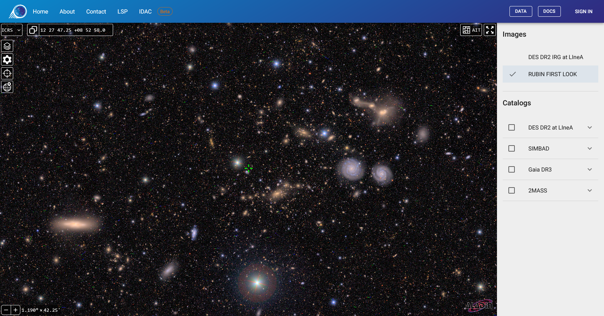
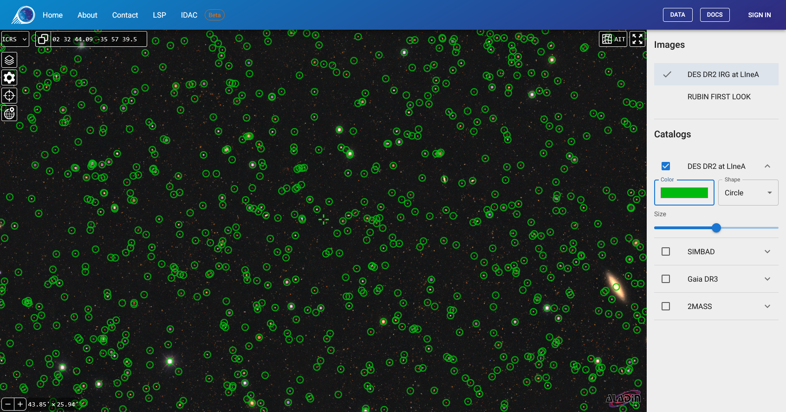
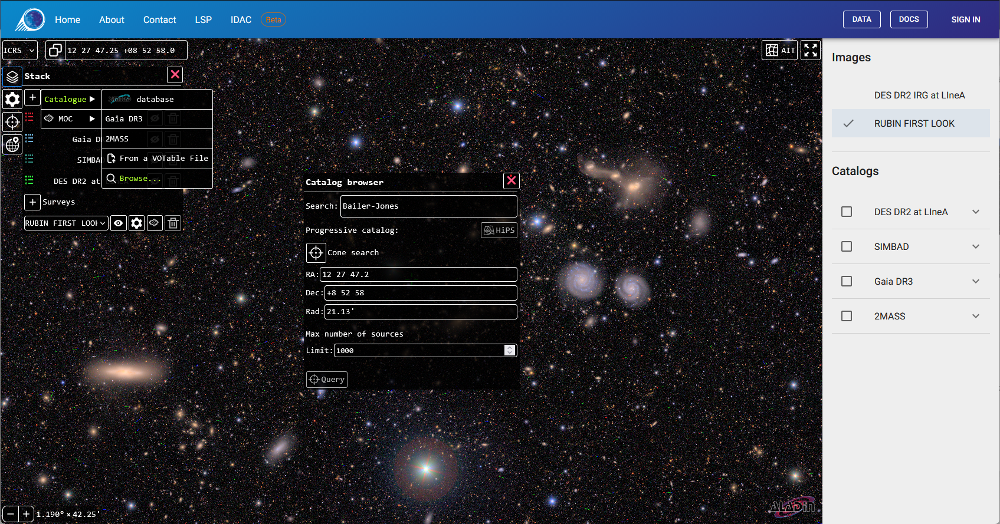
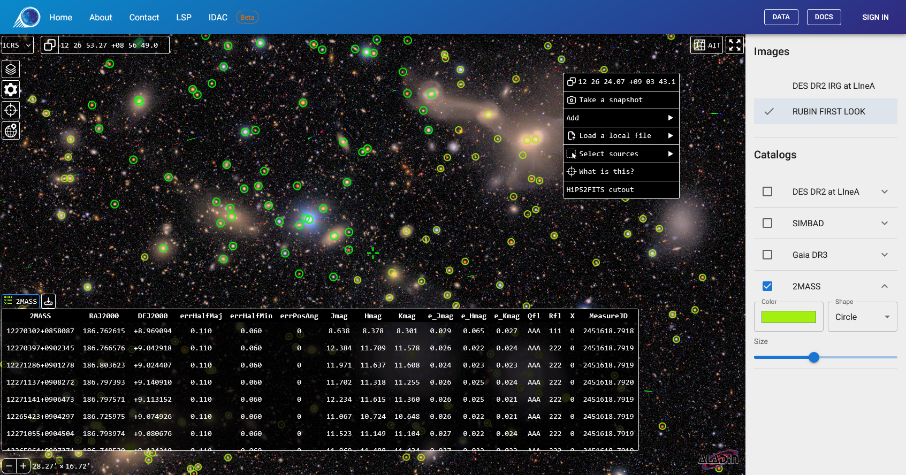

[*Sky Viewer*](https://skyviewer.linea.org.br) es una plataforma avanzada de visualización astronómica basada en la herramienta *Aladin Lite v3*. El sistema fue concebido para la exhibición de imágenes *HiPS* (*Hierarchical Progressive Surveys*) y la superposición de catálogos provenientes de múltiples fuentes de datos.

De manera análoga al *Target Viewer*, el *Sky Viewer* fue originalmente desarrollado en el ámbito del relevamiento *DES* (*Dark Energy Survey*). Su versión precursora permanece accesible a través del [*DES Science Server*](https://scienceserver.linea.org.br/), proporcionando acceso heredado a los datos del *DES* DR2. La iteración actual, diseñada para integrarse al portafolio de servicios del IDAC-Brasil, es una solución flexible que ofrece niveles de acceso diferenciados: datos públicos destinados a la comunidad general y datos embargados (como los del LSST) restringidos a miembros debidamente autenticados.

## Panel de control para datos locales

Ubicado en el lateral derecho de la interfaz.

Este panel actúa como el administrador central de los datos alojados en LIneA, filtrando el acceso conforme a las credenciales del usuario.

### 1.1 Sección de Imágenes (*Background*)

Esta sección enumera los relevamientos *HiPS* disponibles localmente para su utilización como imagen de fondo.

**Acceso Restringido:** Los usuarios no autenticados visualizarán exclusivamente los relevamientos públicos. Tras el procedimiento de inicio de sesión (*Sign In*), los miembros de colaboraciones específicas (como el LSST) tendrán acceso a opciones adicionales, restringidas a sus respectivos grupos de trabajo.

### 1.2 Sección de Catálogos (*Overlays*)

Presenta la relación de catálogos tabulares (*HiPScat*) disponibles localmente para superposición.

**Visualización:** La activación de un catálogo se efectúa mediante la marcación de la casilla de verificación correspondiente.

**Personalización:** Al hacer clic en la flecha (▼) adyacente al nombre del catálogo, se expanden los controles de visualización:

- ***Color***: Define la coloración de los marcadores, facilitando la distinción entre múltiples catálogos.
- ***Shape***: Modifica la morfología geométrica de los marcadores (círculo, cuadrado, cruz, entre otros).
- ***Size***: Ajusta el tamaño de los puntos en píxeles.

### Datos Disponibles en LIneA

| Nombre del *Dataset* | Tipo | Acceso | Descripción Técnica |
|----------------------|------|--------|---------------------|
| *DES* DR2 | Imagen y Catálogo | Público | *Dark Energy Survey Data Release 2* (Espectro Óptico). |
| *Rubin First Look* | Imagen | Público | Imágenes públicas iniciales del Observatorio Rubin. |
| LSST DP0.2 | Imagen | Restringido | *Data Preview 0.2* (Simulación). Exclusivo para miembros. |
| LSST DP1 | Imagen y Catálogo | Restringido | *Data Preview 1*. Restringido a entornos de desarrollo y miembros autorizados. |

## Interfaz estándar de *Aladin Lite*

Menús y barras de herramientas nativos de la aplicación. Estas herramientas rigen la modalidad de visualización de los datos, ofrecen recursos de navegación y referencia espacial, y son fundamentales para la experiencia del usuario.

### 2.1 Barra de búsqueda (superior)

Posibilita la navegación hacia una posición específica mediante dos métodos:

- **Por Coordenadas:** Acepta formatos decimales o sexagesimales (p. ej.: 13 25 27.6 -43 01 09).
- **Por Nombre de Objeto:** Permite la introducción del identificador (p. ej.: NGC 4755). El sistema consulta el servicio *Sesame* (CDS) para resolver las coordenadas y centrar el mapa en el objeto.

### 2.2 Administrador de capas (icono de «pila» - superior izquierdo)

Mientras que el panel derecho se destina a la gestión más directa de la exhibición de imágenes *HiPS* y catálogos locales, este menú proporciona acceso a un amplio conjunto de catálogos públicos remotos alojados por el CDS.

- ***Overlays***: Permite la selección de catálogos o incluso la búsqueda de otros catálogos para su exhibición en capa sobre las imágenes de relevamientos. Las bases de catálogos locales también se muestran en esta lista.

- ***Surveys***: Se destina a la selección y gestión de capas de imágenes disponibles en servidores remotos. Las imágenes *HiPS* locales también se muestran en esta lista.
    - ***Contrast***: Controles para el ajuste de brillo, saturación, contraste y gamma de la imagen exhibida.
    - ***Opacity***: Permite la creación de composiciones visuales, ajustando la transparencia de la imagen de fondo o de los catálogos superpuestos.
    - ***Colormap***: Modifica el mapa de colores de la imagen (p. ej.: *Rainbow*, *Heatmap*, *Grayscale*), recurso útil para evidenciar variaciones de intensidad en imágenes monocromáticas.
    - ***Cutout***: Controles para la exportación de capturas de pantalla y tipo de *stretch* (modelo de realce de contraste) de las imágenes.

### 2.3 Configuraciones de visualización (icono de engranaje)

- ***Coordinate Grid***: Superpone las líneas de Ascensión Recta y Declinación.
- ***Reticle***: Muestra una mira central fija, esencial para la identificación precisa de la coordenada en el centro del campo de visión.
- ***HEALPix Grid***: Muestra la cuadrícula de teselación de los datos, útil para la inspección técnica de la calidad de la imagen.

### 2.4 Sistemas de referencia y proyecciones

Ubicados en la barra inferior o en el menú de configuraciones:

#### *Coordinate Frame* (Sistemas de Referencia)

Permite seleccionar el marco de referencia astronómico para la orientación del mapa y la cuadrícula de coordenadas. Las opciones disponibles son:

- **ICRS:** *International Celestial Reference System* (Sistema de Referencia Celeste Internacional). Configuración predeterminada que utiliza coordenadas ecuatoriales (J2000) con representación sexagesimal (horas, minutos, segundos).
- **ICRSd:** Variación del sistema ICRS que muestra las coordenadas ecuatoriales en formato de grados decimales, facilitando la lectura directa de valores numéricos para análisis cuantitativos.
- **GAL:** Sistema de Coordenadas Galácticas. Reorienta la visualización teniendo como plano fundamental el disco de la Vía Láctea, ideal para estudios de la estructura galáctica.

#### Tipos de proyección

El usuario puede seleccionar la geometría de proyección del mapa que mejor se adecue a su exploración. Las opciones incluyen:

- ***Tangential***: (proyección gnomónica) Proyecta la esfera desde el centro sobre un plano tangente. Esta proyección posee la propiedad única de representar todos los círculos máximos (como meridianos y el ecuador) como líneas rectas. Es ideal para astrometría en campos pequeños; sin embargo, presenta distorsión severa en los bordes en campos amplios.
- ***Stereographic***: (proyección estereográfica) Proyección conforme que preserva los ángulos locales. Aunque el área no se conserva (la escala aumenta lejos del centro), las formas de objetos pequeños (como cráteres o galaxias) permanecen fieles.
- ***Spheric***: La representación estándar de «globo virtual», simulando la visión de una esfera tridimensional desde una distancia finita. Es la proyección más intuitiva para la navegación general.
- ***Zenital equal-area***: (proyección acimutal de Lambert) Preserva rigurosamente el área de los objetos en detrimento de la forma. Es fundamental para análisis estadísticos, como el conteo de fuentes por grado cuadrado o estudios de densidad estelar, garantizando que regiones del mismo tamaño en pantalla correspondan a áreas iguales en el cielo.
- ***Mercator***: Proyección cilíndrica conforme clásica. Preserva las direcciones y formas locales, pero distorsiona significativamente las áreas en altas latitudes (polos). Es útil para visualizar regiones ecuatoriales.
- ***Hammer-Aitoff***: Proyección de área equivalente que muestra la esfera celeste completa (*All-Sky*) en una elipse. En comparación con *Mollweide*, produce distorsiones angulares menos severas en las regiones externas, siendo excelente para mapas de distribución galáctica completa.
- ***Mollweide***: Proyección pseudocilíndrica de área equivalente, frecuentemente utilizada para mapas globales de la esfera celeste, como mapas de la radiación cósmica de fondo o densidad estelar de la Vía Láctea. Los paralelos son líneas rectas, mientras que los meridianos son elipses.

## Menú contextual

Accesible mediante clic con el botón derecho sobre el mapa.

El menú contextual proporciona accesos directos inmediatos y herramientas analíticas exclusivas. Algunas funcionalidades complementan los recursos anteriormente mencionados, mientras que otras ofrecen capacidades distintas.

### 3.1 Identificación y coordenadas

- ***What is this?***: Ejecuta una consulta radial en la base de datos SIMBAD, basada en la posición del clic, devolviendo la lista de objetos catalogados en la región.
- ***Copy Coordinates***: Copia inmediatamente las coordenadas (AR/Dec en el sistema ICRS) del punto seleccionado al portapapeles.

### 3.2 Exportación de datos

- ***Take a snapshot***: Genera una imagen visual (*WebP*) fiel a la visualización en pantalla. Ideal para presentaciones e ilustraciones. La personalización visual de la imagen debe realizarse en el administrador de capas del relevamiento (*cutout*).
- ***HiPS2FITS cutout***: Función no disponible en este momento.

### 3.3 Herramientas de selección (para catálogos)

Permiten el filtrado visual de los datos de un catálogo cargado.

- ***Select sources*** > ***Rectangular*** / ***Circular*** / ***Polygon***: El usuario define una región en el mapa. El sistema seleccionará todas las fuentes del catálogo contenidas en la geometría delimitada y filtrará la tabla de datos correspondiente en el panel inferior. Este subconjunto seleccionado puede descargarse como un archivo CSV.

### 3.4 Importación local

- ***Load a local file***: Permite la carga de datos almacenados localmente en la computadora del usuario para su comparación con los datos del servidor.
  - **Catálogos:** Archivos CSV o *VOTable* (requieren columnas AR/Dec).
  - **Imágenes:** Archivos *FITS* con WCS válido.
