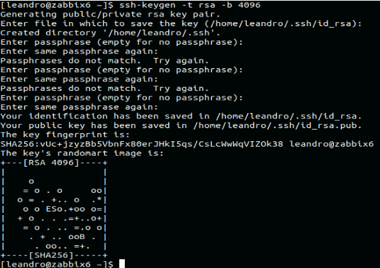
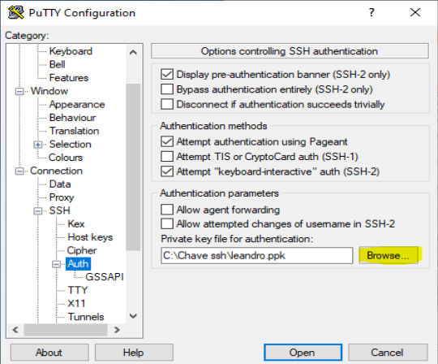
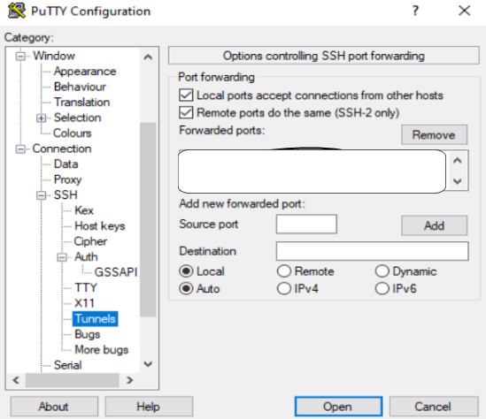

## Como criar par de chaves SSH

Para acessar nosso ambiente via ssh é preciso gerar um par de chaves seguindo os passos abaixos:

### Linux

a) Para gerar o par de chaves utilize o comando abaixo em seu terminal.

    ssh-keygen -t rsa -b 4096
    
    Generating public/private rsa key pair.
    Enter file in which to save the key (/root/.ssh/id_rsa):  [pressione ENTER]
    Created directory '/root/.ssh'.
    Enter passphrase (empty for no passphrase): [digite uma senha e para confirmar pressione ENTER]
    Enter same passphrase again: [repita a senha e pressione ENTER]

b) Após você receber a mensagem que a chave foi gerada. Você pode ver os dois arquivos criados listando o conteúdo do diretório  `ls $HOME/.ssh id_rsa  id_rsa.pub`

c) Após as chaves geradas enviar a chave **.pub** para a equipe de TI via email [helpdesk@linea.org.br](mailto:helpdesk@linea.org.br). A equipe de TI do LIneA irá configurar a chave no servidor e retornar com instruções para login no cluster Apollo. ***Aguarde o retorno de ok***.

### Windows

Para gerar par de chaves no sistema operacional Windows

a) Baixar o aplicativo Putty e instalar.

b) Acessar a pasta onde o programa foi instalado (essa instalação foi no Windows 10)`C:\Program File\PuTTY` (caminho pode ser diferente devido ao sistema operacional), Abra o programa Puttygen.

c) Clicar em Generate (o tipo de chave mantém como **RSA**).

**OBS : Movimentar o ponteiro do mouse ajuda a gerar a chave mais rapidamente, pois gera bits aleatórios**.

d) Par de chaves geradas com sucesso.
 
 - Copiar a chave publicar para ser salva no servidor (detalhe na imagem em amarelo);
 - Colocar uma senha na chave pública (detalhe na imagem em azul).
 - Após copiar salve as chaves public e private no computador (detalhe na imagem em vermelho) envie a chave `.pub` para a equipe de TI via email [helpdesk@linea.org.br](mailto:helpdesk@linea.org.br). A equipe de TI do LIneA irá configurar a chave no servidor. ***Aguarde o retorno de ok***.

    
e) Após o receber o email de confirmação que a chave `.pub` foi cadastrada no servidor de acesso, fazer as configurações no programa `Putty`.
    
 - Crie um atalho na área de trabalho, abra o `PuTTY`;
 - Coloque o Hostname login.linea.org.br.

f) Ao lado esquerdo ir na opção `SSH > Auth (detalhe em azul) > aperte em Browse (detalhe em amarelo) e escolha a chave a ser usada com extenção .ppk`.

h) Caso precise utilizar algum túnel faça a seguinte configuração.    
**OBS: os tunnels são configurado conforme o que o usuário vai acessar**

- Ir na opção Tunnels (lado esquerdo);
- Em Source port coloque a porta;
- Destination > coloque o endereço de destino > Add.

Volte ao lado esquerdo e vá na primeira opção menu `Session (em vermelho) coloque o nome da sessions (em amarelo) e aperte em Save (em azul)`, para acessar aperte em `Open`.

