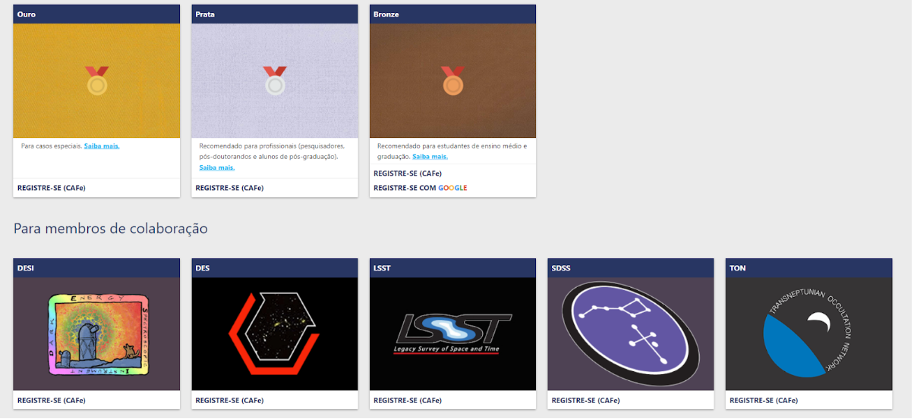
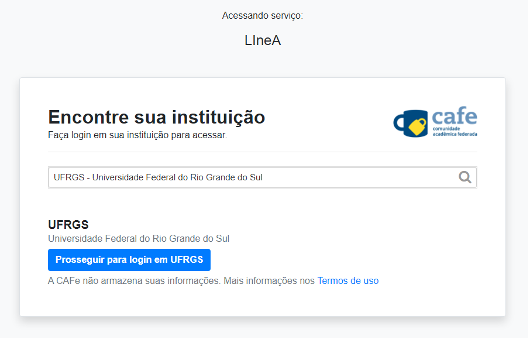

## Manual de boas-vindas 

O manual é um compilado de informações importantes sobre o LIneA para aqueles que estão conhecendo o laboratório pela primeira vez. Nele podemos encontrar a missão, objetivos, as ferramentas para usuários, os serviços de e-ciências oferecidos, descrição dos perfis de usuários, onde buscar ajuda, os representantes das colaborações científicas apoiadas pelo LIneA, maneiras de se comunicar internamente, as redes sociais do LIneA, reuniões regulares, glossário, a política de segurança da informação seguida pelo laboratório, os diferentes tipos de apoio ao usuário disponiveís e, por fim, quem é nossa equipe! 

O manual pode ser acessado por quem desejar [entrando nesta página](https://linea.org.br/o-que-e-linea/manual-de-boas-vindas/).

Vale dizer que muitas das coisas que estão detalhadas no manual de boas vindas você também encontra aqui nesta página de documentação, porém de forma resumida.

*** 

## Registro de usuários

Antes de iniciar seu trabalho e explorar as diversas ferramentas oferecidas pelo LIneA, você precisa fazer o registro na nossa base de usuários. É importante que você tenha o conhecimento dos perfis de usuários e entenda em qual deles você melhor se encaixa para fazer o seu registro. Vamos lá?

### Perfis para o público 

Afinal, quem é o nosso público? 
Entendemos que para esse perfil se encaixam os estudantes e pesquisadores em geral, que **não** fazem parte das colaborações científicas já apoiadas pelo LIneA (veja abaixo). São aqueles que precisam de infraestrutura computacional para desenvolver seus projetos científicos e não possuem, em suas instituições, ferramentas para tal. Pensando nisso, o LIneA oferece gratuitamente máquinas e [suporte](https://docs.linea.org.br/suporte.html) para a comunidade acadêmica. Sendo assim, para proporcionar a melhor experiência e atendimento ao usuário, foram criados três tipos de perfis voltados para o público: 

* **Bronze** - Recomendado para entusiastas da astronomia, estudantes de graduação e ensino médio. Com esse perfil você terá acesso ao JupyterHub e aos dados públicos do Sloan Digital Sky Survey (SDSS - DR17) e Dark Energy Survey (DES - DR2), com recursos computacionais limitados.
* **Prata** - Recomendado para pesquisadores, pós-doutorandos e estudantes de pós-graduação (requer e-mail institucional para o registro). Com esse perfil você terá acesso aos mesmos recursos do perfil bronze, com mais poder computacional e persistência de arquivos entre sessões. 
* **Ouro** - É indicado para casos/projetos específicos e que necessitam de recursos computacionais que vão além dos recursos pré-definidos para os perfis Bronze e Prata. Se esse é o seu caso, você poderá submeter um projeto informando a sua necessidade para a aprovação pelo Comitê de Usuários do LIneA. Caso ainda não tenha um projeto bem definido, sugerimos que inicie o registro com perfil Prata. Usuários do perfil Prata podem solicitar "_upgrade_" para o perfil ouro a qualquer momento, caso tenha necessidade justificada. 

### Perfis para membros de colaboração

Definimos como membros de colaborações usuários que são associados a alguma colaboração científica apoiada pelo LIneA, ou seja, os projetos [DESI](https://www.desi.lbl.gov/), [DES](https://www.darkenergysurvey.org/), [LSST](https://www.lsst.org/), [SDSS](https://www.sdss.org/) e [TON](https://linea.org.br/010-ciencia/projetos/6-tno/). Caso você trabalhe diretamente com alguma dessas colaborações, então indicamos que esse é o seu perfil. Cada colaboração tem o seu perfil de usuário associado, respeitando as regras de acesso a dados proprietários de cada projeto. Para usuários que participam de mais de uma colaboração, é possível ter um perfil misto e ter acesso a dados de múltiplos projetos. O vínculo do usuário com as colaborações será verificado pela nossa equipe no processo de aprovação do registro.    

*** 

Agora que você já sabe qual é o seu perfil, o próximo passo é o registro!

### Como se registrar 

1 - Acesse o site do LIneA em [**linea.org.br**](https://linea.org.br/) e clique no menu **_Serviços_** > **_Registro_**.

2 -  Após abrir a página, escolha o tipo de perfil (Bronze, Prata ou Ouro) ou colaboração (DESI, DES, LSST, SDSS, e TON) em que você se encaixa. Em seguida, clique em Registre-se via CAFe (Comunidade Acadêmica Federada) ou via Google (apenas para o perfil Bronze). 

3 - Você será redirecionado para efetuar login. Efetue o login com a sua credencial institucional (perfis prata, ouro ou colaborações) ou Google (perfil bronze), informando o nome de usuário e a senha. 

Após efetuar o login, você será redirecionado de volta para o nosso formulário de registro.

4 - Preencha todos os campos do formulário com suas informações.

Leia, aceite os termos e clique em "I Agree". 

Para finalizar, clique no botão SUBMIT.

5 - Após a submissão do formulário a equipe do LIneA irá receber a solicitação e prosseguir com o provisionamento da sua conta.

**Aguarde o email de confirmação**.

Para maiores informações, entre em contato com o _Service Desk_ em [helpdesk@linea.org.br](mailto:helpdesk@linea.org.br). 
 
