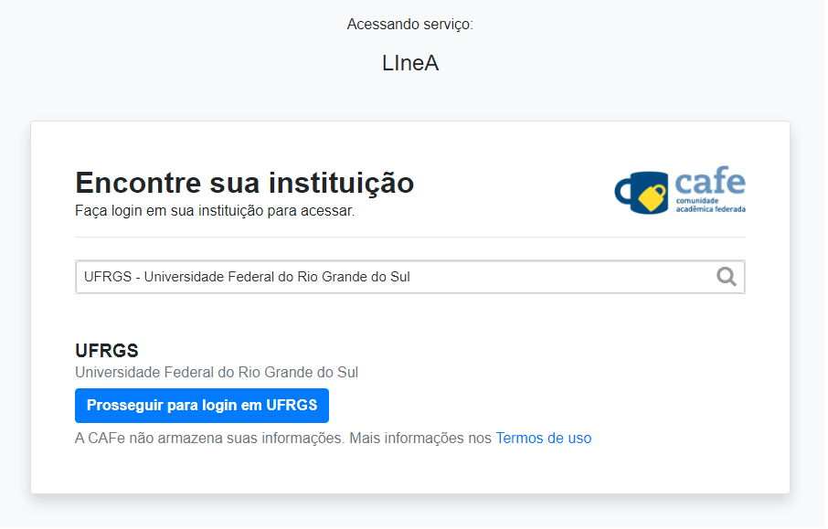

1 - Acesse o [site do LIneA](www.linea.org.br) e clique no menu **_Serviços_** > **_Registro_**.

2 -  Após abrir a página, escolha o tipo de perfil (Bronze, Prata ou Ouro) ou colaboração (DESI, DES, LSST, SDSS, e TON) em que você se encaixa. Em seguida, clique em Registre-se (CAFe) ou via Google (apenas para o perfil Bronze).

3 - Você será redirecionado para efetuar login via CAFe (Comunidade Acadêmica Federada). Efetue o login com a sua credencial institucional, informando o nome de usuário e a senha.

Após escolher a instituição e efetuar login com sua credencial institucional, você será redirecionado de volta para o nosso formulário de registro.

4 - Preencha todos os campos do formulário com suas informações, segue um exemplo abaixo:

OBS: Caso a opção EPPN esteja em branco preencha com o seu email institucional.

**Name:** *Fulano*

**Full Name:** *Fulano de Souza da Silva*

**Email:** *fulano@instituicao.br*

**Phone:** *21 11111-1111*

**Collaborations:** *< preencha com o nome da colaboração, e.x.: LSST >*

**Affiliation:** *< preencha com o nome da instituição, e.x: UFRGS >*

**Supervisor:** *< nome do orientador >*

Leia, aceite os termos e clique em OK.

Para finalizar, clique no botão SUBMIT.

5 - Após a submissão do formulário a equipe do LIneA irá receber a solicitação e prosseguir com o provisionamento da sua conta.

**Aguarde o email de confirmação**.

