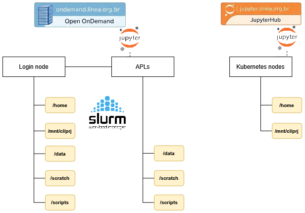

## LustreFS (HPC)

O ambiente do cluster Apollo conta com sistema de arquivos de alta performance [Lustre](https://www.lustre.org/) com dois níveis (_tiers_) de armazenamento, um em SSD com ~70 TB (_T0_) e outro em HDD com ~500 TB (_T1_), ambos conectados a uma rede infiniband EDR de 100 Gb/s. Os dois níveis de armazenamento estão disponíveis em `/scratch` e `/data`. 

### Área /scratch e quota

Os usuários poderão acessar seu diretório de scratch através da variável de ambiente, ou acessando o diretório com o caminho completo.
```Bash
cd $SCRATCH
```
Ou 
```Bash
cd /scratch/users/<username> 
``` 

!!! danger "ATENÇÃO"
    Essa área NÃO sofrerá backup!

Os arquivos que não foram modificados nos últimos 30 dias serão automaticamente removidos, o que torna temporário o armazenamento de arquivos nessa área.
Recomenda-se que os usuários realizem a transferência dos arquivos importantes do `$SCRATCH`  para o seu `homedir`. 

!!! warning
    O script de limpeza é executado uma vez por semana, sempre nos fins de semana.  


**A quota padrão do `/scratch` disponibilizada para usuários com direito ao uso do Cluster é:**

| area     | bsoft  | bhard  | isoft  | ihard  | grace period |
| -------- | ------ | ------ | ------ | ------ | ------------ |
| /scratch | 35 GB  | 40 GB  | 100000 | 120000 | 7 days       |


### Boas práticas

Sistemas de arquivos distribuídos como o Lustre são ideais para ambientes HPC e HTC. Nesses ambientes, a carga de trabalho típica consiste em arquivos grandes que precisam ser acessados ​​a partir de muitos nós de computação com largura de banda muito alta e/ou baixa latência. Portanto, esses sistemas de arquivos são muito diferentes dos sistemas de arquivos usados ​​em computadores desktop ou servidores isolados. Embora sejam excelentes no manuseio de arquivos grandes, eles também apresentam fortes limitações ao lidar com arquivos pequenos e padrões de acesso mais comumente encontrados em ambientes corporativos e de desktop. As operações que podem ser extremamente rápidas em um disco local de estação de trabalho podem ser dolorosamente lentas e caras em um sistema de arquivos Lustre, afetando tanto os usuários que executam essas operações quanto, eventualmente, todos os outros usuários. Estas melhores práticas e recomendações têm como objetivo permitir um uso tranquilo do Lustre, minimizando ou evitando operações desnecessárias ou muito caras do sistema de arquivos.

**Evite acessar atributos de arquivos e diretórios**

Acessar informações de metadados, como atributos de arquivo (por exemplo, tipo, propriedade, proteção, tamanho, datas, etc.) no Lustre consome muitos recursos e pode degradar o desempenho do sistema de arquivos, especialmente quando realizado com frequência ou em diretórios com grande quantidade de arquivos. 
Minimize o uso de chamadas de sistema que acessam ou modificam esses atributos, como `stat()`, `statx()`, `open()`, `openat()`, etc.

O mesmo se aplica a comandos como `ls -l`(para todo o diretório) ou `ls --color` que fazem uso das chamadas mencionadas acima. Em vez disso, use um simples `ls` ou `ls -l filename`.

**Evite usar comandos que acessam metadados massivamente**

Evite usar comandos como `ls -R`, `find`, `locate`, `du`, `df` e similares. 
Esses comandos percorrem o sistema de arquivos recursivamente e/ou executam operações pesadas de metadados. Eles são muito intensivos no acesso aos metadados do sistema de arquivos e podem degradar gravemente o desempenho geral do sistema de arquivos. Se for absolutamente necessário percorrer o sistema de arquivos recursivamente, use o comando fornecido com o Lustre `lfs find` em vez de `find`, por exemplo.

**Use o comando Lustre lfs**

Para minimizar o número de chamadas Lustre RPC, sempre que possível use os comandos `lfs` em vez dos comandos fornecidos pelo sistema:

* `lfs df` => em vez de `df` 
* `lfs find` => em vez de `find`

**Evite usar curingas**

Expandir os curingas exige muitos recursos. A execução de comandos com curingas em um grande número de arquivos pode levar muito tempo e afetar gravemente o desempenho do sistema de arquivos. Em vez de usar curingas, crie uma lista dos arquivos de destino e aplique o comando a cada um desses arquivos.

**Acesso somente leitura**

Sempre que possível, abra os arquivos como somente leitura usando `O_RDONLY`, além disso, se você não precisar atualizar o tempo de acesso ao arquivo, abra os arquivos como `O_RDONLY | O_NOATIME`. Se as informações de tempo de acesso forem necessárias durante a execução de E/S paralela, deixe o processo pai abrir os arquivos como `O_RDONLY` e todas as outras classificações abrirem os mesmos arquivos como `O_RDONLY|O_NOATIME`.

**Evite ter um grande número de arquivos em um único diretório**

Quando um arquivo é acessado, o Lustre bloqueia o diretório pai. Quando muitos arquivos no mesmo diretório devem ser abertos, isso cria contenção. Gravar milhares de arquivos em um único diretório produz uma carga massiva nos servidores de metadados Lustre, geralmente resultando na desativação dos sistemas de arquivos. Acessar um único diretório contendo milhares de arquivos pode causar grande contenção de recursos, degradando o desempenho do sistema de arquivos.

A alternativa é organizar os dados em vários subdiretórios e dividir os arquivos entre eles. Uma abordagem comum é usar a raiz quadrada do número de arquivos, por exemplo, para 90.000 arquivos a raiz quadrada seria 300, portanto devem ser criados 300 diretórios contendo 300 arquivos cada.

**Evite arquivos pequenos**

Acessar arquivos pequenos no sistema de arquivos Lustre é muito ineficiente. O tamanho de arquivo recomendado é superior a 1 GB. Reorganize os dados em arquivos grandes ou use formatos de arquivo como **HDF5**. Alternativamente, se o tamanho total dos arquivos for pequeno, como alguns gigabytes, copie os arquivos pequenos para `/tmp` ou para um diretório temporário local para cada nó de computação no início do trabalho (não se esqueça de transferir e/ou excluir os arquivos no fim). Essa abordagem pode ser combinada com o uso de ferramentas de arquivamento, como `tar` e armazenar pequenos arquivos em um ou mais tarballs grandes podem ser mantidos no Lustre de maneira mais eficiente. 

Ao ler ou gravar arquivos, o Lustre tem um desempenho muito melhor com tamanhos de buffer grandes (>= 1 MB). É altamente recomendável agregar pequenas operações de leitura e gravação em operações maiores. O buffer coletivo MPI-IO permite E/S agregada.

**Evite pequenas operações repetitivas de arquivos**

Evite realizar pequenas operações de E/S repetitivas, como abrir arquivos frequentemente no modo de acréscimo, gravar pequenas quantidades de dados e fechar o arquivo. Em vez disso, abra o arquivo uma vez, execute todas as operações de E/S e feche.

**Evite vários processos abrindo os mesmos arquivos ao mesmo tempo**

Vários processos abrindo os mesmos arquivos ao mesmo tempo podem criar contenção e erros de abertura de arquivos. Em vez disso, execute a abertura a partir de um único processo (pai), ou abra o arquivo somente leitura para evitar bloqueio, ou implemente a abertura com uma abordagem de tentativa e erro com suspensão em caso de erro.

**Evite acessar a mesma região de arquivo de muitos processos**

Se vários processos acessarem a mesma região de arquivo ao mesmo tempo, o gerenciador de bloqueio distribuído Lustre reforçará a coerência para que todos os clientes vejam resultados consistentes. Ter muitos processos tentando acessar a mesma região de arquivo simultaneamente pode causar degradação no desempenho.

Neste caso, pode ser preferível: replicar o arquivo, dividir o arquivo, executar as operações de E/S a partir de uma única classificação de processo ou garantir que o acesso simultâneo não ocorrerá. Em qualquer caso, é recomendado manter a quantidade de operações de abertura e bloqueio de arquivos em paralelo tão pequena quanto possível para reduzir a contenção.

Se vários processos tentarem anexar ao mesmo arquivo, isso acionará o bloqueio e poderá causar grande contenção. Idealmente, apenas um processo deve anexar cada arquivo.

**Operações de arquivo através de processo pai**

Ao acessar pequenos arquivos compartilhados em uma tarefa paralela, muitas vezes é mais eficiente executar todas as operações necessárias através do processo pai e, se necessário, transmitir os dados para outras classificações, em vez de acessar os mesmos arquivos de todas as classificações. Da mesma forma, se múltiplas classificações de um trabalho paralelo requerem informações sobre um determinado arquivo, a abordagem mais eficiente é fazer com que o processo pai execute as chamadas necessárias (por exemplo `stat()`, `fstat()`, etc) e então transmita as informações para as outras classificações.

**Distribuição de arquivos (striping)**

No Lustre, arquivos grandes podem ser divididos em segmentos que, por sua vez, podem ser distribuídos automaticamente por vários dispositivos de armazenamento. A distribuição de arquivos é útil para E/S paralela em arquivos grandes. Para que isso funcione, o ponto de montagem em questão aponta para vários dispositivos de armazenamento (OSTs). O comando `lfs df` pode ser usado para verificar se um determinado ponto de montagem aponta para vários OSTs. Para obter informações de distribuição de arquivos para um determinado arquivo, use:

`lfs getstripe filename`

A distribuição do arquivo pode ser definida usando o comando `lfs setstripe`. Se o comando for aplicado a um diretório, ele definirá as configurações de distribuição padrão para arquivos criados nesse diretório. Um subdiretório herda todas as configurações de distribuição de seu diretório pai. Se o comando for aplicado a um arquivo, ele distribuirá esse arquivo pelos OSTs de acordo com as configurações especificadas.

`lfs setstripe -s 128m -c 8 filename` => divide o arquivo em segmentos de 128 MB e os distribui em 8 OSTs

Se um arquivo grande for compartilhado em paralelo por vários processos, com cada processo trabalhando em sua própria parte do arquivo, então pode ser útil dividir o arquivo em um número de segmentos igual ao número de processos, ou um múltiplo do número de processos.

Para obter o máximo desempenho, as solicitações de E/S devem ser alinhadas às faixas, o que significa que os processos que acessam o arquivo devem fazê-lo em deslocamentos que correspondam aos limites das faixas. Isto minimiza as chances de um processo ter que acessar mais de um segmento (e mais de um OST) para obter os dados necessários.

Para arquivos pequenos, a distribuição (striping) deve ser desabilitada, isso pode ser conseguido definindo uma contagem de distribuição de 1. O mesmo se aplica se um arquivo grande for acessado por um único processo.

`lfs setstripe -s 1m -c 1 meudiretorio/arquivospequenos/` 

**Evite instalar software no Lustre** 

Um software geralmente é composto de muitos arquivos pequenos e, como mencionado anteriormente, acessar muitos arquivos pequenos no Lustre pode sobrecarregar os servidores de metadados. As compilações de software em particular podem ser melhor executadas localmente copiando ou descompactando o software para /tmp/$USER/ ou para o seu `homedir`.

Além disso, sob alta carga, o acesso de E/S aos sistemas de arquivos Lustre pode ser bloqueado. Se os executáveis ​​forem armazenados no Lustre e o acesso ao sistema de arquivos falhar, os executáveis ​​poderão travar. Portanto, sempre que possível, é melhor copiar os executáveis ​​para o `/tmp` dos nós do cluster.

## Área /scripts

Os usuários poderão acessar seu diretório de scripts através da variável de ambiente, ou acessando o diretório com o caminho completo. 
```Bash
cd $SCRIPTS
```
Ou 
```Bash
cd /scripts/<username> 
```

Essa área é destinada ao armazenamento de scripts de submissão de jobs ao cluster e outros. Recomenda-se também utilizar esse caminho para a criação de ambientes (envs) Python e kernels.

**A quota padrão do `/scripts` disponibilizada para usuários é:**

| area     | bsoft | bhard | isoft | ihard | grace period |
| -------- | ----- | ----- | ----- | ----- | ------------ |
| /scripts | 10 GB | 12 GB | 100k  | 120k  | 7 days       |

Observação: O diretório `/scripts` **não** é afetado pelo processo de limpeza automática.

## Homedir

O diretório `home` é uma área para os usuários armazenarem seus arquivos pessoais e é acessível através dos nós de login do cluster e também na plataforma [jupyter](.).

**A quota padrão do homedir de cada usuário, segundo o seu perfil, é apresentada abaixo:**

| perfil                | bsoft  | bhard  | isoft   | ihard   | grace period |
| --------------------- | ------ | ------ | ------- | ------- | ------------ |
| público geral         | 5 GB   | 7 GB   | 7000    | 10000   | 7 dias       |
| público institucional | 25 GB  | 30 GB  | 40000   | 50000   | 7 dias       |
| colaboração LSST      | 35 GB  | 40 GB  | 1000000 | 1200000 | 7 dias       |

!!! tip
    Para verificar os valores de quota configurado basta utilizar o comando: `quota -s -u <username> /home`.

Observação: O diretório `/home` do usuário **não** é afetado pelo processo de limpeza automática.

## Comandos úteis

a) Como verificar minha quota disponível?
   
    show_quota 
b) Como verificar a quota de um projeto?
    
    show_proj_quota <projeto>
    
c) Como consultar os meus arquivos criados há _mais_ de 30 dias? 

    lfs find $SCRATCH --uid $UID -mtime +30 --print

d) Como consultar os meus arquivos criados há _menos_ de 30 dias? 

    lfs find $SCRATCH --uid $UID -mtime -30 --print
    
e) Como listar os OSTs do Lustre?

    lfs osts $SCRATCH

f) Como listar os arquivos armazenados há mais de 30 dias em um determinado OST do Lustre?

    lfs find $SCRATCH -mtime +30 --print --obd t0-OST0002_UUID
    
g) Como configurar o striping em diretório de modo a "quebrar" os arquivos e distribuir esses "pedaços" em 10 OSTs?

    lfs setstripe -c 10 $SCRATCH/meus_arquivos_grandes
    
h) Como consultar o striping de arquivos/diretórios?

    lfs setstripe -c $SCRATCH/meus_arquivos_grandes


!!! tip
    O Lustre do LIneA foi projetado para trabalhar a 100Gbps, para alcançar o máximo de performance faça uso do striping e sempre com arquivos grandes (+1GB).


## NAS (NFS)

Os sistemas de armazenamento NAS são utilizados para armazenamento de longo prazo e não estão acessíveis através dos nós de processamento (HPC).

Características atuais: 

| Fabricante | Modelo               | Capacidade | Instalado em | Disponibilidade |
| ---------- | -------------------- | ---------- | ------------ | --------------- |
| SGI        | IS5600               | 240TB      | Jul-2014     | Em uso          |
| HPE        | APOLO 4510           | 1.2 PB     | Apr-2025     | Em uso          |

## Backup

| áreas    | backup incremental (diário) | backup completo (mensal)  | retenção |
| -------- | :-------------------------: | :-----------------------: | :------: |
| /home    | :heavy_check_mark:          | :heavy_check_mark:        | 90 dias  |
| /data    | :x:                         | :x:                       | -        |
| /scratch | :x:                         | :x:                       | -        |
| /scripts | :x:                         | :x:                       | -        |

!!! info
    Apesar de não possuir agendamento de backup, o volume /data é composto por um sistema robusto de redundância de discos que preserva a integridade de seus dados. 


## Visão geral das áreas de armazenamento

<div style="text-align: center;">
  
</div>

## Referências

Estas melhores práticas foram compiladas a partir da experiência do time do LIneA e das seguintes fontes:

1. https://www.nas.nasa.gov/hecc/support/kb/lustre-best-practices_226.html
1. https://hpcf.umbc.edu/general-productivity/lustre-best-practices/
1. https://wiki.gsi.de/foswiki/bin/view/Linux/LustreFs
1. https://doc.lustre.org/lustre_manual.pdf


