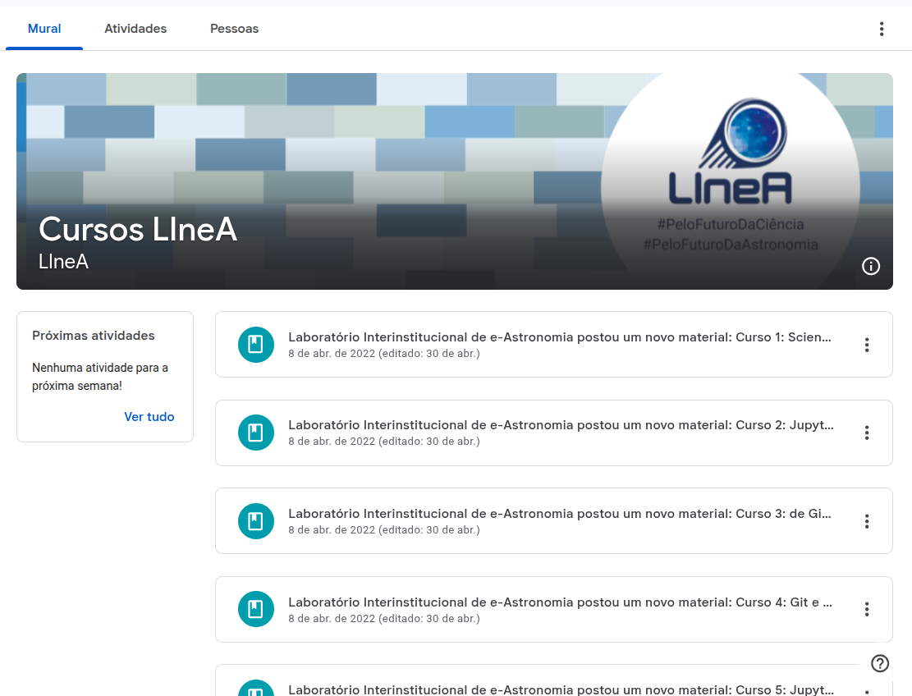

O LIneA oferece cursos de treinamento nas principais ferramentas utilizadas pelos projetos. As gravações e o material didático de todos os cursos já oferecidos se encontram disponíveis no Google Classroom. Acesse a [**página de cursos no site do LIneA**](https://classroom.google.com/c/NDkzMTA0MzEyODA1?cjc=kl5jjnd) para mais detalhes. 

### Vídeos Tutoriais

#### Tutoriais de Registro de Usuários

* [Registro de Usuários para Membros da Colaboração LSST](https://youtu.be/nyRN5xVRRqo)

#### Tutoriais de Uso do Ambiente de HPC

* [Como criar um novo kernel para o Jupyter Notebook - LIneA Open OnDemand](https://youtu.be/EOiCO8S7vGc)
