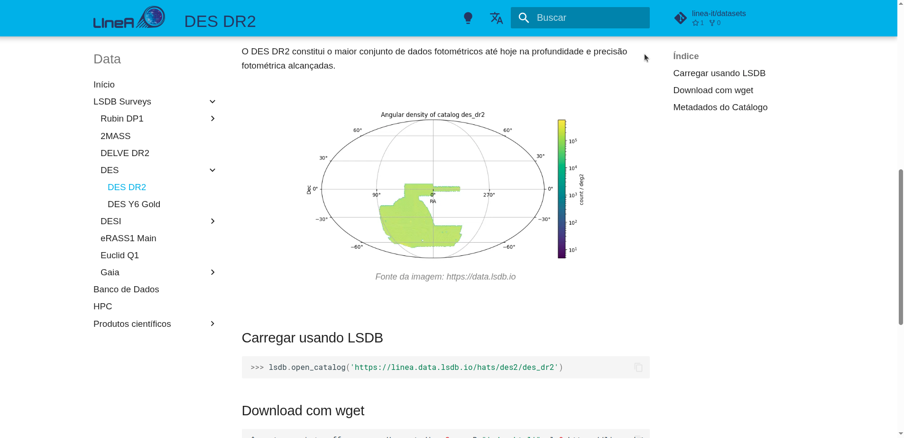

# Acervo de Dados

Todo o acervo de dados hospedados no LIneA está documentado no site [data.linea.org.br](https://data.linea.org.br). Lá você encontrará informações relevantes sobre os conjuntos de dados, links para as respectivas publicações e sites dos levantamentos de origem, além de instruções de acesso através das plataformas científicas e APIs.  

    
<a href="https://data.linea.org.br" target="_blank" rel="noopener noreferrer"><strong><u>data.linea.org.br</strong></u></a> 

  

