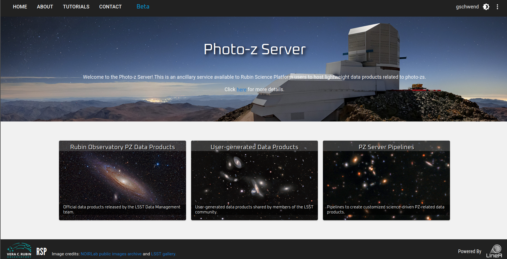
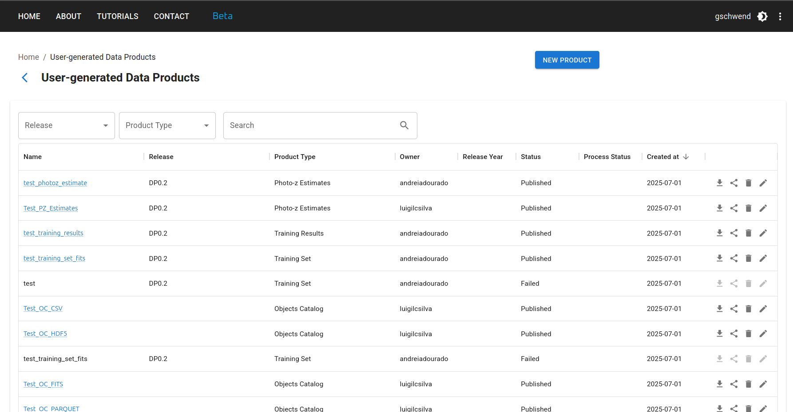
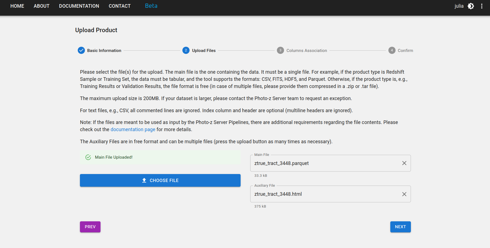
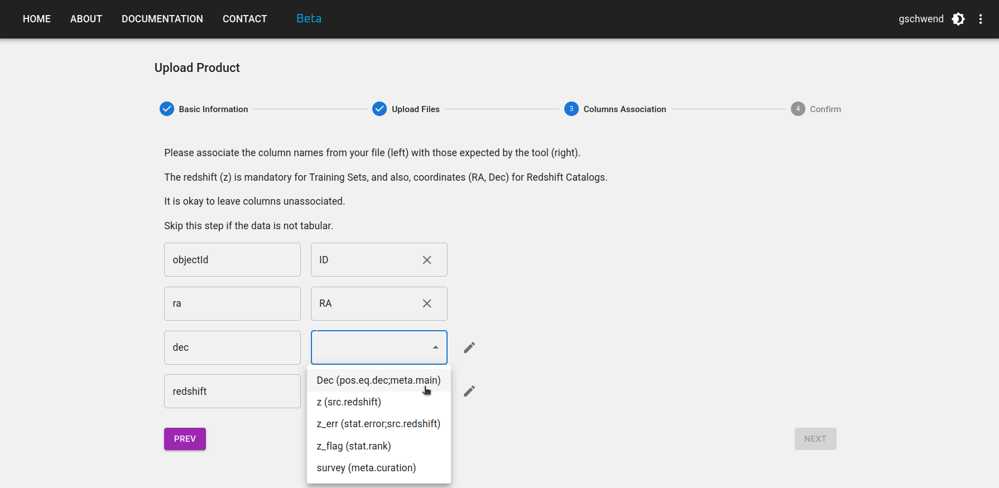
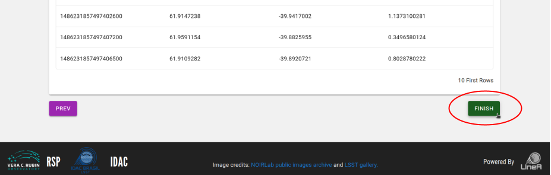
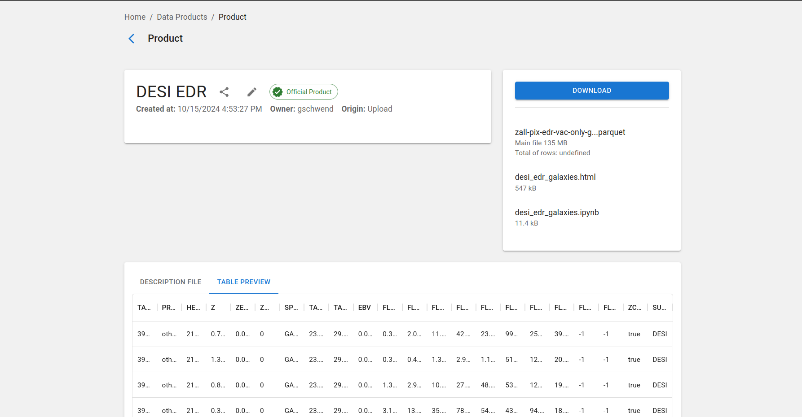
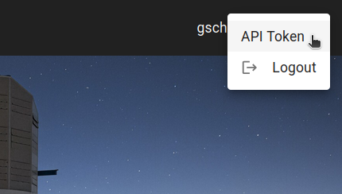
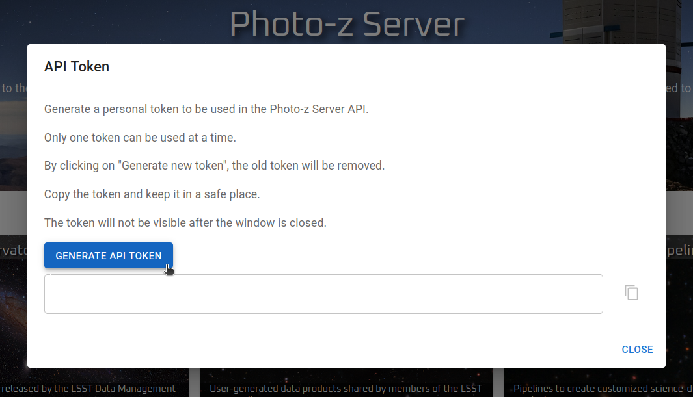

### Aviso

!!! warning "Aviso sobre a versão PT-BR" 
      Esta é uma tradução do documento original disponível em inglês. Optamos por não traduzir os nomes dos pipelines e tipos de produtos para manter os nomes consistentes com os que aparecem no Photo-z Server. Além disso, não traduzimos trechos de código para mantê-los consistentes com o tutorial disponibilizado como Jupyter notebook no repositório da biblioteca Python `pzserver`.  

### Introdução

Inspirado no DES Science Portal ([Gschwend et al., 2018](https://www.sciencedirect.com/science/article/abs/pii/S2213133718300891?via%3Dihub){:target="_blank"}; [Fausti Neto et al., 2018](https://www.sciencedirect.com/science/article/abs/pii/S2213133717300975){:target="_blank"}), o [Photo-z Server](https://pzserver.linea.org.br/) é um serviço online complementar ao Rubin Science Platform (RSP) para hospedar e produzir produtos de dados leves relacionados ao photo-z e oferecer ferramentas de gerenciamento de dados que permitam o compartilhamento de produtos de dados entre usuários do RSP, anexar e compartilhar metadados relevantes e auxiliar no rastreamento de proveniência.

O serviço está hospedado no Brazilian Independent Data Access Center ([IDAC](https://scienceplatform.linea.org.br/idac)) e está aberto a toda a Comunidade LSST, sem restrições geográficas. Ele foi projetado para ser o mais amplo e genérico possível, a fim de ser útil a todas as Colaborações Científicas do LSST que trabalham com produtos de dados de photo-z. Conforme exigido pelo programa de contribuições _in-kind_ do LSST, o código-fonte está disponível publicamente no [GitHub](https://github.com/linea-it/pzserver_app){:target="_blank"}.

O Photo-z Server foi projetado para auxiliar os usuários do RSP a participar do Photo-z (PZ) Validation Cooperative. Esta iniciativa da equipe de Data Management (DM) ocorrerá durante a fase de comissionamento do LSST (consulte a nota técnica [dmtn-049](https://dmtn-049.lsst.io/) para obter detalhes). O PZ Coordination Group receberá credenciais de usuário administrador com permissões especiais para adicionar produtos de dados marcados como _official data products_. Isso incluirá conjuntos padronizados de treinamento e validação utilizados para comparações de desempenho de algoritmos, bem como um meio de coletar resultados de múltiplos usuários.

Além do PZ Validation Cooperative, o Photo-z Server continuará sendo um recurso para a Comunidade LSST nos próximos anos. Os usuários do RSP podem continuar a usá-lo para organizar, rastrear e compartilhar arquivos leves contendo diversos resultados de testes.

!!! abstract "Datasets"
      Os administradores do Photo-z Server mantêm e atualizam periodicamente uma lista selecionada de conjuntos de dados para dar suporte à Comunidade LSST com produtos de dados relacionados ao Photo-z. Descrições detalhadas e links para cada produto de dados estão disponíveis em uma [página separada](../../en/data/pz_server_data.md).

### Site do Photo-z Server

A interface principal do Photo-z Server é o seu site no endereço [pzserver.linea.org.br](https://pzserver.linea.org.br/).

<p align="center">

</p>

Os três cards na página inicial levam à lista de produtos de dados (esquerda e centro) ou aos pipelines do Photo-z Server (direita).

Na página da lista de produtos de dados, os usuários podem navegar, pesquisar e filtrar os produtos enviados por outros usuários ou criados com um pipelines do Photo-z Server. Os produtos de dados enviados para o PZ Server tornam-se automaticamente visíveis, baixáveis e compartilháveis com todos os usuários registrados.

<p align="center">

</p>

### Upload de um novo produto de dados

Para fazer upload de um novo produto de dados, clique no botão **NOVO PRODUTO** no canto superior direito da [User-generated Data Products page](https://pzserver.linea.org.br/user_products) e preencha o formulário com os metadados relevantes em quatro etapas:

**Etapa 1:** Informe um nome curto e mnemônico para o seu novo produto de dados. Selecione o tipo de produto de dados que você está carregando (por exemplo, Reference Redshift Catalog, Training Set, etc.) e ao release ao qual ele pertence (se aplicável).

<p align="center">

</p>

**Etapa 2:** Selecione o arquivo principal e quantos arquivos auxiliares desejar enviar. O arquivo principal contém o produto de dados em si, enquanto os arquivos auxiliares podem incluir documentação, descrição ou qualquer outra informação relevante sobre o produto de dados.

Se o produto de dados for tabular, a ferramenta de upload pode exigir formatos de arquivo específicos, dependendo do tipo. Os formatos atualmente suportados são: CSV, FITS, HDF5 e Parquet. Entre em contato com a [equipe de desenvolvimento](mailto:pzserver-admin@linea.org.br) se o seu caso científico exigir um formato de arquivo diferente ou se o arquivo for maior que o limite de 200 MB.

<p align="center">

</p>

**Etapa 3:** Se o produto de dados for um Reference Redshift Catalog ou um Training Set, algumas colunas são obrigatórias. Os nomes das colunas são livres, mas você deve fornecer a associação com seu significado e [UCDs no padrão IVOA](https://www.ivoa.net/documents/REC/UCD/UCD-20050812.html), como na figura abaixo.
<p align="center">

</p>

**Etapa 4:** Revise suas informações e volte aos passos anteriores, se necessário. Não se esqueça de clicar no botão FINISH na parte inferior da página para enviar seu produto de dados.

<p align="center">

</p>

### Download de um produto de dados

Para baixar um produto de dados, clique no ícone  na linha do produto na [página Produtos de Dados Gerados pelo Usuário](https://pzserver.linea.org.br/user_products). O clique acionará a preparação de um arquivo .zip compactado com todo o conteúdo do produto de dados, incluindo arquivos de descrição auxiliares.

Há também um botão na página de detalhes do produto, que pode ser acessada clicando no nome do produto na lista.

<p align="center">

</p>

### Compartilhar produtos de dados

Para compartilhar um produto de dados, clique no ícone  na linha do produto na [página Produtos de Dados Gerados pelo Usuário](https://pzserver.linea.org.br/user_products) ou na página de detalhes do produto. O clique abrirá uma janela pop-up com o **internal_name** e o endereço URL do produto. Você pode copiar as informações para compartilhá-las com outros usuários.

!!! info "internal_name"
      Cada produto de dados possui um nome único ("**internal_name**"), composto automaticamente pelo sistema como um número **id** único seguido pelo nome escolhido pelo usuário, com espaços substituídos por sublinhados. Este nome é o endereço URL da página de detalhes do produto de dados no site do Photo-z Server:

      <p align="center"> https://pzserver.linea.org.br/product/internal_name </p>

      e é a chave para acessar os dados usando a API Python do Photo-z Server (veja os detalhes abaixo). A maneira mais fácil de compartilhar um produto de dados é fornecendo o **internal_name** ou a URL do produto, que leva à página de download do produto.

## Tipos de produtos

### Reference Redshift Catalog

No contexto do PZ Server, Reference Redshift Catalogs são definidos como qualquer catálogo contendo coordenadas equatoriais esféricas e medidas de redshift (geralmente medidas espectroscópicas ou redshift verdadeiros, em caso de simulações).

Colunas obrigatórias:

* Ascensão reta [graus] - `float`
* Declinação [graus] - `float`
* Redshift - `float`

Coluna recomendada:

* Erros do redshift - `float`

Um Catálogo de Desvio para o Vermelho de Referência pode incluir dados de um único levantamento espectroscópico ou uma combinação de dados de várias fontes.

!!! warning "Requisitos do pipeline"
      Se um Reference Redshift Catalog for destinado a ser utilizado como dado de entrada para o pipeline _Combine Redshift Catalogs_ aplicando o recurso de resolução de duplicatas (consulte [detalhes do pipeline aqui](./pz_server_crc.md)), recomenda-se incluir as seguintes colunas:

      * Indicador de qualidade (associar com **z_flag** na etapa 3 do upload) - `integer`, `float` ou `string` (o sinalizador de qualidade original do catálogo de origem, quando disponível)
      * Tipo de medição - `string` (por exemplo, "s" para "spectroscopic", "g" para "grism/prism", "p" para "photometric", conforme adotado em [SITCOMTN-154](https://sitcomtn-154.lsst.io/){:target="_blank"})
      * Nome do levantamento (associar com **survey** na etapa 3 do upload) - `string` (ex.: "DESI", "COSMOS2025", "JADES", etc.)
      * Outras colunas com informações adicionais que você deseja usar para resolução de duplicatas (ex.: resolução de instrumento).

### Training Set

No contexto do Photo-z Server, os Training Sets são definidos como o produto da associação espacial entre um determinado Reference Redshift Catalog (levantamento único ou compilação) e os dados fotométricos, neste caso, o LSST Object Catalog. O pipeline *Training Set Maker* do Photo-z Server permite que os usuários criem Training Sets personalizados com base nos Reference Redshift Catalogs disponíveis (consulte [detalhes do pipeline aqui](./pz_server_tsm.md)).

!!! info "subconjuntos de train/test"
      Os training sets comumente divididos em dois ou mais subconjuntos para fins de validação do photo-z. Se o proprietário do training set tiver definido previamente quais objetos devem pertencer a cada subconjunto (treinamento e validação/teste), essas informações devem estar disponíveis como uma coluna extra na tabela ou como instruções claras para reproduzir a separação de subconjuntos na descrição do produto. Para o caso de dois arquivos previamente separados, seus uploads devem ser feitos separadamente, gerando dois produtos de dados independentes, ambos classificados com o tipo de produto "Training Set". A sua destinação pode ser informada explicitamente no nome e/ou descrição do produto. 
 
!!! info "training sets baseados em imagens" 
      O tipo de produto Training Set aceita apenas dados de catálogos. Training sets baseados em imagens comumente usados por algoritmos de deep-learning não são compatíveis. Nesse caso, utilize o tipo de produto "Other" e forneça uma descrição clara do formato dos dados na descrição do produto.

Para garantir flexibilidade nos observáveis, a única coluna obrigatória é o redshift (`float`). Outras colunas esperadas são:

* `objectId` do LSST Objects Catalog - `integer`
* Observáveis (magnitudes e/ou cores, ou fluxos) do LSST Objects Catalog - `float`
* Erros dos observáveis - `float`
* Ascensão reta [graus] - `float`
* Declinação [graus] - `float`
* Indicador de Qualidade - `integer`, `float` ou `string`
* Indicador de Subconjunto - `integer`, `float` ou `string`

### Training Results

Os resultados do treinamento de algoritmos baseados machine learning também podem ser hospedados no Photo-z Server para serem compartilhados e reutilizados. Este tipo de produto permite arquivos em formato livre. Quando os resultados do treinamento são gerados com o [método `inform` do RAIL](https://rail-hub.readthedocs.io/en/latest/source/overview.html#estimation), eles são armazenados como arquivos *pickle*.

### Validation Results

O tipo de produto Validation Results destina-se a identificar os resultados de qualquer procedimento de validação de foto-z. Ele pode ser usado para armazenar os resultados da PZ Validation Cooperative ou quaisquer outras tarefas de validação.

Este tipo de produto é bastante genérico. Ele pode conter estimativas de photo-z (estimativas individuais e/ou PDF) de um conjunto de teste, métricas de validação, gráficos QQ-PIT, etc. Os usuários podem carregar um arquivo principal e uma lista de arquivos auxiliares em qualquer formato.

### Photo-z Estimates

As Estimativas Photo-z são os resultados de qualquer procedimento de estimativa Photo-z, geralmente a saída do [método `estimate` do RAIL](https://rail-hub.readthedocs.io/en/latest/source/overview.html#estimation). Se os dados forem maiores que o limite de upload de arquivo (200 MB), a entrada do produto armazenará apenas os metadados e as instruções de acesso aos dados devem ser fornecidas no campo de descrição.

### Other

Qualquer outro produto de dados que não se enquadre nas categorias anteriores pode ser carregado como um produto do tipo Other. Este é um tipo de produto genérico que permite aos usuários carregar qualquer formato de arquivo e fornecer uma descrição do produto de dados no campo de descrição.

## API & Python library 

O Photo-z Server também oferece uma API e uma biblioteca Python para facilitar o acesso de linha de comando a dados e metadados. A API contém funções para explorar os produtos de dados disponíveis, recuperar o conteúdo de um determinado produto de dados para trabalhar na memória ou baixar os arquivos de interesse.

O pacote Python `pzserver` é de código aberto e está disponível no [GitHub](https://github.com/linea-it/pzserver){:target="_blank"} e pode ser instalado via pip com:

```bash
pip install pzserver
```

### Tutorial notebook 

Um [notebook de tutorial](https://github.com/linea-it/pzserver/blob/main/docs/notebooks/pzserver_tutorial.ipynb) com exemplos para todos os métodos `pzserver` está disponível no [repositório da biblioteca `pzserver` no GitHub](https://github.com/linea-it/pzserver). Há também a [página de documentação da API](https://linea-it.github.io/pzserver){:target="_blank"} com mais detalhes voltados para desenvolvedores.

### Token de acesso

Após instalada e importada em um ambiente Python, a classe `PzServer` abre a conexão remota com o banco de dados do PZ Server.

```python
from pzserver import PzServer
pz_server = PzServer(token="<cole seu token de acesso aqui>")
```

Um token de acesso é necessário para autenticação. Os usuários podem gerar o token no site do PZ Server (menu no canto superior direito da página inicial).

 

### Comandos básicos

Comandos básicos para exibir dados e metadados em uma célula do notebook Jupyter (se não estiver em um notebook Jupyter, substitua `display` por `get` para retornar os resultados como dicionários Python):

```python
pz_server.display_product_types()
```

```python
pz_server.display_releases()
```

```python
pz_server.display_products_list()
```

```python
pz_server.display_products_list(filters={"release": "DP1",
                                         "product_type": "Training Set"})
```

```python
search_results = pz_server.get_products_list(filters={"product_type": "results"})
```

```python
pz_server.display_product_metadata(id or "internal_name")
```
Comandos básicos para baixar ou retornar dados para a memória:

```python
pz_server.download_product(id or "internal_name", save_in=".")
```

```python
data = pz_server.get_product(id or "internal_name")
```

Consulte o [notebook de tutorial](https://github.com/linea-it/pzserver/blob/main/docs/notebooks/pzserver_tutorial.ipynb) para obter a lista completa de exemplos, incluindo instruções para upload e edição de metadados por meio da biblioteca `pzserver`.

## Photo-z Server pipelines 

Os [pipelines do Photo-z Server](https://pzserver.linea.org.br/pz_pipelines) são um conjunto de ferramentas para ajudar os usuários a criar e gerenciar produtos de dados. Os pipelines atualmente disponíveis são (clique nos links para mais detalhes):

### [Combine Redshift Catalog](./pz_server_crc.md)

### [Training Set Maker](./pz_server_tsm.md)


## Código Aberto

O Photo-z Server é um projeto de código aberto. Seu código-fonte está disponível nos seguintes repositórios do GitHub:

* [pzserver\_app](https://github.com/linea-it/pzserver_app): o código principal da aplicação, incluindo a interface web e a API.
* [pzserver](https://github.com/linea-it/pzserver): a biblioteca Python utilizada para acessar a API do Photo-z Server.
* [pzserver\_pipelines](https://github.com/linea-it/pzserver_pipelines): o código das pipelines disponíveis no Photo-z Server.
* [orchestration](https://github.com/linea-it/orchestration): a aplicação responsável por enviar as pipelines para o cluster HPC do IDAC e gerenciar sua execução.
* [pz-lsst-inkind](https://github.com/linea-it/pz-lsst-inkind): código para tarefas de gerenciamento de dados no programa in-kind do Photo-z Server, incluindo preparação de dados, verificação de qualidade e notebooks de validação das pipelines.
* [pz-lsst-inkind-doc](https://github.com/linea-it/pz-lsst-inkind-doc): documentação de alto nível sobre o programa in-kind do Photo-z Server, publicada via GitHub Pages.

O código está licenciado sob a [Licença MIT](https://opensource.org/license/mit). Contribuições são bem-vindas!


## Agradecimentos

_O Photo-z Server utiliza recursos computacionais do IDAC-Brasil no Laboratório Interinstitucional de e-Astronomia (LIneA) com apoio financeiro do INCT do e-Universo (Processo n.º 465376/2014-2) e do projeto FINEP: LIneA: Centro de e-Ciência para explorar os mistérios do Universo e apoiar projetos de Big Data (ref. n.º 0883/24)._