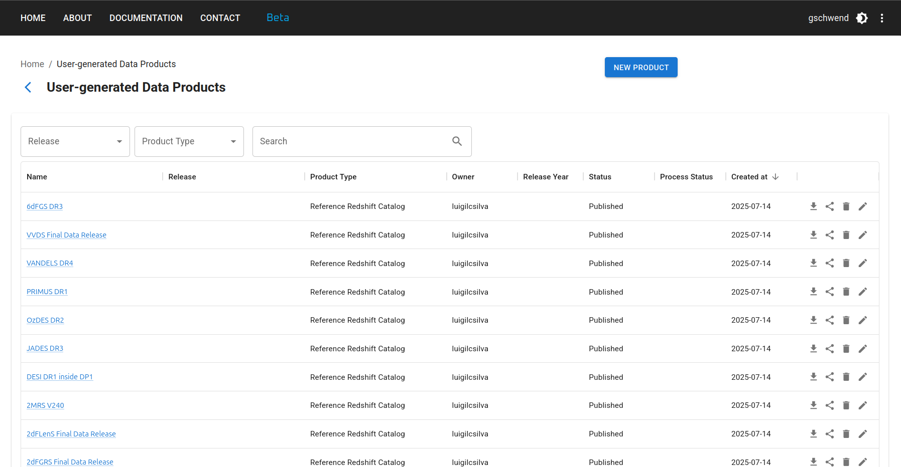

### Introdução

Inspirado pelo DES Science Portal ([Gschwend et al., 2018](https://www.sciencedirect.com/science/article/abs/pii/S2213133718300891?via%3Dihub){:target="_blank"}; [Fausti Neto et al., 2018](https://www.sciencedirect.com/science/article/abs/pii/S2213133717300975){:target="_blank"}), o [Photo-z Server](https://pzserver.linea.org.br/) é um serviço online complementar à Rubin Science Platform (RSP) para hospedar e produzir produtos de dados leves relacionados a photo-z e para oferecer ferramentas de gerenciamento de dados que permitem compartilhar produtos entre usuários da RSP, anexar e compartilhar metadados relevantes e ajudar no rastreamento de proveniência.

O serviço é hospedado no Centro Brasileiro de Acesso Independente a Dados (IDAC) e está aberto para toda a Comunidade LSST sem restrições geográficas. Ele foi projetado para ser o mais amplo e genérico possível, a fim de ser útil para todas as Colaborações Científicas LSST que trabalham com produtos de dados photo-z. Conforme exigido pelo programa in-kind do LSST, o código-fonte estará disponível publicamente no [GitHub](https://github.com/linea-it/pzserver_app){:target="_blank"}.

O Photo-z Server foi projetado para ajudar os usuários da RSP a participarem da Photo-z (PZ) Validation Cooperative. Esta iniciativa da equipe de DM ocorrerá durante a fase de comissionamento do LSST (veja a nota técnica [dmtn-049](https://dmtn-049.lsst.io/) para detalhes). O Grupo de Coordenação de PZ receberá credenciais de usuário "admin" com permissões especiais para adicionar produtos de dados marcados como "produtos oficiais".

Durante a PZ Validation Cooperative, o Grupo de Coordenação de PZ poderá usar o Photo-z Server para hospedar e distribuir conjuntos padronizados de treinamento e validação para experimentos de comparação de desempenho de algoritmos e para coletar os resultados de diferentes usuários. No entanto, o Photo-z Server continuará servindo à Comunidade LSST nos anos seguintes. Além da PZ Validation Cooperative, os usuários da RSP podem usar o Photo-z Server para acompanhar e compartilhar facilmente arquivos leves contendo diversos resultados de testes.

### Primeiros passos

#### Website do Photo-z Server

A principal interface do usuário do website do Photo-z Server é seu site em [pzserver.linea.org.br](https://pzserver.linea.org.br/). 

<p align="center">
  
</p>

Os três cartões na página inicial levam à lista de produtos de dados (esquerda e centro) ou aos pipelines do Photo-z Server (direita).

Na página da lista de produtos de dados, os usuários podem navegar, pesquisar e filtrar os produtos enviados por usuários ou criados com o pipeline do Photo-z Server. Os produtos de dados enviados ao PZ Server tornam-se automaticamente visíveis, disponíveis para download e compartilháveis com todos os usuários registrados.    

<p align="center">
  
</p>

#### Tipos de produtos de dados

Os produtos relacionados a photo-z são organizados em quatro categorias (tipos de produtos):

* **Reference Redshift Catalog:**  Catálogo de redshifts de referência e posições das galáxias (geralmente redshifts espectroscópicos e coordenadas equatoriais).
* **Training Set:**  Conjunto de treinamento para algoritmos de photo-z (dados tabulares). Normalmente contém magnitudes, erros e redshifts de referência.
* **Training Results:** Resultados de um procedimento de treinamento photo-z (formato livre). Normalmente é um arquivo pickle criado pelo submódulo RAIL Inform.
* **Validation Results:** Resultados de um procedimento de validação photo-z (formato livre). Normalmente contém estimativas de photo-z (estimativas pontuais e/ou pdf) de um conjunto de validação, métricas de validação photo-z, gráficos de validação, etc.
* **Photo-z Estimates:** Resultados de um procedimento de estimativa photo-z (geralmente a saída do módulo RAIL Estimate). Se os dados forem maiores que o limite de upload de arquivo (200MB), a entrada do produto armazena apenas os metadados (as instruções para acessar os dados devem ser fornecidas no campo de descrição).

#### Enviar um novo produto de dados

Para enviar um novo produto de dados, clique no botão **NEW PRODUCT** no canto superior direito da [página de Produtos de Dados Gerados pelo Usuário](https://pzserver.linea.org.br/user_products) e preencha o Formulário de Envio com os metadados relevantes. A descrição e os arquivos auxiliares são opcionais e podem ser modificados posteriormente. 

<p align="center">
  
</p>

Dependendo do tipo de produto de dados, se os dados forem tabulares, a ferramenta de upload pode exigir formatos de arquivos específicos. Os formatos atualmente suportados são: CSV, FITS, HDF5 e Parquet[^dagger]. 

[^dagger]: Entre em contato com a equipe de desenvolvimento se seu caso científico exigir um formato de arquivo diferente.  

#### Compartilhar produtos de dados

Cada produto de dados tem um nome único, daqui em diante chamado "**internal_name**", composto automaticamente pelo sistema como um número **id** único mais o nome escolhido pelo usuário com espaços substituídos por sublinhados. Esse nome é o endereço URL da página de detalhes do produto de dados no site do PZ Server (pzserver.linea.org.br/product/**internal_name**) e é a chave para acessar os dados usando a API Python do Photo-z Server (veja os detalhes abaixo). A maneira mais fácil de compartilhar um produto de dados é fornecendo o **internal_name** ou a URL do produto, que leva à página de download do produto.

#### Baixar um produto de dados

Na página de detalhes, alguns metadados relevantes são exibidos junto com uma prévia da tabela (quando for dado tabular) e o arquivo auxiliar HTML renderizado, quando disponível. 

<p align="center">
  
</p>

O botão de download aciona o download de um arquivo .zip compactado com todos os conteúdos do produto de dados, incluindo arquivos de descrição auxiliares. 

### API do Photo-z Server

O Photo-z Server também oferece uma API como um pacote Python para facilitar o acesso via linha de comando a dados e metadados. A API contém funções para explorar os produtos de dados disponíveis, recuperar o conteúdo de um produto de dados específico para trabalhar em memória ou baixar os arquivos de interesse. 

O pacote Python `pzserver` é open source, disponível no [GitHub](https://github.com/linea-it/pzserver){:target="_blank"}, e pode ser instalado via pip com: 

```bash
pip install pzserver
```

#### Notebook tutorial

Um [notebook tutorial](https://github.com/linea-it/pzserver/blob/main/docs/notebooks/pzserver_tutorial.ipynb) com exemplos para todos os métodos `pzserver` está disponível no [repositório da biblioteca `pzserver` no GitHub](https://github.com/linea-it/pzserver). Há também a [página de documentação da API do Photo-z Server](https://linea-it.github.io/pzserver){:target="_blank"} com mais detalhes voltados para desenvolvedores. 

#### Token de acesso

Uma vez instalado e importado em um ambiente Python, a classe `PzServer` abre a conexão remota com o banco de dados do PZ Server. 

```python
from pzserver import PzServer
pz_server = PzServer(token="<cole seu token de acesso aqui>")  
``` 

Um token de acesso é necessário para autenticação. O token pode ser gerado pelos usuários no site do PZ Server (menu no canto superior direito da página inicial).    

 

#### Comandos básicos  

Comandos básicos para exibir dados e metadados em uma célula de notebook Jupyter (se não estiver em um notebook Jupyter, substitua `display` por `get` para retornar os resultados como dicionários Python):  

```python
pz_server.display_product_types()
```

```python
pz_server.display_releases()
```

```python
pz_server.display_products_list() 
```

```python
pz_server.display_products_list(filters={"release": "DP1", "product_type": "Training Set"})
```

```python
search_results = pz_server.get_products_list(filters={"product_type": "training results"}) 
```

```python 
pz_server.display_product_metadata(<product_id>)
```

Comandos básicos para baixar ou recuperar dados na memória: 

```python 
pz_server.download_product(<product_id>, save_in=".")
```

```
training_set = pz_server.get_product(<training_set_id>)
training_set.display_metadata()
```

Consulte o [notebook tutorial](https://github.com/linea-it/pzserver/blob/main/docs/notebooks/pzserver_tutorial.ipynb) para a lista completa de exemplos, incluindo métodos para tipos de produtos específicos, instruções para envio e modificação de produtos de dados via a biblioteca `pzserver`.