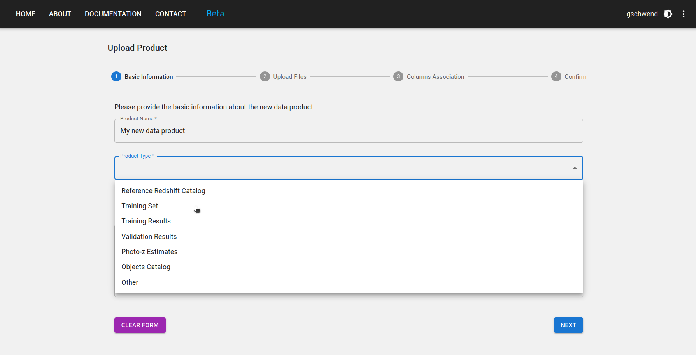

### Introdução

Inspirado no DES Science Portal ([Gschwend et al., 2018](https://www.sciencedirect.com/science/article/abs/pii/S2213133718300891?via%3Dihub){:target="_blank"}; [Fausti Neto et al., 2018](https://www.sciencedirect.com/science/article/abs/pii/S2213133717300975){:target="_blank"}), o [Photo-z Server](https://pzserver.linea.org.br/) é um serviço online complementar à Plataforma Científica Rubin (RSP) para hospedar e produzir produtos de dados leves relacionados ao Photo-z e oferecer ferramentas de gerenciamento de dados que permitam o compartilhamento de produtos de dados entre usuários do RSP, anexar e compartilhar metadados relevantes e auxiliar no rastreamento de procedência.

O serviço está hospedado no Centro Independente de Acesso a Dados (IDAC) do Brasil e está aberto a toda a Comunidade LSST, sem restrições geográficas. Ele foi projetado para ser o mais amplo e genérico possível, a fim de ser útil a todas as Colaborações Científicas do LSST que trabalham com produtos de dados Photo-z. Conforme exigido pelo programa de doações do LSST, o código-fonte estará disponível publicamente no [GitHub](https://github.com/linea-it/pzserver_app){:target="_blank"}.

O Photo-z Server foi projetado para auxiliar os usuários do RSP a participar da Cooperativa de Validação Photo-z (PZ). Esta iniciativa da equipe de Desenvolvimento de Projetos ocorrerá durante a fase de comissionamento do LSST (consulte a nota técnica [dmtn-049](https://dmtn-049.lsst.io/) para obter detalhes). O Grupo de Coordenação do PZ receberá credenciais de usuário "admin" com permissões especiais para adicionar produtos de dados marcados como "produtos de dados oficiais".

Durante a Cooperativa de Validação PZ, o Grupo de Coordenação PZ pode usar o Photo-z Server para hospedar e distribuir conjuntos padronizados de treinamento e validação para experimentos de comparação de desempenho de algoritmos e coletar os resultados de diferentes usuários. No entanto, o Photo-z Server continuará a servir a Comunidade LSST nos anos subsequentes. Além da Cooperativa de Validação PZ, os usuários do RSP podem usar o Photo-z Server para monitorar e compartilhar facilmente arquivos leves contendo vários resultados de testes.

!!! info "Conjuntos de Dados"
      Os administradores do Photo-z Server mantêm e atualizam periodicamente uma lista selecionada de recursos de dados para oferecer suporte à Comunidade LSST com produtos de dados relacionados ao Photo-z. Descrições detalhadas e links para cada produto de dados estão disponíveis em uma [página separada](../data/pz_server_data.md).

### Site do Photo-z Server

A interface principal do site do Photo-z Server é seu endereço [pzserver.linea.org.br](https://pzserver.linea.org.br/).

<p align="center">

</p>

Os três cartões na página inicial levam à lista de produtos de dados (esquerda e centro) ou aos pipelines do Photo-z Server (direita).

Na página da lista de produtos de dados, os usuários podem navegar, pesquisar e filtrar os produtos enviados por outros usuários ou criados com o pipeline do Photo-z Server. Os produtos de dados enviados para o PZ Server tornam-se automaticamente visíveis, baixáveis e compartilháveis com todos os usuários registrados.

<p align="center">

</p>

### Carregar um novo produto de dados

Para carregar um novo produto de dados, clique no botão **NOVO PRODUTO** no canto superior direito da [página Produtos de Dados Gerados pelo Usuário](https://pzserver.linea.org.br/user_products) e preencha o Formulário de Carregamento com os metadados relevantes em quatro etapas:

**Etapa 1:** Informe um nome curto e mnemônico para o seu novo produto de dados. Selecione o tipo de produto de dados que você está carregando (por exemplo, Catálogo de Referência do Redshift, Conjunto de Treinamento, etc.) e a versão de dados à qual ele pertence (se aplicável).

<p align="center">

</p>

**Etapa 2:** Selecione o arquivo principal e quantos arquivos auxiliares desejar enviar. O arquivo principal contém o produto de dados em si, enquanto os arquivos auxiliares podem incluir documentação, descrição ou qualquer outra informação relevante sobre o produto de dados.

Se o produto de dados for tabular, a ferramenta de upload pode exigir formatos de arquivo específicos, dependendo do tipo. Os formatos atualmente suportados são: CSV, FITS, HDF5 e Parquet. Entre em contato com a [equipe de desenvolvimento](mailto:pzserver-admin@linea.org.br) se o seu caso científico exigir um formato de arquivo diferente ou se o arquivo for maior que o limite de 200 MB.

<p align="center">

</p>

**Etapa 3:** Se o produto de dados for um Catálogo de Referência do Redshift ou um Conjunto de Treinamento, algumas colunas são obrigatórias. Os nomes das colunas são livres, mas você deve fornecer a associação com seu significado e [UCDs no padrão IVOA](https://www.ivoa.net/documents/REC/UCD/UCD-20050812.html), como na figura abaixo.
<p align="center">

</p>

**Etapa 4:** Revise suas informações e volte para aSiga as etapas anteriores, se necessário. Não se esqueça de clicar no botão CONCLUIR na parte inferior da página para enviar seu produto de dados.

<p align="center">

</p>

### Baixar um produto de dados

Para baixar um produto de dados, clique no ícone  na linha do produto na [página Produtos de Dados Gerados pelo Usuário](https://pzserver.linea.org.br/user_products). O clique acionará a preparação de um arquivo .zip compactado com todo o conteúdo do produto de dados, incluindo arquivos de descrição auxiliares.

Há também um botão na página de detalhes do produto, que pode ser acessado clicando no nome do produto na lista.

<p align="center">

</p>

### Compartilhar produtos de dados

Para compartilhar um produto de dados, clique no ícone  na linha do produto na [página Produtos de Dados Gerados pelo Usuário](https://pzserver.linea.org.br/user_products) ou na página de detalhes do produto. O clique abrirá uma janela pop-up com o **nome_interno** e o endereço URL do produto. Você pode copiar as informações para compartilhá-las com outros usuários.

!!! info "nome_interno"
      Cada produto de dados possui um nome único ("**nome_interno**"), composto automaticamente pelo sistema como um número **id** único seguido pelo nome escolhido pelo usuário, com espaços substituídos por sublinhados. Este nome é o endereço URL da página de detalhes do produto de dados no site do Photo-z Server:

<p align="center"> https://pzserver.linea.org.br/product/internal_name </p>

e é a chave para acessar os dados usando a API Python do Photo-z Server (veja os detalhes abaixo). A maneira mais fácil de compartilhar um produto de dados é fornecendo o **nome_interno** ou a URL do produto, que leva à página de download do produto.

## Tipos de produtos

### Catálogo de Redshift de Referência

No contexto do PZ Server, os Catálogos de Redshift de Referência são definidos como qualquer catálogo contendo coordenadas equatoriais esféricas e medições de redshift (geralmente redshifts espectroscópicos ou verdadeiros para simulações).

Colunas obrigatórias:

* Ascensão reta [graus] - `float`
* Declinação [graus] - `float`
* Desvio para o vermelho - `float`

Coluna recomendada:

* Erro de desvio para o vermelho - `float`

Um Catálogo de Desvio para o Vermelho de Referência pode incluir dados de um único levantamento espectroscópico ou uma combinação de dados de várias fontes.

!!! Perigo "ATENÇÃO: Requisitos do pipeline"
      Se o Catálogo de Referência Redshift for destinado a ser usado como dado de entrada para os _Catálogos de Redshift Combinados_, aplicando o recurso de resolução de duplicatas (consulte [detalhes do pipeline aqui](./pz_server_crc.md)), recomenda-se incluir as seguintes colunas:

* Sinalizador de qualidade (associar com **z_flag** na etapa 3 do upload) - `integer`, `float` ou `string` (o sinalizador de qualidade original do catálogo de origem, quando disponível)
* Tipo de medição - `string` (por exemplo, "s" para "espectroscópico", "g" para "grism/prism", "p" para "fotométrico", conforme adotado em [SITCOMTN-154](https://sitcomtn-154.lsst.io/){:target="_blank"})
* Nome do levantamento (associar com **survey** na etapa 3 do upload) - `string` (ex.: "DESI", "COSMOS2025", "JADES", etc.)
* Outras colunas com informações adicionais que você deseja usar para resolução de duplicatas (ex.: resolução de instrumento).

### Conjunto de Treinamento

No contexto do Servidor PZ, os Conjuntos de Treinamento são definidos como o produto do cruzamento espacial entre um determinado Catálogo de Redshift de Referência (levantamento único ou compilação) e os dados fotométricos, neste caso, o Catálogo de Objetos LSST. O pipeline *Criador de Conjuntos de Treinamento* do Photo-z Server permite que os usuários criem Conjuntos de Treinamento personalizados com base nos Catálogos de Redshift de Referência disponíveis (consulte [detalhes do pipeline aqui](./pz_server_tsm.md)).

!!! Informações sobre "subconjuntos de treinamento/teste"
      Os conjuntos de treinamento são comumente divididos em dois ou mais subconjuntos para fins de validação do Photo-z. Se o proprietário do Conjunto de Treinamento tiver definido previamente quais objetos devem pertencer a cada subconjunto (conjuntos de treinamento e validação/teste), essas informações devem estar disponíveis como uma coluna extra na tabela ou como instruções claras para reproduzir a separação de subconjuntos na descrição do produto de dados. Para dois arquivos separados, cada um deve ser carregado separadamente e se tornará um produto de dados independente, ambos com o tipo de produto "Conjunto de Treinamento".

!!! Informações sobre "conjuntos de treinamento baseados em imagem"
      O Servidor PZ suporta apenas conjuntos de treinamento em nível de catálogo. Conjuntos de treinamento baseados em imagem, por exemplo, para algoritmos de aprendizado profundo, não são suportados. Nesse caso, use o tipo de produto "Outro" e forneça uma descrição clara do formato dos dados na descrição do produto.

Para garantir flexibilidade nos observáveis, a única coluna obrigatória é o desvio para o vermelho (`float`). Outras colunas esperadas sãoe:

* ID do Objeto do Catálogo de Objetos do LSST - `integer`
* Observáveis: magnitudes (e/ou cores, ou fluxos) do Catálogo de Objetos do LSST - `float`
* Erros observáveis: erros de magnitude (e/ou erros de cor, ou erros de fluxo) do Catálogo de Objetos do LSST - `float`
* Ascensão reta [graus] - `float`
* Declinação [graus] - `float`
* Sinalizador de Qualidade - `integer`, `float` ou `string`
* Sinalizador de Subconjunto - `integer`, `float` ou `string`

### Resultados do Treinamento

Os resultados do treinamento de algoritmos PZ baseados em aprendizado de máquina também podem ser hospedados no Servidor PZ para serem compartilhados e reutilizados. Este tipo de produto permite arquivos em formato livre. Quando os resultados do treinamento são gerados com o [método `inform` do RAIL](https://rail-hub.readthedocs.io/en/latest/source/overview.html#estimation), eles são armazenados como arquivos *pickle*.

### Resultados de Validação

O tipo de produto "Resultados de Validação" destina-se a marcar os resultados de qualquer procedimento de validação de foto-z. Ele pode ser usado para armazenar os resultados da Cooperativa de Validação PZ ou quaisquer outras tarefas de validação.

Este tipo de produto é bastante genérico. Ele pode conter estimativas de foto-z (estimativas únicas e/ou PDF) de um conjunto de teste, métricas de validação de foto-z, gráficos QQ-PIT, etc. Os usuários podem carregar um arquivo principal e uma lista de arquivos auxiliares em qualquer formato.

### Estimativas Photo-z

As Estimativas Photo-z são os resultados de um procedimento de estimativa Photo-z, geralmente a saída do [método `estimate` do RAIL](https://rail-hub.readthedocs.io/en/latest/source/overview.html#estimation) módulo). Se os dados forem maiores que o limite de upload de arquivo (200 MB), a entrada do produto armazenará apenas os metadados e as instruções de acesso aos dados devem ser fornecidas no campo de descrição.

### Outros

Qualquer outro produto de dados que não se enquadre nas categorias anteriores pode ser carregado como um produto do tipo "Outro". Este é um tipo de produto genérico que permite aos usuários carregar qualquer formato de arquivo e fornecer uma descrição do produto de dados no campo de descrição.

## API do Photo-z Server

O Photo-z Server também oferece uma API como um pacote Python para facilitar o acesso de linha de comando a dados e metadados. A API contém funções para explorar os produtos de dados disponíveis, recuperar o conteúdo de um determinado produto de dados para trabalhar na memória ou baixar os arquivos de interesse.

O pacote Python `pzserver` é de código aberto e está disponível no [GitHub](https://github.com/linea-it/pzserver){:target="_blank"} e pode ser instalado via pip com:

```bash
pip install pzserver
```

### Caderno de tutoriais

Um [caderno de tutoriais](https://github.com/linea-it/pzserver/blob/main/docs/notebooks/pzserver_tutorial.ipynb) com exemplos para todos os métodos `pzserver` está disponível no [repositório da biblioteca `pzserver` no GitHub](https://github.com/linea-it/pzserver). Há também a [página de documentação da API do Photo-z Server](https://linea-it.github.io/pzserver){:target="_blank"} com mais detalhes voltados para desenvolvedores.

### Token de acesso

Após instalada e importada em um ambiente Python, a classe `PzServer` abre a conexão remota com o banco de dados do PZ Server.

```python
from pzserver import PzServer
pz_server = PzServer(token="<cole seu token de acesso aqui>")
```

Um token de acesso é necessário para autenticação. Os usuários podem gerar o token no site do PZ Server (menu no canto superior direito da página inicial).

 

### Comandos básicos

Comandos básicos para exibir dados e metadados em uma célula do notebook Jupyter (se não estiver em um notebook Jupyter, substitua `display` por `get` para retornar os resultados como dicionários Python):

```python
pz_server.display_product_types()
```

```python
pz_server.display_releases()
```

```python
pz_server.display_products_list()
```

```python
pz_server.display_products_list(filters={"release": "DP1",
"product_type": "Conjunto de Treinamento"})
```

```python
search_results = pz_server.get_products_list(filters={"product_type": "results"})
```

```python
pz_server.display_product_metadata(<product_id>)
```

Comandos básicos para baixar ou recuperar dados para a memória:

```python
pz_server.download_product(<product_id>, save_in=".")
```

```
data = pz_server.get_product(<product_id>)
```

Consulte o [notebook do tutorial](https://github.com/linea-it/pzserver/blob/main/docs/notebooks/pzserver_tutorial.ipynb) para obter a lista completa de exemplos, incluindo instruções para Carregue e modifique produtos de dados por meio da biblioteca `pzserver`.

## Pipelines do Photo-z Server

Os pipelines do Photo-z Server são um conjunto de ferramentas para ajudar os usuários a criar e gerenciar produtos de dados. Os pipelines estão disponíveis na [página Pipelines](https://pzserver.linea.org.br/pz_pipelines) do site do Photo-z Server.

&ensp; &ensp; [<font size=4>Combinar Catálogos Redshift</font>](./crc.md)

&ensp; &ensp; [<font size=4>Criador de Conjuntos de Treinamento</font>](./tsm.md)

## Agradecimentos

_O Photo-z Server utiliza recursos computacionais do IDAC-Brasil no Laboratório Interinstitucional de e-Astronomia (LIneA) com apoio financeiro do INCT do e-Universo (Processo n.º 465376/2014-2) e do projeto FINEP: LIneA: Centro de e-Ciência para explorar os mistérios do Universo e apoiar projetos de Big Data (ref. n.º 0883/24)._