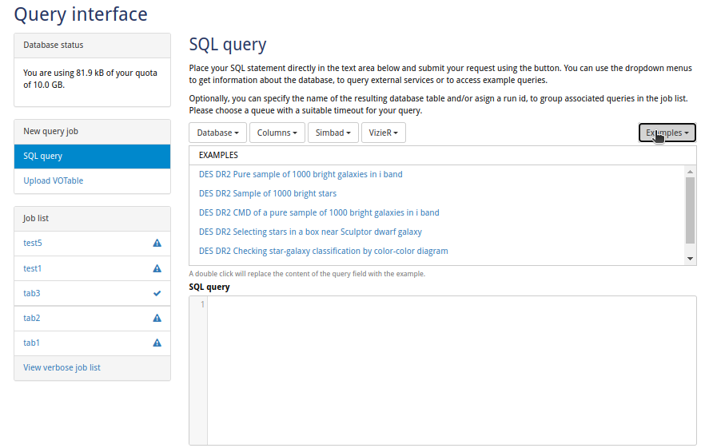
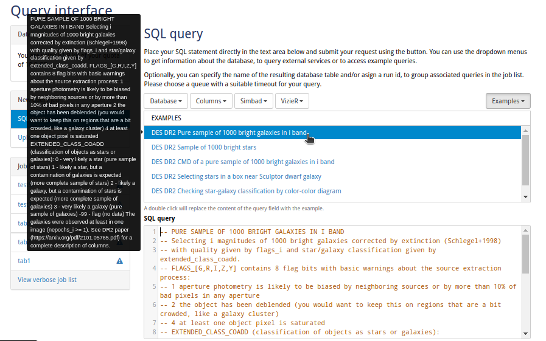
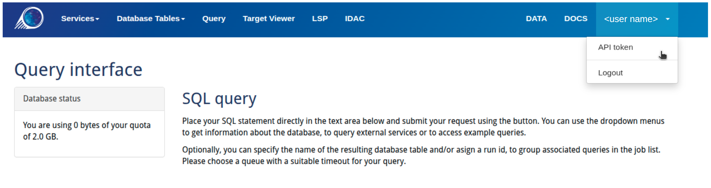
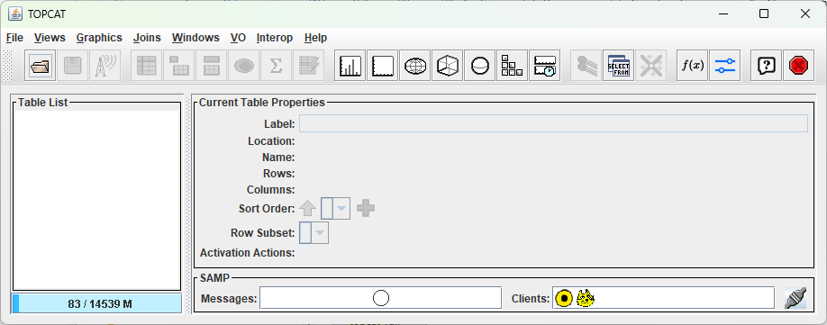
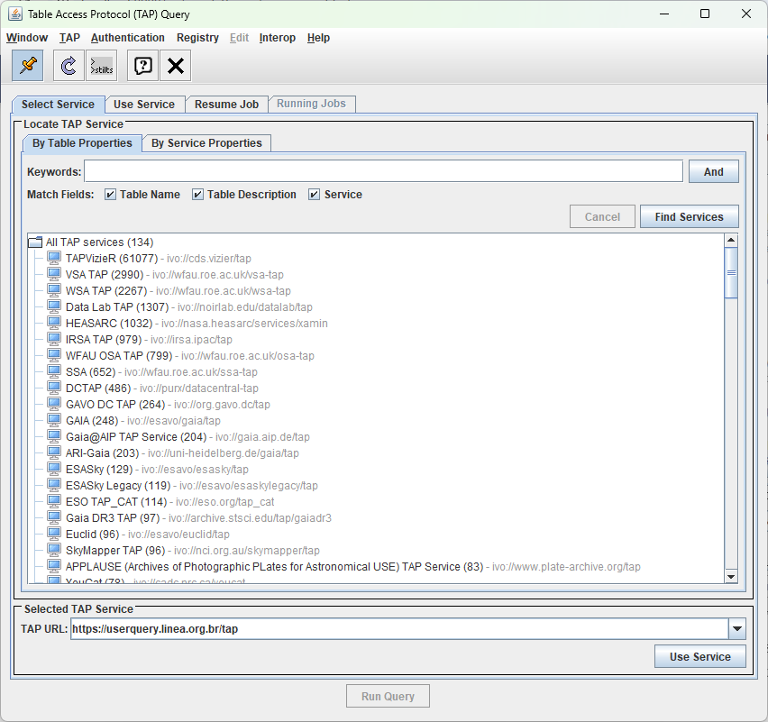
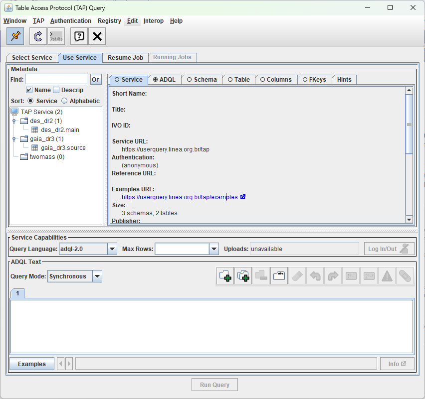

O [*User Query*](https://userquery.linea.org.br/query) é a interface SQL baseada em web do LIneA para consultar bases de dados astronômicas. Permite executar consultas em catálogos de *surveys* públicos (como *DES* DR2 e *Gaia* DR3), salvar resultados no seu espaço de trabalho pessoal e exportar dados em diversos formatos.

As tabelas que você cria são armazenadas no *MyDB*, seu espaço privado de banco de dados. Essas tabelas podem ser acessadas imediatamente a partir do *JupyterHub* do LIneA ou remotamente via *TAP Service*. Se sua tabela incluir coordenadas celestes (R.A./Dec.) e identificadores únicos, ela estará automaticamente disponível no [*Target Viewer*](../sci-platforms/target_viewer.md) para visualização de imagens.

---

## Interface web

Ao abrir o *User Query*, você verá a interface principal de consultas dividida em três áreas: a **barra lateral** à esquerda mostrando sua cota de armazenamento e histórico de jobs, o **editor SQL** no centro onde você escreve as consultas, e a **barra de ferramentas** na parte superior com ferramentas de navegação de banco de dados e consultas de exemplo.



### Escrevendo e enviando consultas

Para executar uma consulta:

1. **Escreva seu SQL** no editor, ou clique no menu **Examples** para carregar uma consulta predefinida
2. **Escolha o dialeto SQL**: `ADQL` para consultas VO padrão ou `PostgreSQL` para recursos avançados
3. **Selecione uma fila** de acordo com o tempo estimado de execução
4. **Clique em "Submit"** para executar a consulta

A captura de tela abaixo mostra uma consulta de exemplo carregada a partir do menu Examples. Observe como ao selecionar um exemplo o editor SQL é preenchido e uma descrição da consulta é exibida no tooltip.



### Opções de consulta

Antes de enviar, configure a execução da sua consulta:

| Opção | Descrição |
|-------|-----------|
| **Queue** | Escolha de acordo com o tempo de execução esperado: `30 seconds` para testes rápidos, `5 minutes` para joins e filtros, ou `2 hours` para crossmatches extensos. A consulta é cancelada se exceder o limite de tempo. |
| **Table name** | Nome para a tabela de resultados (por padrão usa um timestamp se deixado em branco). |
| **Run ID** | Rótulo opcional para agrupar consultas relacionadas na lista de jobs—útil para organizar consultas por projeto ou tarefa de análise. |

### Gerenciando resultados

As consultas completadas aparecem na **Job list** na barra lateral esquerda. Clique em qualquer job para:

- **Visualizar resultados** em uma tabela interativa
- **Criar gráficos** a partir de colunas numéricas
- **Baixar** em formato CSV, VOTable ou FITS
- **Arquivar** para liberar espaço de cota

Sua cota de armazenamento pessoal é de **10 GB**.

### Formatos de download

Exporte seus resultados a partir da aba **Download**:

| Formato | Quando utilizar |
|---------|-----------------|
| **CSV** | Planilhas, scripts de propósito geral |
| **VOTable** | Interoperabilidade com ferramentas VO como *TOPCAT* |
| **FITS** | Pipelines astronômicos, armazenamento de arquivo |

---

## TAP Service

Para fluxos de trabalho automatizados, análises reprodutíveis ou acesso a dados embargados, você pode consultar as bases de dados do LIneA diretamente a partir do Python utilizando o *TAP Service* (*Table Access Protocol*) e a biblioteca [`pyvo`](https://pyvo.readthedocs.io/en/latest/){:target="_blank"}.

### Obtendo seu token de API

Para acessar catálogos restritos (como os produtos de dados do LSST), você precisa de um token de API. Na interface do *User Query*, clique no seu nome de usuário no canto superior direito da barra de navegação para abrir o menu suspenso, então selecione **"API token"**.



!!! warning "Mantenha seu token seguro"
    Seu token de API concede acesso à sua conta e a quaisquer dados restritos que você esteja autorizado a consultar. Nunca compartilhe ou inclua em repositórios públicos.

### Configuração

Instale as bibliotecas necessárias:

```bash
pip install pyvo requests
```

!!! note "Linguagem de consulta"
    Os exemplos abaixo utilizam sintaxe **ADQL** (por exemplo, `SELECT TOP n` ao invés de `LIMIT n`), que é o padrão. Para usar sintaxe PostgreSQL, adicione `language="postgresql"` às suas chamadas de consulta:
    ```python
    result = tap.run_sync(query, language="postgresql")
    ```

### Consultas síncronas

Para consultas rápidas que completam em menos de 30 segundos, utilize o modo síncrono:

```python
import pyvo
import requests

# Endpoint TAP do LIneA
url = "https://userquery.linea.org.br/tap"

# Seu token de API (obtenha em User Query → API Token)
token = "Token YOUR_TOKEN_HERE"

# Criar sessão autenticada
session = requests.Session()
session.headers["Authorization"] = token

# Conectar ao serviço TAP
tap = pyvo.dal.TAPService(url, session=session)

# Executar consulta
query = "SELECT TOP 100 ra, dec, mag_auto_g FROM des_dr2.main"
result = tap.run_sync(query)

# Converter para tabela e exibir
table = result.to_table()
print(table)
```

### Consultas assíncronas

Para consultas mais extensas que podem levar minutos ou horas, utilize o modo assíncrono. Esta abordagem é mais robusta: os jobs sobrevivem a interrupções de rede e não têm limites de timeout do navegador.

!!! important "Configure o parâmetro QUEUE para consultas longas"
    Por padrão, as consultas expiram após 30 segundos. Para consultas mais longas, você deve especificar o parâmetro `QUEUE` ao enviar o job:
    
    - `"default"` — 30 segundos
    - `"five_minutes"` — 5 minutos  
    - `"two_hours"` — 2 horas

```python
import pyvo
import requests
import time
from io import BytesIO
from astropy.table import Table

url = "https://userquery.linea.org.br/tap"
token = "Token YOUR_TOKEN_HERE"

session = requests.Session()
session.headers["Authorization"] = token

tap = pyvo.dal.TAPService(url, session=session)

# Enviar uma consulta de longa duração
query = """
    SELECT TOP 500000
    ra, dec, mag_auto_g, mag_auto_r, mag_auto_i
    FROM des_dr2.main
    WHERE mag_auto_g < 20
"""

# Opções de QUEUE: "default", "five_minutes", "two_hours" (padrão é 30 segundos)
job = tap.submit_job(query, QUEUE="two_hours")
job.run()
print(f"Job ID: {job.job_id}")

while job.phase not in ("COMPLETED", "ERROR", "ABORTED"):
    print(f"Status: {job.phase}", end="\r")
    time.sleep(5)

print(f"Status: {job.phase}")

if job.phase == "COMPLETED":
    print("Fetching the results...", end="\r")
    
    # Construir a URL do resultado manualmente para evitar problemas de resolução de links do PyVO
    result_url = f"{url}/async/{job.job_id}/results/result"
    
    # Obter o resultado
    r = requests.get(result_url, headers=session.headers)
    table = Table.read(BytesIO(r.content), format='votable')
    print("Query completed successfully.")
else:
    print(f"Job failed with status: {job.phase}")

print(table)
```

!!! tip "Quando usar async"
    Utilize consultas assíncronas quando esperar que a consulta leve mais de 30 segundos, quando executar consultas em scripts em lote, ou quando precisar recuperar resultados posteriormente.

---

## Dialetos SQL

O *User Query* suporta dois dialetos SQL:

**ADQL** — O Astronomical Data Query Language, um padrão VO com funções de geometria integradas:

```sql
SELECT * FROM des_dr2.main
WHERE CONTAINS(POINT('ICRS', ra, dec), CIRCLE('ICRS', 53.0, -28.0, 0.5)) = 1
```

**PostgreSQL** — Sintaxe nativa com extensões espaciais para usuários avançados. Os índices Q3C e PgSphere estão disponíveis:

```sql
-- Usando Q3C (consultas radiais rápidas)
SELECT * FROM des_dr2.main
WHERE q3c_radial_query(ra, dec, 53.0, -28.0, 0.5)

-- Usando PgSphere (operadores de geometria esférica)
SELECT * FROM des_dr2.main
WHERE spoint(radians(ra), radians(dec)) @ scircle(spoint(radians(53.0), radians(-28.0)), radians(0.5))
```

Ambos os dialetos funcionam bem — consultas ADQL são automaticamente traduzidas para PostgreSQL otimizado internamente.

---

## Usando o TOPCAT

O [*TOPCAT*](https://www.star.bris.ac.uk/~mbt/topcat/){:target="_blank"} é uma aplicação desktop popular para trabalhar com tabelas astronômicas. Você pode conectá-lo aos catálogos públicos do LIneA via TAP.

**Passo 1:** Abra a janela de consulta TAP em **VO → Table Access Protocol (TAP) Query**.



**Passo 2:** Digite a URL do endpoint do LIneA no campo **TAP URL** na parte inferior: `https://userquery.linea.org.br/tap`, então clique em **"Use Service"**.



**Passo 3:** Uma vez conectado, o painel esquerdo mostra os schemas e tabelas disponíveis. Clique em uma tabela para ver suas colunas e metadados à direita. Utilize o botão **Examples** para carregar consultas de exemplo, então clique em **"Run Query"** para executar.


